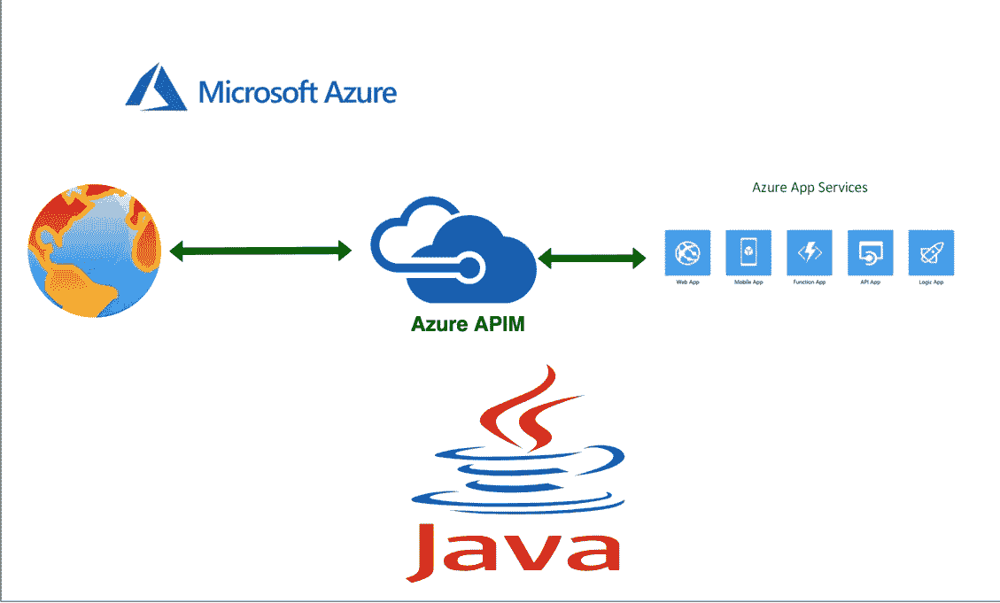

# 如何为运行在应用服务上的 Java APIs 添加 API 网关

> 原文：<https://medium.com/bb-tutorials-and-thoughts/how-to-add-api-gateway-for-your-java-apis-running-on-app-services-d648ec67b7d0?source=collection_archive---------0----------------------->

## 包含示例项目的逐步指南

当你在应用服务上部署你的 web 应用或 API 时，你可以直接从应用服务端点公开它们，也可以通过 Azure APIM 提供服务。使用 APIM 有几个优势，如基于上下文路径路由到不同的应用程序，实现微服务…