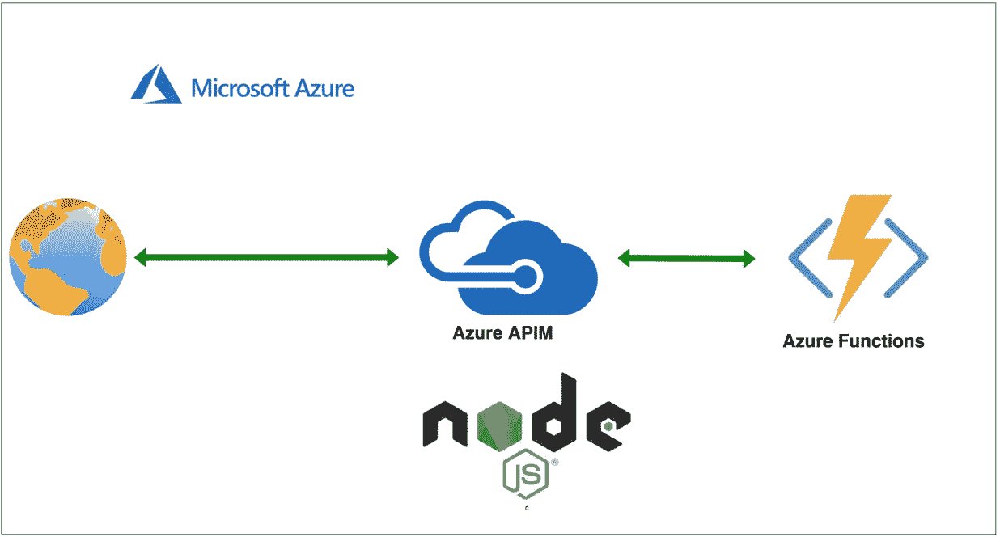

# 如何为运行在 Azure 函数上的 NodeJS APIs 添加 API 网关

> 原文：<https://medium.com/bb-tutorials-and-thoughts/how-to-add-api-gateway-for-your-nodejs-apis-running-on-azure-functions-7c36a5a7319c?source=collection_archive---------0----------------------->

## 包含示例项目的逐步指南

当你在 Azure Functions 上部署 web 应用或 API 时，你可以直接从 Azure function endpoint 公开它们，也可以通过 Azure APIM 提供服务。使用 APIM 有几个优点，如根据上下文路径路由到不同的应用程序，实现…