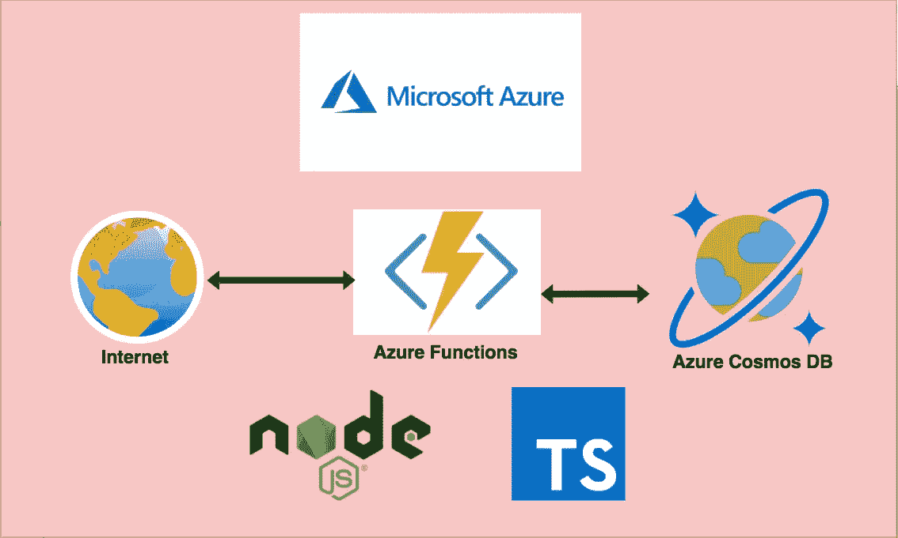

# 如何为你的 NodeJS Azure 函数添加 Cosmos DB 数据库

> 原文：<https://medium.com/bb-tutorials-and-thoughts/how-to-add-cosmos-db-database-for-your-nodejs-azure-functions-eb6db5c3d1f6?source=collection_archive---------0----------------------->

## Cosmos DB 的 MongoDB 风格的示例项目

如今编写无服务器代码非常普遍。Azure 提供了 Azure 函数，让你只在代码运行的时候付费。可以用 Java、Python、NodeJS 等不同语言编写 Azure 函数。