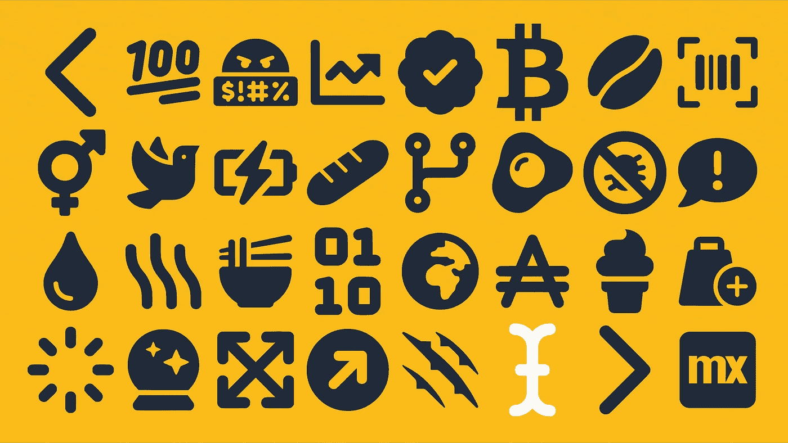
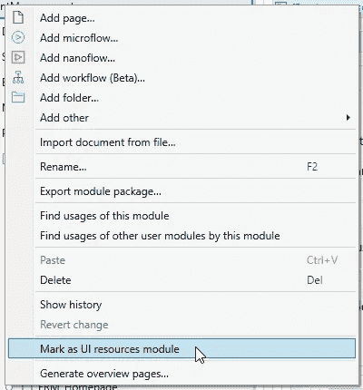
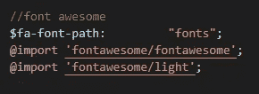

# 如何在 Mendix 9 中添加字体图标

> 原文：<https://medium.com/mendix/how-to-add-font-icons-in-mendix-9-9307c2634392?source=collection_archive---------0----------------------->



How to add font-icons in Mendix 9

## 还有普通字体。

事情与我们在 Mendix 8 [(你可以在这里阅读)](/mendix/mendix-how-to-add-font-icons-465e2a03884)中的做法略有不同。围绕管理您的设计系统，已经有了一些真正令人兴奋的发展。有一些很好的特性需要解释一下，幸运的是我在这里给你指出正确的方向。

> 在这篇博客中，我们将跳过许多“基本步骤”，如果你不知道以下内容，这并非不可能，但它肯定会有所帮助:
> 
> - sass 和 mendix
> -CSS 中的字体
> -图标字体需要如何配置

# 找到正确的文件夹

如果你打开你的项目目录，你会注意到现在有 3 个样式文件夹:

```
PROJECTNAME
  - theme
  - theme-cache
  - themesource
```

主题和主题缓存现在可以忽略。

# Ui 模块

主题源包含项目中的所有模块。
mx9 很酷的一点是你可以把一个模块变成一个 UI 资源。
如果你想启动你的可扩展设计系统，这里可能会有一个名为“CLIENTNAME-core”的模块，把它变成一个 UI 资源。

这将允许您将此模块及其所有资源上传到市场。



现在你已经把它变成了一个 UI 资源，我们可以开始把字体放到正确的位置了。

# 安置

当您打开 themesource 目录时，您将看到以下内容:

```
PROJECTNAME
  - themesource
  -  - CLIENTNAME-core
  -  -  - native
  -  -  - web
```

我们将在这里创建一个名为“public”的额外文件夹

```
PROJECTNAME
  - themesource
  -  - CLIENTNAME-core
  -  -  - native
  -  -  - web
  -  -  - **public**
```

并在*公共*文件夹中创建两个新文件夹，“资源”和“字体”

```
PROJECTNAME
  - themesource
  -  - CLIENTNAME-core
  -  -  - native
  -  -  - web
  -  -  - public
  -  -  -  - **fonts**
  -  -  -  - **resources**
```

*public* 文件夹真的很酷，你放在这里的任何东西都会出现在你的部署文件夹的根目录下(记住这一点以便以后使用)。

在*资源*中，我们可以添加 logo.svg 或您的客户可能需要的任何其他资源。
在*字体中*我们把你的字体。

# 在 SASS 中路由您的字体。

一旦你把你的字体放到文件夹中，你的 CSS 就可以开始定位它们了。

需要注意的是，你需要从编译的 CSS 位置定位字体，而不是从你的 sass 位置(还记得我告诉你要记住的那件事吗？).

如果你遵循了上面的结构，你的字体应该在/fonts 中，并且应该写在你的公司核心文件中，这样每个人都可以使用你的新字体。



下面是一个实现字体 awesome 的例子。字体 awesome 使用一个变量来配置它的路径，结果是:

```
@font-face {
src: url('**fonts**/fa-light-300.eot');
}
```

这就是如何在 Mendix 9 中向设计系统添加自定义字体

## 阅读更多

[](/mendix/mendix-how-to-add-font-icons-465e2a03884) [## 如何在 Mendix 中添加字体图标

### 所以你想在你的项目中添加一个自定义的字体图标。对于这个例子，我们将使用 Icomoon，因为这是一个…

medium.com](/mendix/mendix-how-to-add-font-icons-465e2a03884) [](https://docs.mendix.com/howto/mobile/native-custom-fonts) [## 将字体添加到您的原生移动应用程序- Studio Pro 9 操作指南| Mendix 文档

### 良好的字体设计在传达你的应用信息的同时，在强化你公司的品牌形象方面起着重要的作用…

docs.mendix.com](https://docs.mendix.com/howto/mobile/native-custom-fonts) 

*来自发布者-*

如果你喜欢这篇文章，你可以在我们的 [*中页*](https://medium.com/mendix) *找到更多喜欢的。对于精彩的视频和直播会话，您可以前往*[*MxLive*](https://www.mendix.com/live/)*或我们的社区*[*Youtube PAG*](https://www.youtube.com/c/MendixCommunity/community)*e .*

*希望入门的创客，可以注册一个* [*免费账号*](https://signup.mendix.com/link/signup/?source=direct) *，通过我们的* [*学苑*](https://academy.mendix.com/link/home) *即时获取学习。*

有兴趣更多地参与我们的社区吗？你可以加入我们的 [*Slack 社区频道*](https://join.slack.com/t/mendixcommunity/shared_invite/zt-hwhwkcxu-~59ywyjqHlUHXmrw5heqpQ) *或者想更多参与的人，看看加入我们的*[*Meet ups*](https://developers.mendix.com/meetups/#meetupsNearYou)*。*