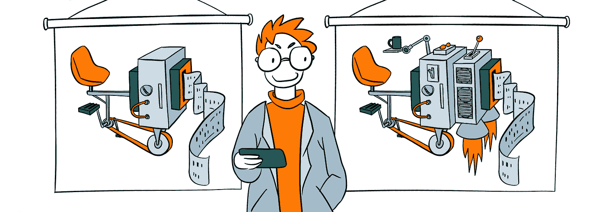

# 如何在生产中向应用程序添加新功能，而不破坏任何东西

> 原文：<https://medium.com/quick-code/how-to-add-new-features-to-your-app-in-production-and-not-ruin-anything-da2c6dfb6fc2?source=collection_archive---------4----------------------->

在本文中，我将通过我个人经历中的例子，展示如何对一个单片系统的后端进行有效的升级。首先，我们将讨论不同类型的软件开发；我们还将关注升级在竞争系统生命周期中的重要性。此外，我将描述通过有效的架构、将一个特性逐步部署到产品中的方法，以及开发人员与同事的良好关系来最小化风险的方法。

# **软件开发的类型**

我喜欢把时间看作描述各种系统发展的普遍微分方程的一个元素。随着时间的推移，所有系统要么改进，要么不复存在——就像进化过程一样。出于本文的目的，我所说的“开发”是指对服务器应用程序后端的升级。

软件开发的方式多种多样(详见史蒂夫·麦康奈尔的《代码完整》)。这可以通过逐步改进和添加新功能来实现，也可以通过完全重建来创建一个“更好”的系统。还有将前两者结合起来的混合方法。

**完全重建方法**有一些严重的缺点:不仅需要大量的时间，而且新版本总是落后于主版本，因为后者不断有新功能添加进来。该过程可能会比最初估计的时间长几倍，因此有失败的风险。

**逐步改进和重构方法**更加普遍，尽管它只在一定的范围内适用。例如，如果一个系统最初是为低负载设计的，那么再多的重构也不能使它适应高负载。

使用**混合方法**，系统的一些部分从零开始重建，而其他部分则逐渐改进。可以把它看作是一个不断升级的过程，在这个过程中，系统的部件被替换为新的和改进的组件。

# **高原效应**

通常认为发展是一个渐进的过程；然而，在实践中，它通常发生在相对较短的突发中。两个连续脉冲串之间的停顿称为“平台期”。平台期的特征是缺乏增长(或非常缓慢的增长)；在此之后，会有一个新的质量水平的飞跃，然后是另一个平台期。

当谈到软件生命周期时，平台期效应可以用几个因素来解释。其中一个原因是每个系统都有一些限制，比如设计的负载范围。在没有明确必要性的情况下重建一个系统从来都不是一个好主意，尤其是如果公司的利润依赖于此的话。因此，只有当系统现有的限制不再能满足当前的需求时，例如，当负载达到系统可以工作的最大点时，才进行实质性的升级。这通常意味着升级过程有相当长的时间限制。

平台期之间的爆发通常被称为“升级”。我将使用这个术语来表示所有旨在快速添加特性和提高性能的行为。在 IT 会议上，演讲者倾向于使用“升级”这个词来表示他们系统开发时间表中的关键点。升级系统几乎总是一项复杂的任务。这通常意味着利用新技术或重建大部分系统代码。不管你喜欢什么类型的开发，有一点是不变的:如果你想保持竞争力，你绝对需要升级你的系统。

# 在实践中升级系统:如果出现问题，如何最小化风险

从开发人员的角度来看，几乎任何任务都可以分为三个阶段:漫长的开发、测试和部署。实际上，开发人员最初的计划经常被废弃:主要的问题是总会出错，尤其是在升级整个系统这样复杂的过程中。

问题不仅会在开发期间出现(比如落后于初始计划)，也会在发布之后出现。系统内部或其连接的每个外部组件可能出现故障。虽然外部系统超出了我们的控制范围，但我们当然可以采取措施，将自身的风险降至最低。

## **建立反馈机制**

开发新系统时，不断问自己一个简单的问题至关重要:

**“如果出了问题，我该怎么办？”**

这将有助于你确定关键点和可能的恢复方式，以防事情不尽如人意。

通常，部署后出现的任何缺点几乎都能立即识别出来。每个人都知道度量和日志有多重要。当熟练的开发人员在开发一个好的产品时，他们几乎对所有的事情都使用度量标准，所以没有失败会被忽略。但是，每个系统都不一样。在某些情况下，有如此多的参数组合，以至于区分问题的症状和正常运行的迹象变得非常棘手。

假设你是一名开发人员，你的系统出现了问题。你的行动是什么？

你将如何识别问题？

如果某个东西在发布两天后失败了，你打算怎么办？

您应该在首次展示后监控您的系统，还是应该立即投入到不同的项目中？

如果不是你，谁将在发布后监控系统，监控多长时间？有没有可能找到至少一个有足够空闲时间做这件事的人？

最后，如果出了问题(或者你至少怀疑有问题)，谁来帮助你？为了证明你的怀疑，你会自己创建数据库查询并搜索日志吗？

如果你曾经发现自己处于这种不幸的境地，你就知道那是什么感觉了。为了避免再次陷入这种情况，在计划阶段，当你还有足够的时间时，预先考虑消极的情况并制定解决方案。这样，当您发现自己时间紧迫时，您将知道要分析什么指标和查看什么日志。

在开始开发流程之前，您应该创建一个仪表板，一个突出显示数字、指标和日志的计划，可用于获得有关您所做更改的反馈。如果可能的话，开始使用旧系统收集新指标的数据:这样，当使用新系统时，您将会看到不同之处。这有点类似于 TDD，在 TDD 中，您首先为您的未来系统开发测试。在开发系统之前识别关键指标和日志的实践将会在将来为您省去很多麻烦。

你应该了解并热爱你的产品；没有这一点，创建一个高效的仪表板是不可能的。我相信每个开发人员都需要知道关键数字，了解受支持产品的核心指标。开发人员还必须清楚地了解使用产品的主要客户，以及他们的行为模式。例如，客户在一天中的流量分布可能有显著的差异；在这种情况下，相同的数字可能对一个客户来说是个问题，但对另一个客户来说是完全正常的。通常，只有人类专家才能分辨出如此细微的差别。

## 通过使用触发器和逐步替换旧功能来最大限度地减少损失

在发布大的升级时，另一个最小化风险的方法是使用 togglers 将一个特性逐步部署到产品中。

升级系统时最常犯的一个错误是突然从旧版本切换到新版本。打个响指，升级一部署，系统就立即从状态 A 进入状态 B。但通常情况下，打响指是不够的。

在某些情况下，金丝雀部署(只为总流量的一小部分发布新特性)可以帮助系统的回归测试，但它并不总是有效地工作。在分割测试中，变更很少会保持超过一天。同时，整个测试过程可能依赖于一些外部周期，这些周期可能持续几天甚至几周。

根据我自己的经验，推出复杂功能的最有效方法是通过 togglers 逐渐切换流量。与拆分服务器(在现实生活中，流量会被重定向到拆分服务器以进行新功能的短期测试)不同，togglers 允许以这样一种方式部署该功能，即系统可以在两种模式下长期工作:有或没有新功能。Togglers 还允许在两种工作模式之间切换。例如，您的客户可能会花时间批准更改，然后必须立即引入。Togglers 可以通过各种方式实现，这取决于您的基础设施和手头的任务:通过数据库、环境变量，或者将 nginx 路由逐步迁移到新的 API 版本。

我们在中使用的第一个任务之一是返工订阅取消系统。最初，订阅时间一天延长几次；这是可以接受的，尽管订阅数量很少。随着这个数字的增长，取消系统需要重新设计，这样订阅时间可以精确到一秒钟。

在测试阶段，很明显我们不能简单地为我们所有的合作伙伴推出这个功能；相反，我们必须与每个合作伙伴单独协调，所以我们使用了一个基于项目的方法，将所有的活动项目分成三个“波”。当新功能上线时，它只对测试项目有效。起初，我们只在第一波中为小项目打开它。当转换主要项目的时候到了，我们已经建立了基础设施，进行了分析，并且理解了新系统行为的所有细微差别。

每种解决方案都有代价:除了额外的灵活性，您还将面临一些复杂性。但是，您不应该让这些缺点阻碍您的进步:

1.  从旧系统迁移到新系统可能需要很多时间。在这个过程中，你必须支持两个系统，并保持开发的继续。逻辑、测试、日志、配置——几乎所有东西都翻倍了。最好是分析旧系统中的日志和度量集合，并想出一种在新仪表板中方便地表示它的方法。您可能还想考虑在准备阶段解决一些特定的任务。
2.  解决旧版本和新版本之间基于逻辑的冲突是另一件要考虑的事情。在大多数情况下，你不能在不影响现有功能的情况下推出新功能。您应该测试系统是否降级，并在两个版本中应用必要的修复。

形象地说，我对系统升级的想法是搬家。我们没有拆掉旧房子，盖一栋新房子，而是住在两栋房子里，同时逐渐将各种家用电器搬到新房子里。这是一个漫长的过程，在现实生活中可能看起来不合理；然而，当你有很多东西要失去时，这是一个好的选择。

请这样想:你不仅仅是在重建旧系统。相反，你正在创建一个新的系统，一步一步地取代旧的系统。

规划切换时，请留出一些时间进行进一步分析。你的最终任务不仅仅是推出新功能；这是为了确保新功能在部署后能够正常工作——这可能需要时间。

没有神奇的药丸，使用 togglers 可能不是在每种情况下都是最佳的。但是如果可行的话，它肯定会让你的任务变得更容易。

## 建立良好的关系

真正想要及时部署新特性的开发人员必须考虑许多外部因素。其他开发人员、经理、管理员、支持人员、在并行开发中协调子系统的需要、测试的难度、文档维护、甚至预测最终用户的反应——开发人员依赖于所有这些。用一个视频游戏的话来说，如果方法不正确，这很可能会归结为一场“永不改变的战争”。

“我们造就了公司。”这是我在参加过的每个团队中都听到的话。事情是这样的，每个部门的每个团队都这么认为。管理员、反欺诈专家、支持团队成员、经理、测试人员——所有这些人都会告诉你他们是公司的基础。这篇文章是一个开发者写的，站在一个开发者的角度，开发者在聚光灯下。这并不意味着管理员、经理或测试人员不能成为关注的焦点。相反，当系统被不同类型的专家包围时，每个人都有自己的观点，这是很好的。但是要记住，其他部门的任务和你的任务本来就不一样。看起来你在解决同一个问题，但是你的目的不同。这样，由于对主题有最深的了解，开发人员必须成为升级过程背后的驱动力。

我坚信开发者和他的团队应该完成这项任务。一旦你投资了某件事，它对你来说就变得至关重要。选择团队成员的是你。也许你应该让你的管理员、分析师、技术作家和/或你的支持人员加入团队。万一你还没有这样做，考虑挑选你自己的团队成员，并在整个开发周期中与他们交流。不要犹豫，咨询分析师或任何其他可能帮助你的专家。在理想的情况下，开发人员必须与公司的所有其他部门进行沟通，这样关于任务当前状态的信息才能在两个方向自由流动。这对于复杂的任务尤其重要。

# 摘要

简而言之，这些是我想在这篇文章中提出的要点:

1.  从头开始重建系统，然后突然将所有流量切换到新版本，这不是一个好主意。
2.  在架构规划阶段，从长远来看，包含日志、指标和分析的组织不良的仪表板将损害您的反馈能力。
3.  您应该努力提供总体透明度、文档的可访问性、数据的自由流动、对包含日志和指标的仪表板的轻松访问、对所有流程的清晰易懂的描述，以及针对可能出现的负面情况的备份计划。
4.  您应该与管理员、数据库管理员、分析师、技术作家、支持人员和其他重要的同事建立良好的工作关系。确保他们事先都清楚地了解任务。
5.  最后但同样重要的是，不要试图独自完成所有事情。往往会导致效果不佳。