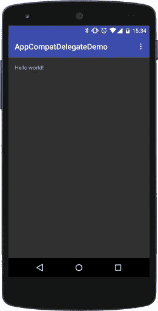

# 如何添加工具栏

> 原文：<https://medium.com/google-developer-experts/how-to-add-toolbar-to-an-activity-which-doesn-t-extend-appcompatactivity-a07c026717b3?source=collection_archive---------0----------------------->

# 参加活动

# 它不扩展 AppCompatActivity

## Android 支持库 22.1 引入了 AppCompatDelegate

新的 **AppCompat 支持库**版本 **22.1** 引入了许多很酷的新功能，允许轻松地将材料设计/API 21+功能添加到我们旧的非 AppCompat 活动中。

我们知道扩展[**appcompactivity**](https://developer.android.com/reference/android/support/v7/app/AppCompatActivity.html)是最好的方法，但是有时候你需要用老方法，对吗？；-)

您可以使用支持库提供的新的[**appcompatmdelegate**](http://developer.android.com/reference/android/support/v7/app/AppCompatDelegate.html)组件来轻松地**为您的活动**添加工具栏。

# 1)将工具栏小部件添加到活动布局

ActionBar 现在已被弃用，它应该由 [**工具栏**](https://developer.android.com/reference/android/support/v7/widget/Toolbar.html) 小部件所取代，这允许更大的 UI 灵活性，也允许您的活动轻松地符合材质设计 UI 模式。

因为我们在这里使用支持库，**我们将使用工具栏**的支持版本(否则，只能从 API 21+获得)。

将它添加到 xml 布局中，如下所示:

```
<**android.support.v7.widget.Toolbar**

    **android:id=**"@+id/my_awesome_toolbar"
    **android:layout_height=**"@dimen/abc_action_bar_
default_height_material"
    **android:layout_width=**"match_parent"
    **android:minHeight=**"@dimen/abc_action_bar_
default_height_material"
    **android:background=**"?attr/colorPrimary"

    />
```

# 2)修改你的主题

因为我们在布局中嵌入了工具栏，所以我们需要使用一个无 ActionBar 的主题。

所以，一定要用一个**主题。AppCompat.NoActionBar** 主题放在你的 *styles.xml* 中。

**ProTip:** 添加**材质设计颜色项**到你的主题中，方便工具栏和状态栏着色(仅在状态栏的 21+上)。

```
*<!-- Base application theme. -->* <**style name="AppTheme" parent="Theme.AppCompat.NoActionBar"**>

    *<!-- colorPrimary is used for coloring the Toolbar -->* <**item name="colorPrimary"**>#3F51B5</**item**>

    *<!-- colorPrimaryDark is used for coloring the status bar -->* <**item name="colorPrimaryDark"**>#303F9F</**item**>

    *<!-- colorAccent is used as the default value for colorControlActivated
         which is used to tint widgets -->* <**item name="colorAccent"**>#FFAB40</**item**>

</**style**>
```

# 3)将 AppCompatDelegate 添加到您的活动

[**appcompatmdelegate**](http://developer.android.com/reference/android/support/v7/app/AppCompatDelegate.html)是一个为您的活动提供 AppCompatActivity 特性的委托，只能使用 [*create()*](http://developer.android.com/reference/android/support/v7/app/AppCompatDelegate.html#create(android.app.Activity, android.support.v7.app.AppCompatCallback)) 方法创建，该方法有两个参数:*活动*本身，以及一个[*AppCompatCallback*](http://developer.android.com/reference/android/support/v7/app/AppCompatCallback.html)。

因此，首先，让我们的活动实现 *AppCompatCallback* (在本演示中，我们可以将这些方法留空)。

```
**public class** MainActivity **extends** Activity **implements** AppCompatCallback {

    @Override
    **public void** onSupportActionModeStarted(ActionMode mode) {
      //let's leave this empty, for now
    }

    @Override
    **public void** onSupportActionModeFinished(ActionMode mode) {   
      // let's leave this empty, for now
    }
```

然后，在我们活动的 onCreate()中:

1.  用[**appcompatmdelegate . create()**](http://developer.android.com/reference/android/support/v7/app/AppCompatDelegate.html#create(android.app.Activity, android.support.v7.app.AppCompatCallback))创建**appcompatmdelegate**
2.  调用[**appcompatmdelegate . oncreate()**](http://developer.android.com/reference/android/support/v7/app/AppCompatDelegate.html#onCreate(android.os.Bundle))***(****有一些活动生命周期方法应该代理给委托人)*
3.  用[**appcompatdelegate . setcontentview()**](http://developer.android.com/reference/android/support/v7/app/AppCompatDelegate.html#setContentView(int))展开布局
4.  用[**appcompatdelegate . setsupportactionbar()**](http://developer.android.com/reference/android/support/v7/app/AppCompatDelegate.html#setSupportActionBar(android.support.v7.widget.Toolbar))给代理添加工具栏

```
private AppCompatDelegate **delegate**;

@Override
**protected void** onCreate(Bundle savedInstanceState) {
    **super**.onCreate(savedInstanceState);

    *//let's create the delegate, passing the activity at both arguments (Activity, AppCompatCallback)* **delegate** = AppCompatDelegate.*create*(**this**, **this**);

    *//we need to call the onCreate() of the AppCompatDelegate* **delegate**.onCreate(savedInstanceState);

    *//we use the delegate to inflate the layout* **delegate**.setContentView(R.layout.***activity_main***);

    *//Finally, let's add the Toolbar* Toolbar toolbar= (Toolbar) findViewById(R.id.***my_awesome_toolbar***);
    **delegate**.setSupportActionBar(toolbar);
}
```

**ProTip:** 一个[活动](http://developer.android.com/reference/android/app/Activity.html)只能链接一个 [AppCompatDelegate](http://developer.android.com/reference/android/support/v7/app/AppCompatDelegate.html) 实例，所以从 [create()](http://developer.android.com/reference/android/support/v7/app/AppCompatDelegate.html#create(android.app.Activity, android.support.v7.app.AppCompatCallback)) 返回的实例应该保留到活动被销毁。

现在你完成了！运行您的应用程序，您的活动将神奇地拥有一个工具栏，看起来完全像一个真正的材料设计 AppCompatActivity！



很简单，是吧？；——)

同样，这是针对边缘情况的，在使用 AppCompatDelegate 之前，您应该始终考虑 AppCompatActivity 的用法。

请务必查看**appcompatmdelegate**的[完整参考，如果您想让活动完全充当 AppCompatActivity，有许多方法您应该注意包装在活动中。](http://developer.android.com/reference/android/support/v7/app/AppCompatDelegate.html)

这里有一个 Github 项目演示了这篇文章中描述的内容。

*如果你喜欢这篇文章，* [***在 Google+***](https://plus.google.com/+MarioViviani/posts) *或在**[***Twitter***](https://twitter.com/Mariuxtheone)**上关注我，了解更多关于* ***Android 的信息！*****