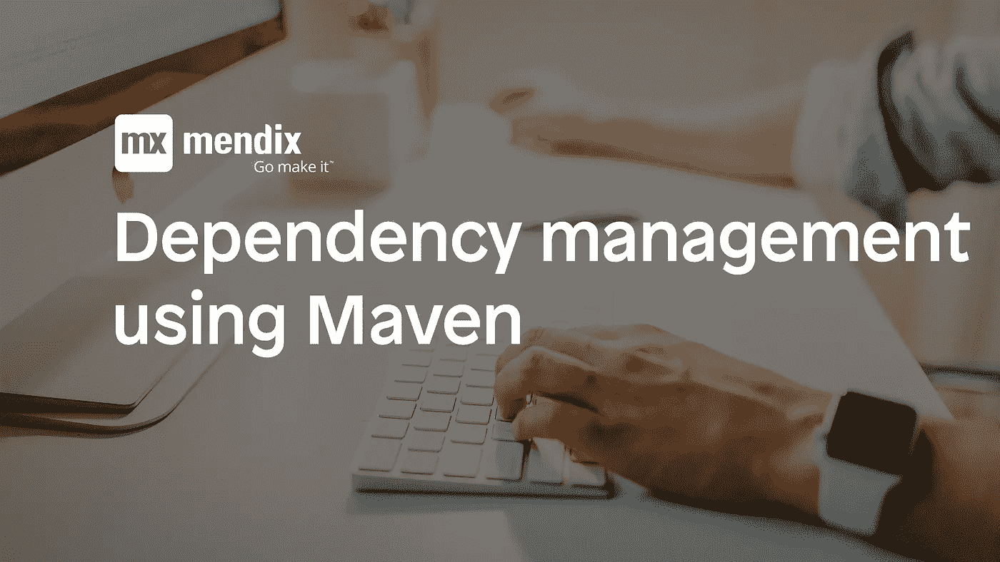

# 如何使用 Maven 在 Mendix 中自动化依赖管理

> 原文：<https://medium.com/mendix/how-to-automate-dependency-management-in-mendix-using-maven-6af490512f79?source=collection_archive---------0----------------------->



几周前，我决定发布一个新的应用商店模块，AmazonSQSConnector。GitHub repo 在一年多前就已经创建好了，但是我从来没有花时间去准备发布的模块。我打开项目，创建了一个“待办事项”列表。最重要的任务是更新 AWS (Amazon Web Services)依赖项。每次当我不得不更新 App Store 模块中的依赖项时，搜索正确的依赖项并将其包含在模块包中是很麻烦的。在这篇博客中，我将向您展示我如何使用 Apache Maven 自动化 Mendix 模块的依赖管理。

我过去做的是下载所有(可传递的)依赖项，并将它们添加到 Mendix 项目的`/userlib`文件夹中。我们来考察一下能否用 Maven 编译代码，收集依赖关系，导出模块包。我认识的几个人在他们的 Mendix 应用商店模块中使用 Gradle，但我发现自己更熟悉 Maven。

# 创建 POM

第一步是启动一个 Maven 项目，在根目录中包含一个空的`POM.xml`(项目对象模型)文件。在 Maven 可以编译代码之前，Mendix Java API 库被添加到依赖列表中。

我使用了几个属性来确保配置可以很容易地更改为新的 Mendix 版本。可以在 POM 中硬编码默认值，但是也可以在命令行或 Eclipse Maven 插件中传递属性值。

# 指定目录结构

之后，我查看了 Mendix 项目的文件夹结构，它不同于默认的 Maven Java 项目。源文件位于`/javasource`文件夹，编译后的源代码位于`/deployment/run/bin`文件夹。

# 清理项目文件夹

每当执行构建时，我都希望清理项目文件夹。Apache Maven 提供了清理输出和目标目录的插件。我想将`/userlib`文件夹添加到配置中，以确保每次执行构建时都会重新创建该文件夹。

# 复制依赖关系

最初，我们的目标是管理 Mendix 的依赖关系。我现在必须将依赖项复制到`/userlib`文件夹中，这可以使用复制依赖项插件来完成。我必须确保 Mendix 依赖项没有被复制，因为它们是由运行时启动器自动添加到类路径中的。复制依赖项任务被绑定到包阶段。

# 导出模块包

此时，应用程序正在正确编译和运行。使用正确的依赖项自动创建模块包会很好。Mendix 附带了 mxutil.exe 命令行工具，它提供了导出模块包的可能性。`--filter-required-libs`标志给出了包含具有相应。需要一个 Lib 文件。我不得不寻找一种使用 Maven 创建文件和执行命令的方法。Apache Ant 结合 Ant-Contrib 库提供了我正在寻找的特性。我必须将 Ant-Contrib 添加到 POM 文件的依赖列表中。

Apache Ant 使用 XML 文件来执行任务。我创建了一个`build.xml`文件，可以在其中指定任务。构建文件可以访问 Maven 公开的变量，例如`${basedir}`。在开始之前，我必须定义 Ant-Contrib 任务。

`build.xml`文件的第一部分遍历`/userlib`文件夹中的`*.jar`文件(不包括 Ant 依赖项)并创建`.RequiredLib`文件。

对于`/userlib`文件夹中的每个文件，执行`touchRequiredLibFile`目标。

文件的第二部分执行`mxutil.exe`并将 MPK 文件复制到发布目录，包括它的版本号。

`build.xml`文件已准备好执行。我必须使用 antrun-plugin 指定目标名称(`createRequiredLibs`和`exportModulePackage`)，按照正确的顺序执行 POM 文件中的任务。执行被绑定到安装阶段。

# 快跑！

现在我可以使用下面的 Maven 命令编译代码并复制依赖项。当然，Maven 应该被安装并添加到您的路径中。

```
mvn clean package
```

为了创建模块包，我必须在命令中添加安装阶段。

```
mvn clean install
```

这次旅程之后，Mendix 模块的构建过程完全自动化了(除了发布到 App Store，特性请求！)，这将使我能够更容易地发布更新，并清楚地标记依赖关系。我希望鼓励更多的 Mendix 开发者使用这种(或其他)依赖管理解决方案发布高质量的应用商店模块。如果你有任何问题，请联系我！

自己试试，克隆下面的 GitHub repo。

[](https://github.com/WebFlight/AmazonSQSConnector.git) [## WebFlight/AmazonSQSConnector

### 欢迎使用 Mendix AmazonSQSConnector 模块。该模块可用于 Mendix 应用程序连接亚马逊简单…

github.com](https://github.com/WebFlight/AmazonSQSConnector.git)