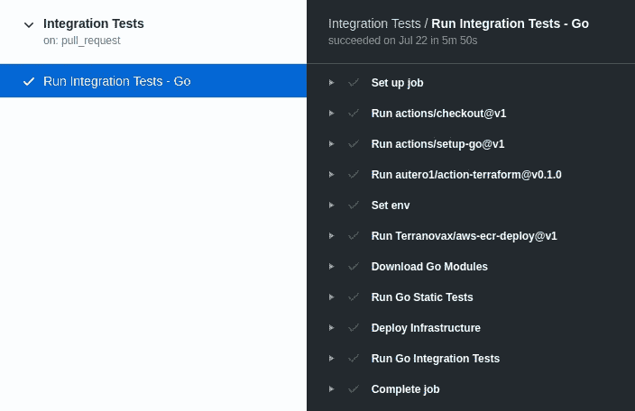

# 自动化 IaC 与 Terraform、GitHub Actions 和 AWS 的集成测试。

> 原文：<https://medium.com/globant/how-to-automate-integration-testing-with-terraform-github-actions-and-aws-6061aa0b6e5f?source=collection_archive---------2----------------------->

辅助编写: [**布雷安·安德烈斯·包蒂斯塔·卡尔德龙**](https://www.linkedin.com/in/brayanbautista/) 和 [**豪尔赫·恩内斯托·格瓦拉·昆卡**](https://www.linkedin.com/in/guevaraernesto/) 。特别感谢他们的帮助和支持。

无论何时开发新的应用程序，您都试图将失败的风险降至最低，测试应用程序的功能、安全漏洞或合规性。如果您正在开发一个已经达到一定复杂程度的开发框架，那么测试应该使用 CI/CD 管道在生产的各个阶段部署和测试应用程序来实现自动化。从应用程序的角度来看，所有这些都非常重要，但是，支持应用程序的基础架构方面又如何呢？。考虑到您可以拥有最强大、最安全和最可靠的应用程序，但如果底层基础架构(服务器、数据库、网络、防火墙等)不稳定，也必须考虑等式的这一面。，)有重要的缺陷，您的应用程序可能会变得一文不值。

将您的基础架构作为代码或 IaC 具有一些优势，包括在部署应用程序之前自动测试您的基础架构的可能性，降低问题进入不同阶段的风险，最重要的是在投入生产之前。

有很多 IaC 工具，但是在这个例子中，我们将使用 **Terraform** 。这个工具是用 Golang 编写的，它允许我们使用语言测试包、terraform 库和其他 Go 库，如 **Terratest** 。对于常见的基础设施测试任务，您可以使用 terratest 函数和模式集合。

# **基础设施场景**

我们在 AWS Fargate 上部署了一个简单的 web 应用程序，有一个带有 ALB 的公共子网，接收外部用户请求并将它们路由到私有子网中的 Fargate 容器。弹性容器注册表存储 docker 应用程序映像，Fargate 使用它来运行 web 应用程序。


# **GitHub 动作**

GitHub Actions 是一个 GitHub 集成特性，它为您提供了一个集成到 CI/CD 工作流每一步的执行环境。我们使用 **GitHub Actions** 来自动化 CI/CD 管道的测试，您可以使用社区开发的各种各样的操作，允许您将您的管道与包括 AWS 在内的不同云供应商集成。

**GitHub 动作概念:**

*   **动作**是单独的任务，您可以将它们组合成创建作业的步骤。您可以创建自己的操作，使用从 GitHub 社区共享的操作，以及自定义公共操作。要在工作流中使用操作，您必须将其作为一个步骤包括在内。
*   **runner** 是任何执行 GitHub 动作的机器，你可以使用 GitHub 托管的 runner 或者托管你自己的 Runner 叫做自托管 Runner。一个跑步者等待可用的工作。当一个 runner 获得一个作业时，它运行该作业的动作，并向 GitHub 报告进度、日志和最终结果。跑步者一次跑一项任务。GitHub 提供每月 2000 分钟的免费 GitHub 托管 runner 执行，允许您利用 CI/CD 功能，而无需在外部服务上花费。
*   **事件**是触发工作流运行的特定活动。例如，当有人将提交推送到存储库时，或者当一个问题或拉请求被创建时，活动可以源自 GitHub。您还可以使用存储库调度 webhook 将工作流配置为在外部事件发生时运行。
*   **作业**是在同一个流道上执行的一组步骤。您可以为作业在工作流文件中的运行方式定义相关性规则。根据前一个作业的状态，作业可以同时并行运行，也可以顺序运行。

# 管道结构

在本节中，我们将描述使用 GitHub 操作创建的管道，如果成功，每个步骤都标有绿色的勾号，如果失败，则标有红色的 x。第一步设置作业是由 GitHub Actions 自动创建的，接下来将描述以下步骤。



GitHub Actions 使用位于内部的 yaml 文件。repo 中的 github/workflows 文件夹，指示运行者一个包含以下内容的作业:要使用的操作、环境变量、何时执行管道(事件)、要执行的命令等。，我们的管道将单个作业分为多个步骤，执行静态和集成测试:

*   运行操作以设置运行测试所需的工具，如 terraform 和 Go。检出动作允许容器复制和检查存储库中的文件。


*   **Run Terranovax/AWS-ECR-deploy @ v1**是一个社区操作，允许构建 docker 容器映像并将其推送到 AWS ECR 服务中。在这里，我们使用预定义的密码，即帐户中具有适当权限的 AWS 访问密钥，来访问我们需要的 AWS 服务和功能。构建映像有我们的示例 web 应用程序，它将允许我们测试基础设施的每个部分。


*   **运行 Go 静态测试**运行基本的 terraform lint 命令并验证 terraform 计划的输出。


*   **部署基础设施**以应用前一阶段地形图输出的变更。


*   **运行 Go 集成测试**这里我们使用了 terratest 库中的 Go 函数，它允许我们对我们的应用程序负载平衡器进行 HTTP GET 调用，该测试从 URL(例如 200)返回一个状态代码，以检查请求是否成功。Go 测试的任何其他返回失败。


# **与 terratest 功能的集成测试**

用 Go 编写测试允许我们使用 terraform - terratest 库和函数。在代码的开头，我们需要导入我们将要使用的库:


导入库之后，我们创建一个主测试函数来准备 terraform 工作目录，并为 ECS Fargate 任务设置一个等待预热期，以完成新的构建映像部署。最后，我们将预期的测试属性(HTTP 状态代码、网页正文)发送给 **testURL** 函数:


**testURL** 函数是集成测试中的主要部分之一，它将模拟用户向我们的应用程序 URL 发出请求，检查网页正文内容并返回 HTTP 状态代码，这允许管道测试所有底层基础设施部分的端到端功能:


# 结果

管道完成后，我们可以在 GitHub 操作作业日志中查看结果。在这里，我们可以看到测试从 web 应用程序获得了预期的 HTTP 状态代码和主体，因此测试结果是成功的:

```
TestHttpMicroserviceValidity 2020-07-22T22:58:02Z retry.go:72: Calling http://tectech-insider-ALB-111111111.us-east-1.elb.amazonaws.com/
TestHttpMicroserviceValidity 2020-07-22T22:58:02Z http_helper.go:32: Making an HTTP GET call to URL http://tectech-insider-ALB-111111111.us-east-1.elb.amazonaws.com/
TestHttpMicroserviceValidity 2020-07-22T22:58:02Z **microservice_integration_test.go:49: Got expected status code 200 from URL http://tectech-insider-ALB-111111111.us-east-1.elb.amazonaws.com/**
**--- PASS: TestHttpMicroserviceValidity (190.34s)
PASS
ok   microservice_test 190.354s**
```

收到意外的正文或状态 HTTP 代码会导致测试失败:

```
TestHttpMicroserviceValidity 2020-07-22T14:16:01Z retry.go:72: Calling http://tectech-insider-ALB-111111111.us-east-1.elb.amazonaws.com/
TestHttpMicroserviceValidity 2020-07-22T14:16:01Z http_helper.go:32: Making an HTTP GET call to URL http://tectech-insider-ALB-111111111.us-east-1.elb.amazonaws.com/
TestHttpMicroserviceValidity 2020-07-22T14:16:01Z microservice_integration_test.go:49: Got expected status code 200 from URL http://tectech-insider-ALB-111111111.us-east-1.elb.amazonaws.com/
    microservice_integration_test.go:54: 
         Error Trace: microservice_integration_test.go:54
                         microservice_integration_test.go:39
                         test_structure.go:24
                         microservice_integration_test.go:35
 **Error:       "Error body page" does not contain "Welcome to tech insiders"
         Test:        TestHttpMicroserviceValidity
         Messages:    Body should contain expected text**
**--- FAIL: TestHttpMicroserviceValidity (191.29s)
FAIL
exit status 1
FAIL microservice_test 191.303s**
```

# **结论**

一个简单的管道允许我们自动化 IaC 测试，这是对应用程序测试的完美补充，因此所有涉及的部分都具有预期的行为和性能。进行静态测试是检查代码健康性的一个非常基本的起点，但是为您的基础设施添加集成测试可以降低不确定性和风险，尤其是在将应用程序投入生产之前。

# 参考

*   链接到代码:[https://github.com/braybaut/tech-insiders-tdi](https://github.com/braybaut/tech-insiders-tdi)
*   GitHub 动作文档:[https://docs.github.com/en/actions](https://docs.github.com/en/actions)
*   地形测试文件:[https://terratest.gruntwork.io/docs/](https://terratest.gruntwork.io/docs/)