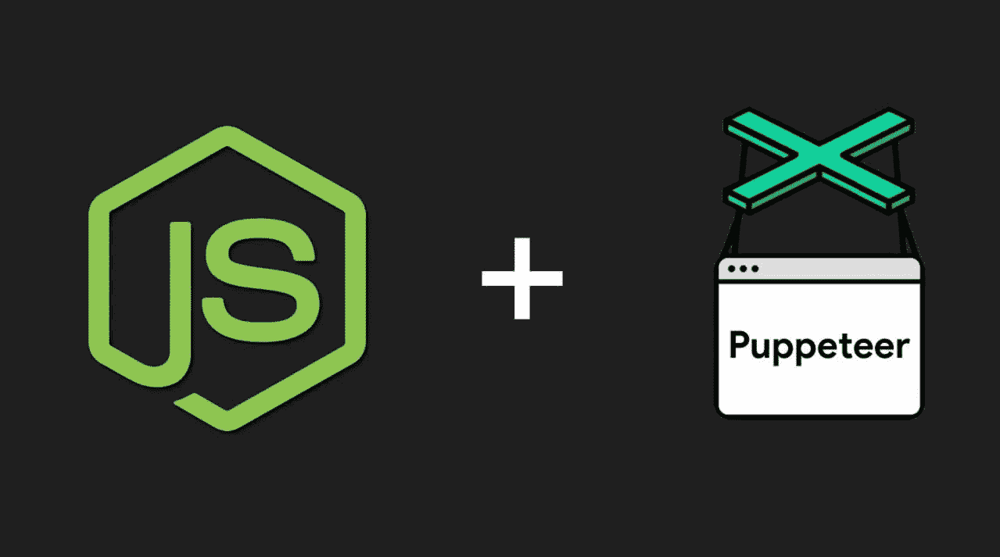
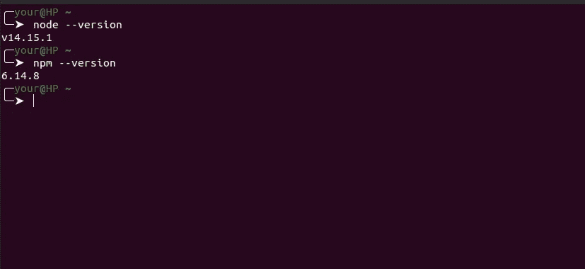
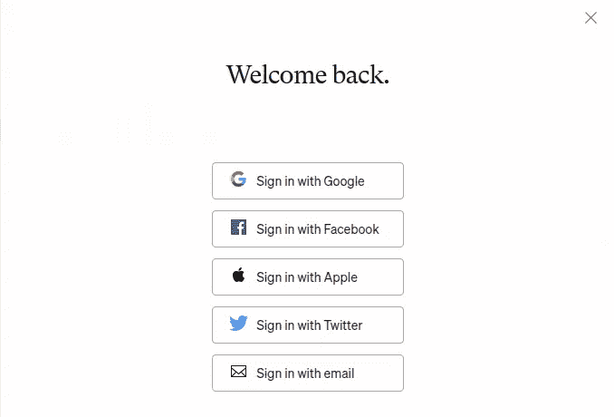
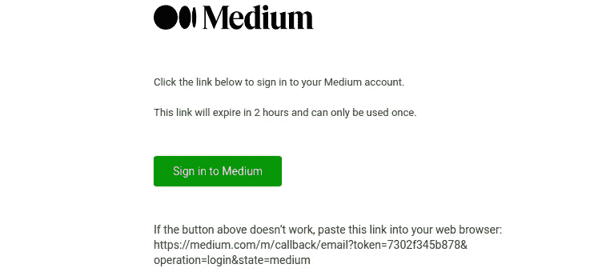
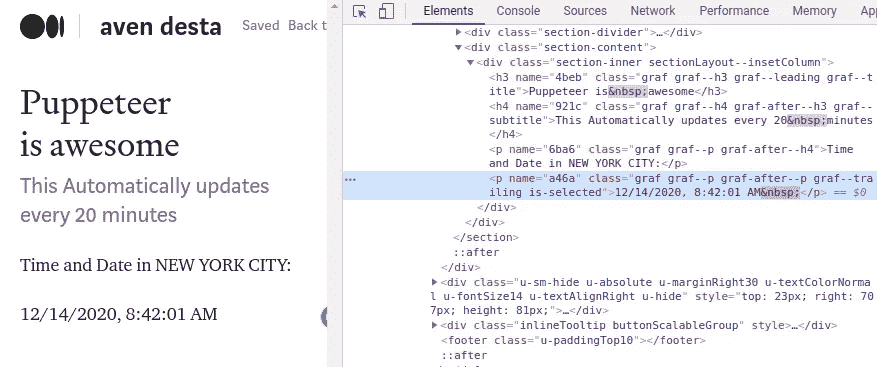
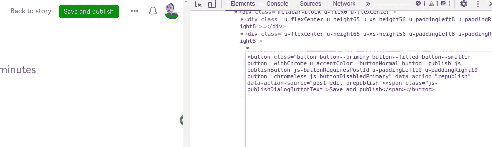
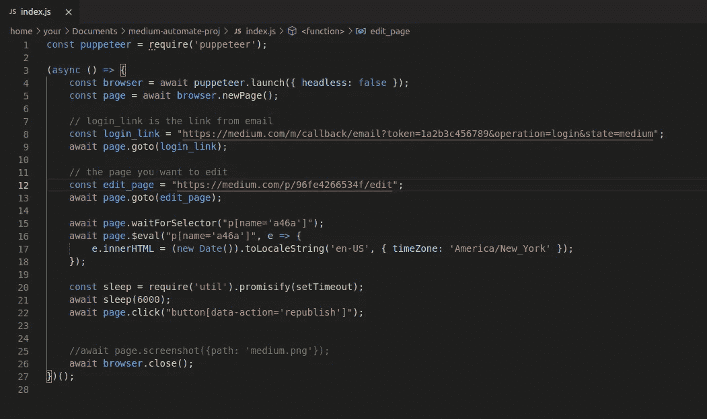

# 如何用 NodeJS 自动化媒体

> 原文：<https://medium.com/quick-code/how-to-automate-medium-with-nodejs-73c7ceed74bc?source=collection_archive---------1----------------------->

## [这个](https://avendesta.medium.com/puppeteer-is-awesome-96fe4266534f)故事每 5 分钟自动更新一次

[该](https://avendesta.medium.com/puppeteer-is-awesome-96fe4266534f)页面显示纽约市的当前日期和时间。页面会每五分钟更新一次，永远更新(当然，除非 Medium 出了问题！😂).我设法用**木偶师**做到了。



P [uppeteer](https://www.npmjs.com/package/puppeteer) 是 Google 开发的一个开源库，旨在自动化和简化前端测试和开发。基本上，一个人可以在浏览器上做的任何事情都可以用木偶师自动化。

木偶师可以自动执行的一些操作有:

*   生成页面的截图和 pdf。
*   自动化表单提交、UI 测试、键盘输入
*   更改页面中的 HTML 元素
*   创建一个最新的自动化测试环境。使用最新的 JavaScript 和浏览器功能，在最新版本的 Chrome 中直接运行测试。

*还有更多*。

希望，这是足够的介绍。现在让我们深入技术层面。

# 1.初始设置

与任何其他节点包一样，我们需要确保已经安装了 [nodejs](https://nodejs.org/en/) 和 [npm](https://www.npmjs.com/) 。如果您使用的是 Linux 或 macOS，使用这两个简单的命令来检查是否一切就绪。

```
> node --version
> npm --version
```



接下来，创建一个项目文件夹/目录，并初始化节点环境。然后用 npm 安装[操纵器](https://www.npmjs.com/package/puppeteer)。

```
> mkdir medium-automate-proj && cd medium-automate-proj
> npm init --yes
> npm install puppeteer
```

最后，确保一切都正常运行。让我们试着运行一个来自木偶师文档的样本脚本。脚本转到`[www.medium.com](http://www.example.com%60/)`，然后对页面进行截图并保存为`medium.png`。

*文件:index.js*

```
const puppeteer **=** require('puppeteer');(async () => {
const browser **=** **await** puppeteer.launch({headless:false});
const page **=** **await** browser.newPage();
**await** page.goto('https://medium.com');
**await** page.screenshot({path**:** 'medium.png'});
**await** browser.close();
})();
```

*输出:medium.png*


# 2.自动登录到介质

不登录您的媒体帐户，您无法编辑已发布的文章。那么我们如何自动化登录过程呢？

中提供了不同的登录方式。出于我们的目的，我们将使用“*通过电子邮件*登录。



输入您的电子邮件地址后，Medium 会给您发送一个指向您的电子邮件的特殊链接。任何人都可以使用此链接登录您的帐户。请注意，此链接只能使用**一次**，如果 2 小时未使用，将会过期。

您的令牌看起来像这样

```
*https://medium.com/m/callback/email?token=1a2b3c4d5678&operation=login&state=medium*
```



在这个阶段，理解下面的代码应该不难

```
const puppeteer = require('puppeteer');(async () => {
const browser = await puppeteer.launch({headless:false});
const page = await browser.newPage();// login_link is the link from email
const login_link = "YOUR LOGIN LINK";
await page.goto(login_link);
await page.screenshot({path: 'medium.png'});
await browser.close();
})();
```

上面的代码只是转到`www.medium.com`并截图保存为`medium.png`

# 3.编辑已发布的文章

不截图了，来做简单的自动化编辑吧。为了做到这一点，我们首先选择一个已出版的故事。然后尝试手动编辑。

当您尝试编辑一个故事时，Medium 会将您重定向到类似“https://Medium . com/p/96fe 4266534 f/edit”的 URL。这个 URL 实际上是我为那个故事编辑页面。

登录到我们的媒体帐户后，我们希望代码将我们重定向到编辑页面。所以让我们把这两行代码添加到我们的代码中

```
const edit_page = "https://medium.com/p/96fe4266534f/edit";
await page.goto(edit_page);
```

在您的编辑页面上，假设您想要编辑故事中的一行。你是怎么做到的？

木偶师为我们提供了`$eval()`功能来编辑页面上的元素。该函数接受两个参数。第一个是我们 HTML 页面上的一个元素，第二个是一个告诉 Puppeteer 如何处理该元素的函数。

例如:

```
await page.waitForSelector("p[name='a46a']");
await page.$eval("p[name='a46a']", e => e.innerHTML = "WOW");
```

这段代码将搜索一个`<p name='a46a' ...>`(并等待标签被加载)，然后将标签中的文本改为“WOW”。

即`<p name='a46a'...>WOW</p>`

注意`name='a46a'`对你来说不一样。你必须检查你的故事，找出你标签的名字。



现在我们的代码是:

```
const puppeteer = require('puppeteer');(async () => {
const browser = await puppeteer.launch({headless:true});
const page = await browser.newPage();// login_link is the link from email
const login_link = "YOUR_LOGIN_LINK_FROM_EMAIL";
await page.goto(login_link);
const edit_page = "https://medium.com/p/96fe4266534f/edit";
await page.goto(edit_page);await page.waitForSelector(p[name="a46a"]);
await page.$eval("p[name='a46a']", e =>{
   e.innerHTML = "WOW";
})//await page.screenshot({path: 'medium.png'});
await browser.close();
})();
```

但是我们想要的不仅仅是把文本改成' *WOW* '。也许我们想显示当前的时间和日期。好了，不要再说了。让我们使用`new Date`对象。

```
const puppeteer = require('puppeteer');(async () => {
const browser = await puppeteer.launch({headless:true});
const page = await browser.newPage();// login_link is the link from email
const login_link = "YOUR_LOGIN_LINK_FROM_EMAIL";
await page.goto(login_link);
const edit_page = "https://medium.com/p/YOUR_STORY_ID/edit";
await page.goto(edit_page);await page.waitForSelector(p[name="a46a"]);
await page.$eval("p[name='a46a']", e =>{
   e.innerHTML = (new Date()).toLocaleString('en-US');
})//await page.screenshot({path: 'medium.png'});
await browser.close();
})();
```

# 4.发布编辑过的故事

编辑完故事后，我们需要重新发布我们的故事，以使效果生效。为此，我们需要点击页面右上角的`save and publish`按钮。木偶师为我们提供了`click`功能来完成任务。该函数接受一个参数—要单击的 HTML 元素(按钮)。

```
await page.click("button[data-action='republish']");
```



但是这里有一个警告。用户需要等待几秒钟才能点击`Save and publish`按钮。这是我们代码的编辑。

```
// wait 6000 miliseconds then click
await page.waitFor(6000);
await page.click('button[data-action="republish"]');
```

# 5.前进的道路

我们目前的代码是



这里有几点需要注意。

*   首先，`login_link`应该在每次运行代码时更新。
*   如果不希望每次运行代码时都启动 GUI 浏览器，可以编辑`headless`属性。`{headless:true}`将避免启动 GUI (Chromium-browser ),一切都将在幕后完成。
*   您的代码只更新一次故事。但是你可以用`setInterval.`每分钟或每小时更新一次

到总结，我们能够使用 Puppeteer 自动编辑一篇中型文章，并且只需要不超过 20 行代码。上面的代码只是将我们故事的一个段落更改为日期时间，一次。但是那样做一点也不好玩。我想看看你能做什么有创意的事情！！

另外，你可以在这里找到我的代码。