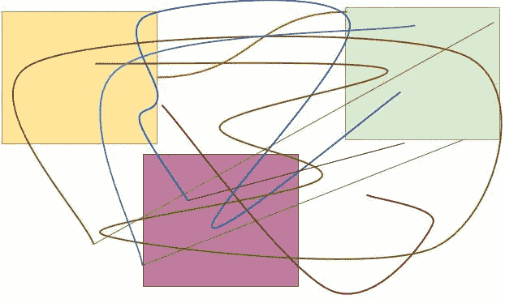
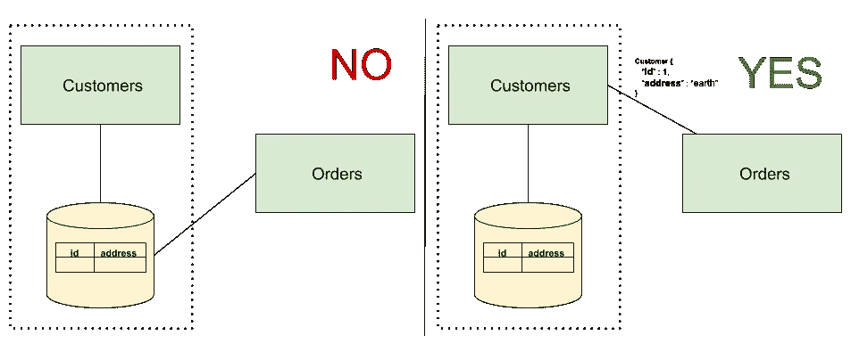
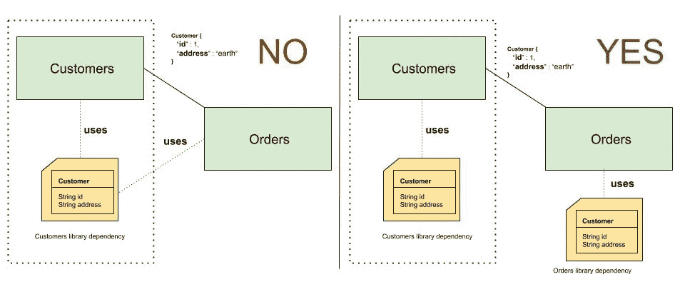
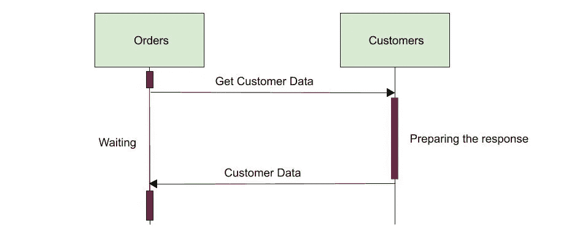
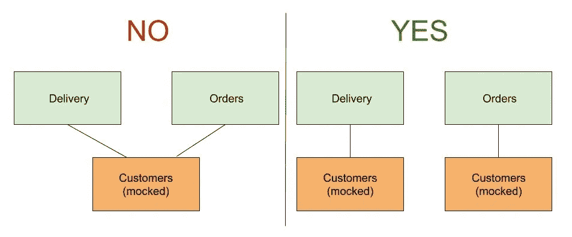
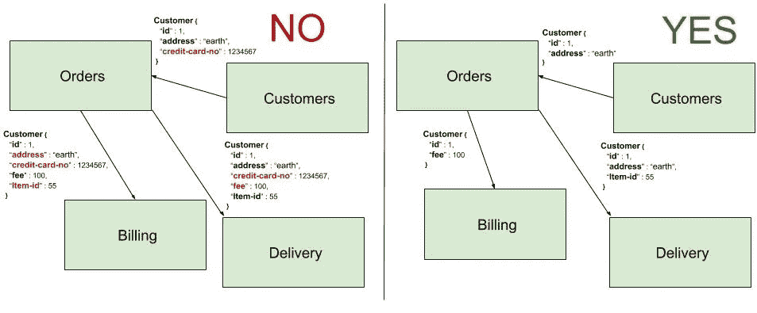

# 微服务设计中如何避免耦合

> 原文：<https://medium.com/capital-one-tech/how-to-avoid-coupling-in-microservices-design-b241d77ae233?source=collection_archive---------0----------------------->

## 通过不创建分布式整体来做好微服务

*Distributed monolith* 是一个有点幽默的短语，暗指设计不太好的微服务架构。由于忽视了[最佳微服务设计实践](https://www.capitalone.com/tech/software-engineering/10-microservices-best-practices/)，您不仅未能克服整体结构的缺点，还产生了新的复杂问题或加剧了现有问题。虽然你仍然可以自豪地称它为*微服务架构*，但这种设计缺乏足够的意图，并且不会与你的整体被随机爆炸粉碎成任意碎片有太大区别。嗯，也许没有那么糟糕，但你可能明白我的意思！

避免分布式整体结构的第一步相当容易。*完全避免微服务。单体是简单的，没有分布式系统的复杂性。一个数据库、一个日志位置、一个监控系统、简单得多的故障排除和端到端测试。但是如果你有*所有正确的理由*使用微服务，最好以这样一种方式采用它们，这样你就可以一直自豪地谈论你的创造。*

在本文中，我将重点介绍松耦合作为微服务设计原则的重要性。我将给出一些糟糕的设计决策的例子，这些决策违反了松散耦合，导致了分布式的整体结构。*生活已经很艰难了。你为什么要让它变得更难？*这就是为什么我要指出一些常见的设计错误，避免这些错误将有助于更平稳地过渡到微服务架构。

# 微服务中的松耦合？多给我讲讲！

如果一个系统的设计、实现或行为的变化不会引起另一个系统的变化，那么这两个系统就是松散耦合的。就微服务而言，如果一个微服务的更改会导致所有其他直接或间接与其协作的微服务立即发生更改，那么就会发生耦合。

让我们来看看耦合可能会在设计中造成漏洞的一些场景。

# 数据库共享

数据库共享是实现耦合的一种常见形式。当一个服务必须改变它的实现以响应另一个服务的实现改变时，实现耦合就发生了。

数据存储、模式和查询语言的选择是应该对客户端隐藏的实现细节；如果你共享你的数据库，你将会暴露他们。为什么要像这样隐藏实现细节？实施细节很容易在未来发生变化，可能会破坏我们客户的代码，除非他们同时采用相同的变化，但这并不总是可行或可持续的。在下面图 1 的左侧，客户正在与订单共享他们的数据库。因此，Orders 可以访问客户数据模型的细节，如果这些细节发生任何变化，都有可能中断。

## 改做什么？

如下面图 1 右侧所示，消除这种耦合的一种方法是让客户提供一个 API，订单可以用它来检索客户数据。只要客户致力于保持其当前的[合同](https://cloud.google.com/appengine/docs/standard/java/designing-microservice-api)有效，该数据的格式将保持不变。Orders 不知道这些数据来自哪里，客户可以自主决定将其数据库放入垃圾桶并用流数据源替换它，而不必担心破坏其他服务。

*Fig. 1 — Implementation coupling through database sharing*

# 代码共享

尽管有独立的代码库，微服务仍然会因为共享依赖库而陷入实现耦合的陷阱。除了产生耦合的危险之外，具有如此多依赖性的臃肿的共享库最终可能需要频繁的更新来满足客户不断变化的需求。因此，共享代码必须尽可能轻量级，具有有限的依赖性，并且应该排除特定领域的逻辑。

在下面图 2 的左侧，Customers 在一个由 Orders 共享的库中定义了 customer 对象。Customers 使用这个对象来模拟它对客户数据请求的响应。Orders 使用相同的对象来读取这些请求的响应正文。如果客户决定对客户对象的内部结构进行更改，例如将地址字段分成多个地址行，订单将会中断。注意，这种反模式也会影响客户对编程语言的选择。如果客户决定切换到不同的编程语言，它必须考虑所有其他使用其对象模型实现的服务。

## 改做什么？

客户和订单都应该在独立的依赖库中拥有自己的客户对象副本。只要客户信守合同，每个人都会开心！

请记住，你不是被雇来在每次发生变化的时候将一堆损坏的服务粘在一起的。你的任务是创建一个灵活的架构，并放弃分布式的整体！

Fig. 2–Implementation coupling through code sharing

# 同步通信

当一个服务(调用者)在继续处理之前，期望另一个服务(被调用者)的即时响应时，就会发生时间耦合。由于被呼叫者响应时间的任何延迟都会对呼叫者的响应时间产生不利影响，因此被呼叫者必须始终处于工作状态并做出响应。这种情况通常发生在服务使用*同步通信*的时候。

如下图 3 所示，客户准备数据的时间越长，订单在响应客户之前等待的时间就越长。换句话说，客户的延迟响应会导致订单的延迟响应。连锁故障也是另一种可能性；如果客户没有响应，订单最终会超时，也不会响应。如果客户在一段时间内继续缓慢或无响应，订单可能会以大量打开的客户连接结束，并最终耗尽内存，*失败*！为了提供令人满意的服务，订单应该消除时间耦合的基础。没有人希望顾客排着愤怒的队伍等待他们的订单到达，分布式平台的创造者也不例外。

*Fig. 3 — Temporal coupling caused by synchronous communication between services*

## 改做什么？

答案取决于你是在寻找一个长期的还是短期的解决方案。如果你别无选择，只能保持同步调用，你可以通过缓存对请求的响应或者使用[断路器模式](https://martinfowler.com/bliki/CircuitBreaker.html)作为控制级联故障的机制来减少时间依赖性。一个更好的替代方法是通过轮询或依靠像 Kafka 这样的消息代理将消息传输到目的地，从而切换到异步通信。当采用异步通信时，服务应该考虑与下游服务达到最终一致性状态的延迟会如何影响它们的响应时间，并做出必要的调整以避免破坏它们的契约。服务水平协议是合同的重要组成部分。

# 共享测试环境

当一个服务的持续集成或持续交付受到另一个服务的阻碍时，就会发生部署耦合。微服务应该是敏捷的，拥有独立的部署流程是实现这一目标的必要条件。

部署耦合的一个突出例子是当服务共享相同的测试环境时。想象一下，一个服务在最终部署到生产环境之前必须通过一个简短的性能测试。作为直接在生产中运行的性能测试的简化版本，管道的这一步旨在测试候选发布的性能。如果这个服务与另一个碰巧同时运行性能测试的服务共享它的测试环境，它们可能会由于发送意外的高流量而导致测试环境停止运行或饱和。最后的结果呢？不是一个快乐的人！*展开失败*。呸！

*Fig. 4 — Deployment coupling caused by sharing test environments*

在上面图 4 的左边，交付和订单都使用相同的模拟客户服务进行性能测试。Orders 团队最初设计这个模拟服务是为了在给定预先计算的资源量的情况下模仿客户的行为。通过添加交付，这些计算现在是无效的，并且在两个服务上同时运行性能测试会导致部署失败。因此，必须有人重新配置被模仿的服务，以使用更多的资源来模仿相同的响应速率。随着越来越多的服务开始共享同一个环境，这种情况还会继续下去。

## 改做什么？

相当容易！不要与任何人分享你的服务。

# 集成测试的下游服务

这也是部署耦合的一种形式。当针对微服务实例运行功能测试时，会发生这种情况，该微服务实例在非测试环境中直接调用其下游服务——希望这不同于生产环境！这种依赖性需要那些下游服务在整个测试过程中保持运行。下游服务的可用性或响应时间的任何滞后都会导致测试、构建管道和部署完全失败。一天失败了这么多！

## 改做什么？

除非你有一个非常好的理由，否则不要嘲笑你的下游服务来进行集成测试。如果您能够将它们封装并加载到托管测试中的微服务的同一个实例上，以避免网络连接问题，那将是最好的。

# 域数据的过度共享

领域驱动设计是将整块材料分解为微服务的推荐技术。一般规则是从每个业务子域一个微服务开始。每个微服务将在其子域边界内运行，而不必处理子域之外的任何事情。一个不欢迎入侵者的乌托邦。

如果微服务开始共享特定于域的数据，它们将通过域耦合创建一个分布式的整体，这违背了分离它们的边界的最初目的。服务无法控制其客户端如何处理共享数据。客户可能会无意中成为不属于自己的数据的来源，或者由于缺乏特定领域的知识而滥用数据。

此外，如果一个服务共享得太广泛，它可能会通过共享敏感数据引入安全威胁。你可能对你认为敏感的东西有完美的保护，但是不能保证你的客户也会这样做，因为这种责任或知识不属于他们的领域。

下面的图 5 显示了一个域耦合的例子。在图片的左侧，Orders 从客户那里获取客户数据，并接收客户的信用卡号和地址。然后它调用 Billing，传递除费用和商品 id 之外的所有数据。在计费成功向客户收费后，订单会将完全相同的一组数据字段发送至交付部门。然而，该图的右边显示了这些微服务之间的理想数据交换量。如果设计正确，计费应该是唯一拥有并存储计费信息的微服务。它不需要从其他服务接收它。

## 改做什么？

只分享你的客户绝对需要的数据。如果他们需要他们领域边界之外的东西，是时候重新考虑你的服务边界了。

*Fig. 5 — Domain coupling through excessive data sharing*

# 摘要

微服务是一种流行的架构风格，如果采用不当，可能会超过它的好处。为了避免过早设计的微服务网络，即*分布式整体*，您的系统需要作为一个整体诞生，并在以后分解为适当的微服务集。

当您将 monolith 迁移到微服务架构时，您的设计可能会在许多方面出错，缺少松散耦合绝对是需要注意的一个重要方面。耦合可以以不同的形式出现；*实施，【太阳时】，部署，*与*域耦合*。在本文中，我们看到了每种耦合类型的示例，以及一些建议的解决方案，以帮助您深思熟虑地避免每种情况。如果你已经有一个分布式的整体，不用担心！遵循本文中讨论的一些技巧，采取纠正措施永远不会太迟。

# 参考

萨姆·纽曼(2020)，[整体到微服务](https://samnewman.io/books/monolith-to-microservices/)。奥赖利。

Martin Fowler，[如何将一个整体变成微服务](https://martinfowler.com/articles/break-monolith-into-microservices.html)。

*最初发表于*[*【https://www.capitalone.com】*](https://www.capitalone.com/tech/software-engineering/how-to-avoid-loose-coupled-microservices/)*。*

*披露声明:2021 首都一号。观点是作者个人的观点。除非本帖中另有说明，否则 Capital One 不隶属于所提及的任何公司，也不被这些公司认可。使用或展示的所有商标和其他知识产权是其各自所有者的财产。*