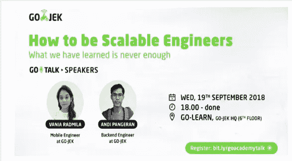

# How to be Scalable Engineers

> 原文：<https://medium.easyread.co/how-to-be-scalable-engineers-what-we-have-learned-is-never-enough-cd80d6d007f1?source=collection_archive---------2----------------------->

## What we have learned is never enough

Sumber: [http://digitalassess.com/wp-content/uploads/2017/01/machine-learning-1.png](http://digitalassess.com/wp-content/uploads/2017/01/machine-learning-1.png)

Kira-kira seminggu yang lalu, saya mengikuti acara *Go-talk* yang dibawakan oleh **Vania Radmila** dan **Andi Pangeran,** *Engineer* dari *GO-JEK* . Kali ini, acara ini mengangkat mengenai *“* ***How to be Scalable Engineers: What we have learned is never enough”* .** *Nah* , melalui artikel ini saya akan merangkum hasil presentasi dari Andi Pangeran.

# **Apa sih sebenarnya Scalability?**

***Scalability*** adalah kemampuan suatu sistem, jaringan, atau proses untuk menangani jumlah pekerjaan yang terus bertambah, atau potensi untuk diperbesar guna mengakomodasi pertumbuhan tersebut. Dalam tahap membuat aplikasi yang memenuhi *scalability* maka seorang *engineer* harus mampu cepat beradapatasi. Berikut adalah beberapa cara untuk menjadi seorang *scalable engineer* .

## Era of Disruptive Technology

Pada era ini *engineer* dituntut mampu memahami teknologi yang berkembang saat ini seperti *Machine Learning, IOT, Blockchain, Artificial Intelligence, Reactive System, Cloud Computing* , dan lain sebagainya.

## Demands of Environment

*Nah* , disini *engineer* diharapkan beradaptasi dengan tuntutan lingkugan bekerja atau menjadi agen perubahan untuk memberikan teknologi baru di sekitarnya, seperti.

**Menggunakan *Agile Methodology*** . Banyak cara dalam pengembangan aplikasi namun *agile* memiliki kelebihan karena bersifat cepat, ringan, bebas bergerak dan waspada. Pengembangan dengan metode ini mengizinkan para *engineer* untuk lebih fokus dan dapat mengukur kemampuan tim.

***Architecture*** . Memilih arsitektur yang tepat untuk memenuhi prinsip *scalable* adalah dengan menggunakan *microservice* . *Microservice* disini dimaksud dengan membuat arsitektur yang memisahkan setiap komponen-komponennya.

***Programming Language*** . Mengetahui beberapa jenis bahasa pemrograman sangat membantu untuk tetap bertahan dalam perkembangan teknologi.

***Tools/Library,* dan sebagainya** . Untuk mempermudah pengerjaan jangan lupa juga untuk menggunakan *tools* penunjang yang dapat membantu menyelesaikan persoalan kita, seperti penggunaan *version control* , CI/CD, dll.

# Learning All The Time

Untuk tetap bisa *survive* dengan perkembangan teknologi, ada beberapa tips yang dapat dilakukan yaitu:

## **Set up Your Learning Ritual**

Memiliki cara belajar sendiri sangat efektif untuk menambah ilmu terlebih jika sudah direncanakan sebelumnya. Menyisihkan sebagian waktu pribadi untuk mempelajari ilmu baru akan lebih baik jika dilakukan dengan konsisten dan disiplin. Belajar jangan hanya sekedar untuk mengetahui saja. Contohnya jika menggunakan *library* sebaiknya melihat codingannya secara langsung walaupun hanya sekedar membaca penjelasannya. Untuk pembelajaran *programming* jangan lupa untuk melakukan push ke *github* atau lainnya sebagai sejarah pembelajaran.

## **Leave Your Comfort Zone, Became T-shaped**

Bar Vertikal dari T mengacu pada pengetahuan dan pengalaman sedangkan bagian atas T mengacu pada kemampuan untuk berkolaborasi dengan para ahli dari ilmu disiplin lain. Hubungannya dengan membangun suatu sistem yaitu *engineer* harus mampu berkolaborasi dengan orang non IT, misalnya dengan orang bisnis.

## **Pay More Attention To Technology Fundamental**

Ada beberapa hal yang perlu diperhatikan dalam fundamental teknologi yaitu sebagai berikut.

*   Memahami dasar struktur data seperti *list, set, map,*
*   Memahami manajemen memori ( *heap/stack* dan *garbage collector* ),
*   Mempelajari tentang *concurrency* dan *parallelism* , dan
*   Memahami paradigma komunikasi, *synchronous* dan *asynchronous* .

## **It Takes Craftsmanship To Do Good Engineering**

Sebagai seorang *engineer* sangat diperlukan untuk membuat program dengan *clean code* , telah di *test* dan dapat di *refactor* . Diperlukan juga prinsip-prinsip yang dapat membuat *code* yang mudah di- *maintain* dan di- *extend* . Salah satu prinsip yang dapat digunakan yaitu dengan menggunakan prinsip **S.O.L.I.D** .

> Software development is a learning process, working code is a side effect — Alberto Brandolini

**Thanks to — Vania Radmila and Andi Pangeran**

# **Reference :**

**GO-TALK Presentation by Vania Radmila and Andi Pangeran**