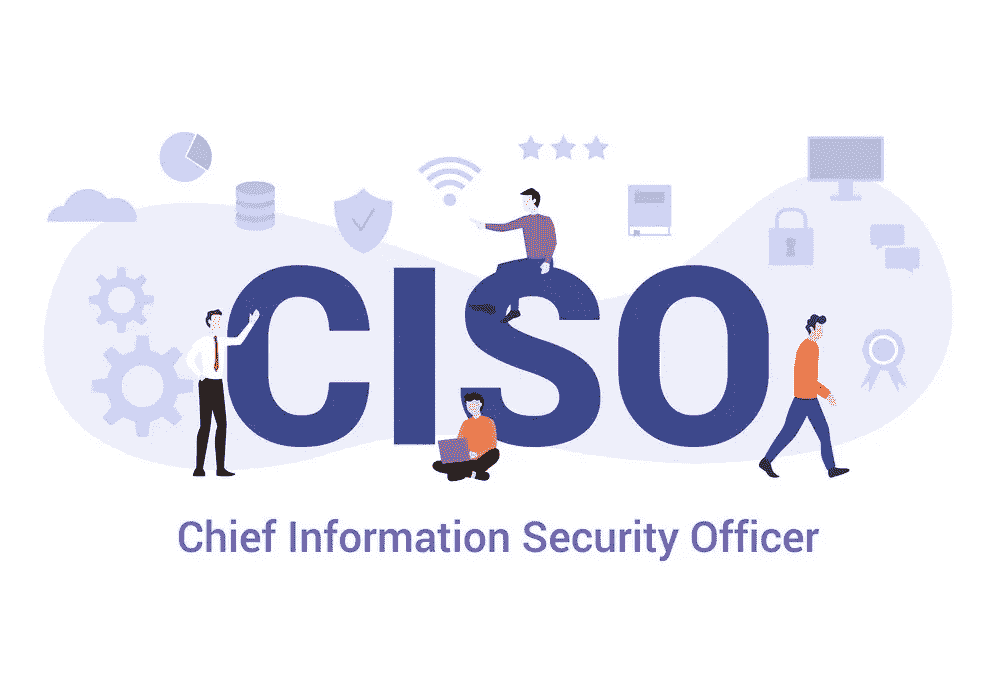

# 如何成为首席信息安全官(CISO)

> 原文：<https://medium.com/quick-code/how-to-become-a-chief-information-security-officer-ciso-5541e488921a?source=collection_archive---------0----------------------->

2020 年，网络安全实施仍然是各组织面临的最大挑战。国内和全球的网络攻击都在增加。

涉及个人信息、银行记录和信用卡号的数据泄露一直是企业和政府所关注的一个重要问题。因此，对首席信息安全官(CISOs)的需求持续增长。

成为一名 CISO 需要广泛的 IT 经验、教育、强有力的领导和沟通技巧。

如果你想知道如何成为一名 CISO，你可以采取一些关键步骤，让你的简历与公司正在积极寻找的安全技能和经验保持一致。更多关于 CISO 的信息请登陆 [**网络安全在线培训**](https://onlineitguru.com/cyber-security-training.html)

# 什么是 CISO？

CISO 是组织中管理信息安全的首席执行官。此角色负责确保所有 IT 技术和信息资产得到充分保护，并符合公司目标。

首席信息安全官的日常职责因公司和组织结构而异。责任可以包括:

*   雇用和管理安全和 IT 专业人员
*   跨多个部门协作开发和维护安全的 IT 基础架构
*   与执行团队合作创建战略性 IT 安全计划
*   引领信息安全解决方案的发展
*   从最初的响应到解决，管理网络安全事件
*   领先的员工教育计划
*   规划、监控和预测安全预算
*   监督软件发布和升级
*   建立远程员工入职流程
*   确保网络升级和重大 IT 项目在不影响安全性的情况下进行

真正的 CISO 只关注安全，但首席信息安全官和首席信息官(CIO)之间的界限在整个组织中可能会变得模糊。

# 顶级 CISO 技能

CISO 的角色不仅仅是信息安全方面的专家。它将技术和安全需求与组织的整体愿景和业务目标联系起来。

虽然日常角色各不相同，但该职位的技能分为三个不同的领域:

*   风险和合规管理
*   技术 IT 专业知识
*   沟通和领导技能

# 1.风险和合规管理

组织依赖各种应用程序、工具、第三方供应商和托管安全服务来自动化和简化其工作流程。

IT 安全环境不再局限于组织内部。它包含了供应商、合作伙伴、远程工作人员、工具和流程的广泛网络，这些网络带来了新的安全挑战，并使风险管理成为 CISOs 的一项关键技能。

CISOs 需要充分了解其组织内所有数据的流动，并且必须定义和管理安全策略以防止信息丢失、损坏、伤害或被盗。

合规性是首席信息安全官的另一个重点关注领域。他们需要跟上不断变化的行业法规，如 FINRA、HIPAA 和 PCI，并确保他们的政策和数据实践符合要求。

组织面临的合规性相关问题还包括个人移动设备管理、软件和补丁程序管理、GDPR 和物联网(IoT)。这些任务也可能由 CISO 负责。

# 2.技术 IT 专业知识

CISOs 需要精通管理复杂的 IT 架构。虽然他们可能不参与日常执行，但他们定期监督广泛的 IT 运营任务，包括漏洞扫描、渗透测试和 web 应用程序安全评估。

雇主要求的一些顶级技能包括:

*   安全架构开发
*   移动和远程设备管理
*   灾难恢复规划
*   网络安全和防火墙管理
*   身份管理
*   危机应对和补救
*   应用程序和数据库安全性
*   数据和信息管理(分类、保留和销毁)

# 3.沟通和领导技能

CISO 是组织中最引人注目的 IT 职位之一。CISOs 必须与运营团队、设计师和开发人员紧密合作，以实现安全目标。

首席信息安全官的影响还不仅限于技术团队。他们必须能够自如地与同行高管、员工、股东、投资者和安全专业人士交谈。强大的沟通技巧是这一角色的重要组成部分。

> 要成为一名职业黑客，需要通过 [**职业黑客在线培训**](https://onlineitguru.com/ethical-hacking-course.html)

建议的培训课程:

*   在您的组织内沟通
*   为商务专业人士写作
*   发现你的领导力声音

# CISO 薪金

不断上涨的薪水和对首席信息安全官的需求巩固了他们在现代组织中不可或缺的作用。PayScale 的数据显示，CISO 在美国的薪资中值超过 15.8 万美元。

这个行业的就业前景继续看好。据估计，到 2021 年，将有 350 万个网络安全职位空缺。

# 如何成为 CISO

成为 CISO 不是一条直线路径。但是你可以采取几个步骤来帮助你培养成为 CISO 角色所需的技能。

# 第一步。获得学士学位

CISO 的教育要求通常包括获得学士学位。选择计算机科学、信息技术、商业或相关领域的学位。

# 第二步。获得 IT 安全体验

平均而言，CISO 角色需要 7-10 年的渐进式 IT 安全经验。编程、信息安全、风险管理和政府部门的工作都是 CISO 职位的重要组成部分。安全分析师、道德黑客和安全架构师等角色也非常适合有志成为 CISOs 的人。

# 第三步。完成 IT 安全认证和培训

没有一个特定的 CISO 证书会最终使你有资格担任这个角色。然而，投资于以安全为重点的 IT 认证和培训计划表明了您对该领域的承诺，并有助于提高您的 IT 敏锐度。以下是一些可以获得的相关网络安全认证:

## 认证授权专家

CAP 认证证明您拥有授权和维护信息系统所需的能力和技能。

获得 CAP 认证有助于您保护信息系统，并最大限度地减少潜在风险、损害或资产。它面向在政府、军队或私营部门组织中使用风险管理框架(RMF)的 It、信息安全和信息保障从业者。

*   先决条件:在 CAP 共同知识体系(CBK)的七个领域中的一个或多个领域有至少两年的累计带薪工作经验。
*   建议课程:认证授权专业训练营

## 注册信息系统安全专家(CISSP)

CISSP 是全球公认的信息安全认证，涵盖了实施和管理安全计划的技术技能。这是安全审计员、架构师、系统工程师和 CISOs 的理想认证。候选人可以通过管理、安全架构或系统工程专业认证。

*   前提条件:需要至少五年的直接全职信息安全领域工作经验，才有资格获得此认证。
*   建议课程:认证信息系统安全专家(CISSP)

# 第四步。积累你的管理经验

大多数 CISO 职位需要丰富的管理经验。一旦你建立了一个基础的 IT 安全背景，寻求管理安全团队的 IT 职位。在 [**网络安全培训**](https://onlineitguru.com/cyber-security-training.html) 上获得 CISO 证书和现场免费演示

# 获得您的 CISO 认证

成为首席信息安全官需要 IT 和领导技能的独特结合。作为全球领先的培训中心，提供您所需的技术和领导力课程，让您为充实的长期职业生涯做好准备。无论您是刚刚开始您的 IT 安全职业生涯，还是想要磨练您的技能，都有帮助您实现目标的课程。