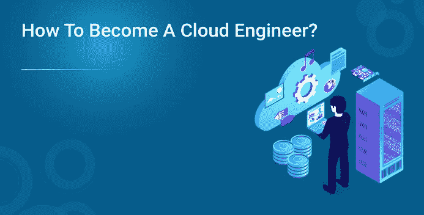
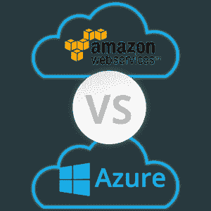

# 如何成为云工程师？

> 原文：<https://medium.com/edureka/how-to-become-a-cloud-engineer-983870f730a2?source=collection_archive---------0----------------------->

***云计算*** 的兴起席卷了技术世界。随着它的受欢迎程度呈指数增长，每个人都想抓住机会成为这个看似不断增长的领域的一部分。因此出现了一个至关重要的问题，即“如何成为一名云工程师？”。如果这个问题引起了你的兴趣，那么这篇文章将回答你围绕这个话题的所有问题。

在我们继续之前，让我们简单地了解一下**云计算**，作为一名云工程师，你应该知道一些事情。

# 什么是云计算？

互联网的兴起带动了 IT 行业和整个计算的兴起。下面列出了现代计算面临的一些问题:

*   优化昂贵的服务器设置
*   监控和管理整个基础架构
*   注意安全
*   方便地放大和缩小

如果别人能帮你做呢？你只需支付很少的费用就可以使用所有的服务。嗯，云或云计算正是为你做的。它为你协调上述所有任务，你只需为你使用的服务付费，就像你为电费付费一样。

简而言之，云计算*是协调数据的存储、计算和检索*的过程，以优化和简化巨大的在线空间(数据中心网络)的计算过程。

回到手头的主要问题“如何成为一名云工程师？”,

# 如何成为云工程师？

云工程师是一名 IT 专业人员，负责履行与云计算相关的技术职责。他或她主要负责:

*   维护和支持
*   管理
*   云基础架构的规划和设计

这意味着您作为 ***云工程师*** 的角色可能会因您所服务的垂直行业而异。你可以担任:

*   云安全工程师
*   系统工程师(云)
*   云开发者
*   云架构师
*   网络工程师(云)

因此，在你寻求成为*云工程师的过程中，你将不得不设定一条满足上述部分或大部分职责的道路。让我们从用粉笔画出的方法开始*

# *从基础开始*

*我已经为你定义了云计算，但是从更深入地理解 ***云计算*** 开始。重点关注以下几点:*

*   *云计算的需求*
*   *域云计算的影响*
*   *云服务模式*
*   *部署模型*
*   *云计算与内部部署方法*
*   *不同的云服务提供商*

*这些话题将构成你实现目标的核心，因为这些话题将帮助你了解作为一名 ***云工程师*** 你想担任什么角色。它有时会让你意识到云。*

# *了解计算基础*

*现在，无论你是新生还是专业人士，你都应该掌握一些基础知识。在您开始实践云计算之前，您需要考虑以下一些基础知识:*

*   *网络(路由、IP 地址、网络层、网络协议等)*
*   *计算机安全(访问策略、加密、数据安全等基础知识)*
*   *计算机体系结构(尝试理解系统设计原则和相关的基础知识)*
*   *学习 pl/SQL 和 Linux 基础知识*

# *了解云服务提供商*

**

*阅读并了解不同的 ***云服务提供商*** 。所有这些服务提供商都免费向您提供他们的门户和控制台。注册这些课程，获得一些实践服务。*

# *实际实施*

*既然基础知识和 ***先决条件*** 都已经解决了，那么让我们来看看你应该关注哪些主题来获得实际的专业知识。以下是主题列表:*

**

*   *计算服务*
*   *存储服务*
*   *数据库服务*
*   *网络或 VPN*
*   *负载平衡和扩展*
*   *云监控*
*   *应用程序迁移*

*如果你能使用上面提到的任何服务提供商来掌握这些服务。在前面提到的任何一个垂直领域，您都有 70%的机会成为云工程师。等等，我刚才是说 70%吗？。你没听错。*

*作为一名云开发人员，您可能需要掌握一些开发技能并理解脚本。作为云管理员，您需要具备管理角色方面的知识。作为解决方案架构师，您需要了解云是如何工作的，以及如何为您的组织设计合理的应用程序。所以也要在这些方面下功夫。*

# *采取结构化的方法*

*到目前为止，您已经掌握了足够的知识来成为一名云工程师？你应该更进一步。所有的云服务提供商都有官方认证。通过浏览这些提供商各自的网站，选择所需的认证和角色。然后开始准备认证，这将帮助你修正你的概念，你也将在这个过程中获得实践。尝试在一个相似的领域进行一个项目，并努力去做。同样，AWS 和 Azure 的网站上都有足够的**样本** **项目**，足以让你入门。*

# *投入的时间*

*学习过程没有明确的时间表，不同的人可能需要不同的时间来达到各自的目标。但是，我们总能有一个大概的估计。这是给你的:*

*   *基础知识(2 周/20 小时)*
*   *计算基础(4 周/40 小时)*
*   *实际实施的服务提供商(4 周/40 小时)*
*   *项目(2 周/20 小时)*
*   *认证准备暂定(4 周/40 小时)*

*我们已经涵盖了我希望你关注的所有基础。这就把我们带到了这篇关于“如何成为云工程师”的文章的结尾。我希望这篇文章能帮助你澄清所有的疑问，并且我希望你对成为云工程师的途径有一个更清晰的认识。如果你想查看更多关于 Python、DevOps、Ethical Hacking 等市场最热门技术的文章，你可以参考 Edureka 的官方网站。*

*请留意本系列中解释 Azure 其他方面的其他文章。*

> **1。* [*蔚蓝教程*](/edureka/azure-tutorial-5a97e30ee9a7)*
> 
> **2。* [*Azure 门户*](/edureka/azure-portal-all-you-need-to-know-about-the-azure-console-8ade1effa474)*
> 
> **3。* [*Azure 存储教程*](/edureka/azure-storage-tutorial-an-introduction-to-azure-storage-dae8fd8f555c)*
> 
> **4。* [*蔚蓝专用网*](/edureka/azure-virtual-network-securing-your-applications-using-vpc-744eba3aa5b1)*
> 
> **5。* [*Azure DevOps 教程*](/edureka/azure-devops-cf755fb334ae)*
> 
> **6。* [*天蓝色木板*](/edureka/azure-boards-ce093b2688bb)*

**原载于 2018 年 11 月 13 日*[*https://www.edureka.co*](https://www.edureka.co/blog/how-to-become-a-cloud-engineer/)*。**