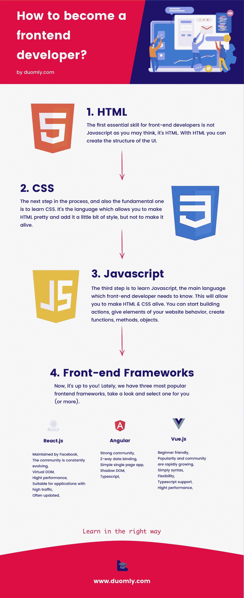

# 如何成为一名前端开发者？

> 原文：<https://medium.com/duomly-blockchain-online-courses/how-to-become-a-front-end-developer-400649cc98a5?source=collection_archive---------0----------------------->

[Duomly — programming courses online](https://www.duomly.com)

本文最初发表于:[https://www . blog . duomly . com/what-do-you-need-to-learn-to-be-a-front-end-developer/](https://www.blog.duomly.com/what-do-you-need-to-learn-to-become-a-front-end-developer/)

最近，很多人问他们应该学习什么才能成为一名前端开发人员。如何学习前端虽然要学的东西那么多，一切变化都那么快，新技术，新的热门库几乎一年一次。当你开始阅读关于它的文章和新闻时，你会感到失落。所有这些技术反应过来，Angular，Vue.js，jQuery，Javascript，甚至 Bootstrap 到处都是。在这一点上，你可能想知道如何和从哪里开始，并最终变得擅长它。

在本文中，我将尝试回答这个问题，向您解释前端开发人员每天都在做什么，以及您应该采取哪些步骤来实现您的目标，哪些是必不可少的，哪些不是那么重要。

# 什么是前端，前端开发者做什么？

前端是应用程序的一部分，我们作为用户可以看到并与之交互。从更技术性的角度来看，它负责从用户那里收集数据，并将数据传递给后端，并向用户显示后端数据。但是前端开发人员还有一个任务，他或她需要实现设计师的想法。

那么，一个优秀的前端开发人员需要具备哪些技能呢？

[Duomly — how to become a front-end developer](https://www.duomly.com)

# 从 HTML 开始

你需要掌握的第一个技能(实际上是最基本的技能)是 HTML(超文本标记语言)，这是前端开发的基础。HTML 创建了我们网站或应用程序的框架。它创建块、元素，如菜单、图像、文本、视频、表格、输入等。不过好消息是，不需要很长时间就能熟悉。经过大约一周的学习和练习，你将能够用 HTML 创建第一个项目。请记住，HTML 不会将颜色和所有的美应用到你的元素中。接下来是你需要掌握的技能。

# 继续使用 CSS

下一件你必须知道的事情是 CSS(层叠样式表)，它将伴随你的整个前端职业生涯，所以最好熟悉它。您将使用 CSS 为您的页面添加一些样式。使用 CSS，你可以创建所有元素的位置，给它们颜色，对齐，字体，大小，边距，甚至一些动画。从一个角度来看，CSS 在开始时非常容易，但是当你试图掌握它时，你会发现背后隐藏着多少你不知道的东西。你学习 CSS 的方法应该让你在一生中不断学习新的技巧。

现在是练习的时候了，有了 HTML 和 CSS 你就可以创建漂亮的网站、仪表盘、UI 或 UI 元素。你创造的越多，你的知识就越丰富。

在这一点上，最好仔细看看像 Bootstrap 或 UI Semantic 或 Foundation 这样的 UI 库。不要害怕；学其中一个就够了，知道怎么用所有的。我建议从 Bootstrap 开始，因为它是最受欢迎的，很多公司都在使用它。

另外在这一点上还有一件事要提到。你需要找出什么是响应式设计和媒体查询，因为在 2019 年，你的项目必须是移动友好的。现在我们可以进入下一步了。

# 深入了解 Javascript

现在让我们从更严肃的事情开始。你必须学习 Javascript 来为你的网站或应用程序增加更多的功能。使用 JS，你可以添加图像滑块、表单验证、弹出窗口、工具提示和许多其他交互式元素。还可以创建到后端的连接，并通过 API 调用发送数据。当然，当你掌握了 Javascript 知识时，你必须进行大量的练习。对于学习 Javascript 的，你可以使用****上的课程，在那里你也可以编写一些代码。如果您在开发过程中遇到任何问题，您可以随时查看文档或询问任何脸书小组、Stackoverflow 或任何编程论坛上的其他 Javascript 社区成员。****

****好像就这样了？不幸的是没有，现在学习一些前端开发的现代框架会很好。让我们进入下一步。****

# ****使用 JS 框架****

****很多步骤已经完成，现在我们可以更深入地研究可能有用的现代 Javascript 框架和库。你可能会问为什么你必须学习框架，但是答案很简单，它会对你的开发有很大的帮助。该框架将为您提供基本结构、一些指南，甚至一些预构建元素。此外，几乎每个公司都使用任何框架，因此更容易得到你梦想的工作。****

****目前市场上有三种最流行的前端框架:React、Angular 和 Vue。让我们仔细看看它们:****

****ReactJS —这是一个由脸书创建的基于组件的库，它是一个构建 UI 的优秀工具。ReactJS 并不复杂，如果你现在懂 Javascript 的话就不应该如此，而且有一个庞大的开发人员社区和大量的资源，你可以用它们来阐明你需要知道的一切。****

****如果您想熟悉 ReactJS，请查看我们准备的教程:****

****构建 ReactJS 应用程序:****

**** [## 如何在 5 分钟内创建 React app？- Duomly 博客-在线编程课程

### React.js 是当今最流行的前端框架之一，很多人觉得学习它很有用。之后…

www.blog.duomly.com](https://www.blog.duomly.com/how-to-create-react-app-in-5-minutes/) 

[https://www.youtube.com/watch?v=SPM4xyYd9MI](https://www.youtube.com/watch?v=SPM4xyYd9MI)

**Angular** —这是一个非常受欢迎的谷歌前端框架，这里有一个棘手的问题，使用 Angular 你需要更新你的知识并添加 Typescript(它非常类似于 Javascript，但它是类型化的，有更多的附加功能)。Angular 也有优秀的文档、大量的资源和一个大的社区。

如果你想熟悉 Angular，看看我们准备的教程:

构建角度应用程序:

【https://www.blog.duomly.com/angular-tutorial/ 

[https://www.youtube.com/watch?v=WYRLYw2rYj0](https://www.youtube.com/watch?v=WYRLYw2rYj0)

Vue.js —这是一个广受欢迎的新框架，它是一个基于组件的框架。Vue.js 的创建者试图让它尽可能简单，以便它可能是初学者的正确选择。另一方面，学习 it 的资源不是很大，社区很小但在不断增长。

现在是你选择的时候了。如果您不确定，也许用它们中的每一个来构建一个测试项目并检查哪一个您觉得合适是个好主意。看起来这就是你需要知道的一切，但是还有一件必要的事情。让我们进行最后一步。

如果你想熟悉 Vue.js，看看我们准备的教程:

构建一个 Vue.js 应用程序:

[https://www . blog . duomly . com/vue-js-tutorial-how-to-create-vue-js-app-in-5-minutes/](https://www.blog.duomly.com/vue-js-tutorial-how-to-create-vue-js-app-in-5-minutes/)

[https://www.youtube.com/watch?v=i43MZ_oSRfs](https://www.youtube.com/watch?v=i43MZ_oSRfs&t=72s)**** 

# ****用 Git 结束****

****你最不应该学的是 git(版本控制系统)，初级开发人员经常会跳过，但几乎每个公司都在用，知道它的工作原理非常有用。它主要用于开发人员在一个代码上的协作。您应该通过在您的机器上安装 g it 来开始学习 git。对你来说，在 Github 或 Bitbucket 上创建你的 repo 并在那里存储你的代码是正确的。看一下文档，学习基本的命令，并了解什么是分支、提交或代码审查。好像就这样了。****

# ****结论****

****现在你需要创建你的新简历，并开始寻找前端开发工作或开始自由职业；决定权在你。****

****你必须记得阅读编程新闻和文章，以了解前端世界的所有新事物，尝试新技术，并随时掌握你的知识。创建新项目并尝试改进它们，避免糟糕的编码实践。****

****我希望这篇文章回答了所有最重要的问题，并将帮助你实现你的目标。****

****祝你事业顺利！****

********

****[Duomly — programming online courses](https://www.duomly.com)****

****感谢您的阅读。****

****本文由我们的队友安娜提供。****