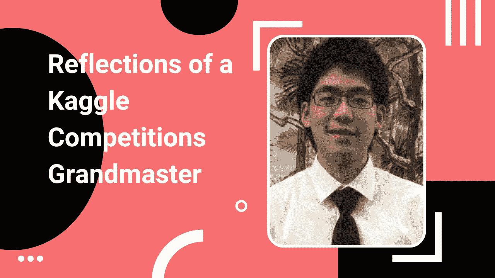

# 如何成为 Kaggle 比赛的特级大师

> 原文：<https://medium.com/google-developer-experts/how-to-become-a-kaggle-competitions-grandmaster-19e221a6c2ff?source=collection_archive---------1----------------------->

## 编剧 001 —何淑君

在这个记者的首次采访中，我和何树军在一起。舒俊是德克萨斯 A&M 大学的一名研究生，也是一名高尔夫球比赛的特级大师。要成为一名卡格尔比赛特级大师，你需要 5 枚金牌和至少一枚单人金牌。在这段对话中，我们探索了他成为卡格尔比赛大师的旅程，以及他从那段经历中学到了什么。

我们开始吧。

## 你是怎么开始做 Kaggle 的？

我在大学期间玩过星际争霸 2，在 [Deepmind 的 AlphaStar](https://www.deepmind.com/blog/alphastar-mastering-the-real-time-strategy-game-starcraft-ii) 之后对深度学习非常感兴趣。后来在谷歌上搜索深度学习相关的东西时偶然发现了 Kaggle。我的第一个竞赛是“预测分子性质”，因为这也与我当时的博士研究有关。那时，一切都显得非常复杂和困难，因为对我来说，即使只是以正确的格式制作一个提交文件也要花很长时间。我在 2739 名参赛者中排名第 1294 位，所以没什么可夸耀的，但我在那场比赛中学到了很多。重要的是，那次比赛中的顶级解决方案给我留下了非常深刻的印象，并给了我一些有用的想法和灵感来参加未来的比赛。

## 一个人需要做什么才能成为一名高尔夫比赛大师？

首先，坚持不懈的努力是必须的。接下来，你需要擅长编码，阅读和理解别人的代码。能够快速从互联网、Kaggle 论坛和 Kaggle 笔记本上吸收信息也是表现出色的关键。此外，对所有不同算法的基本理解，不管是不是机器学习，都至关重要。对试图建模的数据的良好理解也很重要，因为这将有助于选择要使用的最佳方法/算法。精神上的坚韧是很重要的，因为一个人需要能够在压力下做出好的决定，也因为特级大师需要一枚单人金牌——单人比赛可能会非常有压力。最后但同样重要的是，一点运气，因为在 5 个不同的比赛中持续排名前 1%是很困难的，即使是最好中的最好。

## 在团队中工作对成为一名高尔夫比赛大师有什么作用？

在团队中工作是很重要的，因为即使只是简单地集合来自不同队友的解决方案通常也能带来更好的结果。与其他顶级竞争对手一起工作总是一种乐趣，并使事情变得容易得多。然而，对于初学者来说，可能很难找到好的队友，所以最好是独自比赛，首先确立自己的地位，这就是我所做的。我的第一枚金牌是个人金牌，因此我名声大振，这也吸引了其他竞争者想和我组队。

## 你参与过的最有趣的 Kaggle 比赛是哪一个？

我的第一个竞赛是“预测分子性质”，因为那时一切对我来说都是相对未知的，这使它变得有趣，也是一次很好的学习经历。

## 你参与过的最具挑战性的 Kaggle 比赛是哪一场，你从中学到了什么？

我最具挑战性的比赛可能是“Sartorius-Cell Instance Segmentation”，这是一个对象检测比赛，因为我必须使用不同于 PyTorch (detectron 2)的框架。更糟糕的是，我在比赛的最后几天生病了。我对物体检测相对不熟悉，并且很晚才开始比赛(大约还有一个月)，所以我知道如果我想做一些新的事情，我应该分配足够的时间来学习这个领域，一个月可能不够。

## 参加 Kaggle 比赛可以获得哪些技能？

参加卡格尔比赛可以学到很多技能。首先，它正确地进行验证，并跟踪模型的性能。此外，由于现在的大多数比赛都是代码比赛，人们看不到测试数据集，因此参加比赛也可以让人们了解如何处理看不见的数据。接下来，与其他竞争对手合作是 Kaggle 不可或缺的一部分，因此人们还可以学习如何在团队中工作。一个人可以从卡格灵中获得更多的技能，但我提到的是我想到的第一个。

## Kaggle 发起一个你感兴趣的比赛。请向我们介绍一下您从比赛开始到结束的过程。你有你使用的小抄吗？

每场比赛都是不同的，所以没有真正的作弊，你只需要适应环境。我通常会从查看数据开始，并理解它是什么类型的数据(图像/文本/科学数据等)。)然后，我会看看我需要预测什么，并尝试只考虑要使用的适当方法。重要的是在我的头脑中有一个我想要做的事情的蓝图(例如，我想要建立什么样的模型，我想要使用什么样的外部数据)。一旦我有了蓝图，我就开始编码。

## 你是谷歌大脑-呼吸机压力预测竞赛的第一名。没有医学背景你是怎么做到的？

通常我会说领域知识并不是真正必需的，但是有时如果你有一些来自领域知识的特殊见解，那会很有帮助。所以，我不需要医学背景，只要我明白这个问题。我设法赢了，因为我有很强的队友，我们一起工作得很好。

## 告诉我们您目前在 Kaggle 比赛中使用的硬件类型。

目前，我有一个 2x3090 的工作站，尽管有时我也会租用或寻找其他资源。例如，我最近在 vast.ai 上租了一个 8X3090 实例，用于 Google AI4Code 竞赛。

## 如果没有海量的 GPU 硬件，一个人能参加 Kaggle 比赛吗？如果有，如何实现？

是的，他们可以。人们应该在 NLP/CV 之外的更小众的领域寻找竞争；不幸的是，NLP/CV 需要越来越多的计算资源。例如，为了获得我在 OpenVaccine 中的个人金牌，这是关于 mRNA 降解的预测，我使用了我的旧游戏 PC 和 2x2080，我相信你可以在那场比赛中只使用 Colab 和 Kaggle 资源而逃脱。总是有这样的竞争，你必须选择你的战斗。

## 你为什么决定攻读博士学位？

我在本科学习期间做了研究，并认为我擅长于此，所以之后读博士似乎是很自然的事情。

## 你是如何在博士研究中使用深度学习的？

我用深度学习研究过 mRNA 降解和 DNA 信息学。目前，我的博士研究重点是利用深度强化学习稳定 mRNA 疫苗。

## 如果你今天开始学习数据科学和机器学习。你的学习过程会是怎样的？你会从哪些技能开始，你会在哪里找到资源？

这是一个棘手的问题。数据科学和机器学习是非常多面的，为了成功，你需要学习很多东西。最重要的技能肯定是编码。你需要能够通过编码来实现你的想法，所以我会从学习编码开始。数学也很重要，尤其是线性代数，所以我会学习数学，并确保我理解线性代数。至于在哪里找到资源，我认为只要在谷歌上查找你需要的任何东西，并试图找到你需要的任何信息就足够了。

## 你从中国来到美国学习。这个过程对你来说怎么样？

这是一个相当平稳的过渡。美国人通常很容易相处，我也能很快适应美国的大学生活。

## 你写了一些论文。写作在构建数据科学和机器学习的职业生涯中有多重要？

如果你想表达你的想法和展示你的作品，写作是很重要的。我想说，如果你不擅长的话，这绝对是你想做的事情。

## 在你看来，数据科学和机器学习中最被低估的技能是什么？

最被低估的技能是基础知识(如数学和编码)。

## 你完成博士学位后有什么计划？

我想以某种身份继续做研究。

## 人们在网上哪里可以找到你？

我的 [Kaggle 个人资料](https://www.kaggle.com/shujun717)。如果你想和我联系，你也可以在 [Linkedin](https://www.linkedin.com/in/shujun-he-a146148b/) 上找到我。

[在 LinkedIn 上关注我](https://www.linkedin.com/in/mwitiderrick/)获取更多技术资源。