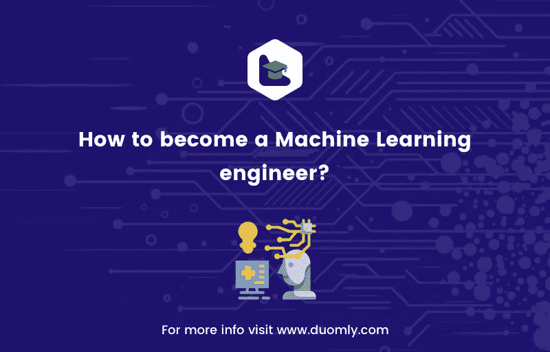

# 如何成为一名机器学习工程师？

> 原文：<https://medium.com/duomly-blockchain-online-courses/how-to-become-a-machine-learning-engineer-db8fb5424b71?source=collection_archive---------5----------------------->

[Duomly — programming online courses](https://www.duomly.com)

本文最初发表于:
[https://www . blog . duomly . com/how-to-start-with-machine-learning/](https://www.blog.duomly.com/how-to-start-with-machine-learning/)

机器学习是关于使用样本数据建立数学模型，使计算机系统能够在没有获得明确指令的情况下执行任务。图像识别、自动驾驶车辆、互联网搜索引擎、计算机视觉、垃圾邮件过滤和许多其他系统都使用机器学习。它还应用于金融预测、医疗诊断、欺诈检测等等。

机器学习是一个广阔而有前途的领域。它为现实世界的问题以及各种高薪工作提供了令人兴奋的解决方案。

这篇文章是关于在这个领域学习和开始职业生涯的。

首先，你应该学习基础知识:

*   学数学
*   了解数据科学和机器学习背后的理论和直觉
*   学习编程
*   数据科学和机器学习学习库
*   通过玩数据来练习

一旦你有了基础，你应该总是学习更多，并通过跟踪该领域的进展使自己保持最新:

*   阅读数据科学、机器学习和人工智能的博客和论文
*   在 Twitter 和其他社交网络上关注有趣的人、团体、公司和组织
*   让自己参与讨论，提出问题，回答别人的问题

文章的其余部分是关于第一部分:建立你的知识基础。

# 学数学

数学知识对于人们进入数据科学和机器学习非常重要。它允许他们深入理解机器学习方法如何以及为什么起作用。它还允许人们正确地设计实验、测试假设、组合方法、优化超参数等等。

机器学习所需的三个主要数学分支是:

*   结石
*   线性代数
*   概率与统计

**微积分**很重要，因为其他一切都依赖于它，尤其是概率论、统计方法和凸优化。有许多潜在有用的微积分书籍，如:

*   J. Stewart 的微积分
*   托马斯的微积分由 G.B .托马斯、M.D .韦尔和 J.R .哈斯完成；请注意，这本书的最新版本是由 J.R .哈斯、C.E .黑尔和 M.D .韦尔撰写的

如果你是一个完全的初学者，你可以试试麻省理工学院的初学者和艺术家微积分教程。

**线性代数**是线性回归、线性判别分析等许多机器学习方法和途径的基础。它将教你如何处理多维数据，以及如何找到它们之间的关系。线性代数方面的一些推荐书籍有:

*   线性代数及其应用
*   g .斯特朗的《线性代数导论》
*   斯特朗的线性代数及其应用
*   线性代数和从数据中学习

你可能也会发现 YouTube 上麻省理工学院 G. Strang 教授的讲座很有帮助。

**概率统计理论**机器学习中使用了很多概念。条件概率、贝叶斯定理、中心极限定理、假设检验、回归技术和信息熵只是这些概念的几个例子。关于概率和统计的一些方便的书籍有:

*   工程师和科学家概率统计导论
*   工程和科学的概率和统计

开始机器学习不需要很高的数学知识水平，但一旦你想理解并执行一些严肃的东西，你就会觉得有必要。

# 了解数据科学和机器学习背后的理论和直觉

你还需要了解数学概念的应用方面，也就是准确理解机器学习方法是如何设计的。关于这些概念的一些好书是:

*   统计学习导论
*   统计学习导论及其在 R 中的应用
*   统计学习的要素:数据挖掘、推理和预测

还有两本精彩的免费在线书籍:

*   深度学习作者:古德费勒、本吉奥和库维尔
*   M. Nielsen 的《神经网络和深度学习》

你会在那里找到许多很好的解释和视觉表现。机器学习课程的笔记可以从斯坦福大学和麻省理工学院的网站上免费获得。这些课程的讲座也可以在 YouTube 上免费获得。 [Duomly](https://www.duomly.com/register) 提供关于机器学习的综合课程，以及几篇你可能会觉得有用的文章:

*   [如何用 Python 创建聊天机器人？](https://www.blog.duomly.com/how-to-create-an-intelligent-chatbot-in-python/)
*   [如何用 Python 创建图像识别？](https://www.blog.duomly.com/how-to-create-image-recognition-with-python/)
*   [人工智能和机器学习之间的区别以及为什么它对我们很重要](https://www.blog.duomly.com/differences-between-artificial-intelligence-and-machine-learning-and-why-its-important-for-us/)
*   [如何通过机器学习面试？](https://www.blog.duomly.com/how-to-pass-machine-learning-interview/)

他们解释了机器学习方法背后的直觉，并提供了它们的一步一步的实现。

# 数据科学和机器学习学习库

其中最重要的一点就是掌握数据科学和机器学习的编程库。用于此目的的主要 Python 库有:

*   **NumPy** 是一个基本的高性能 Python 库，用于操纵数组和数值计算
*   **SciPy** 是一个基于并扩展 NumPy 的数值计算综合库
*   Pandas 是一个库，用于简单直观地操作一维和二维标签数据，也与 NumPy 相关
*   **Scikit-learn** 是一个全面的、广泛使用的机器学习库，构建在顶层 NumPy 和 SciPy 之上，用于数据预处理、回归、分类、聚类分析、模型选择和降维
*   **TensorFlow** 是谷歌主要专注于神经网络的深度学习库
*   **Keras** 是一个用于创建和训练神经网络的库，可以与 TensorFlow、CNTK 或 Theano 后端一起使用
*   Matplotlib 是一个强大且广泛使用的数据可视化库
*   Bokeh 是一个用于在网络浏览器中进行交互式数据可视化和演示的库

官方网站通常为每个库提供良好的免费文档和教程。另外一个特别好的教程是 Matplotlib 的剖析。GitHub 上免费提供。

要了解更多关于 Javascript 机器学习库的信息，请查看 Duomly 的一篇名为[2019 年 6 大 JavaScript 机器学习库](https://www.blog.duomly.com/6-top-machine-learning-libraries-for-javascript-in-2019/)的文章。

# 通过玩数据来练习

如果你想成为任何领域的专家，你必须大量练习。

你应该会得到一个有趣的数据集。它可能与体育、医学、天气、金融、政府有关，只是任何你感兴趣的事情。然后，你可以用它来做一些数据清洗、数据标准化、回归、分类、聚类分析、模式识别、关联规则学习、降维等等。

你可以从许多网站下载免费数据集，如 Kaggle、FiveThirtyEight、Socrata OpenData、维基百科、UCI 机器学习知识库、data.world、data.gov、谷歌趋势、谷歌的 BigQuery 公共数据集、英国政府的官方数据门户、Reddit、Nord Pool 电力市场等等。

此外，scikit-learn、TensorFlow 和 Keras 等库提供了适合实践的数据集。

一个更有趣的资源是 TensorFlow 神经网络游乐场，它允许您从浏览器中可视化地创建和使用神经网络。

有关数据集的更多信息，请免费查看 Duomly 的文章 [15 个最佳机器学习数据集](https://www.blog.duomly.com/15-best-machine-learning-datasets-for-free/)。

# 结论

学习机器学习是一项具有挑战性且有趣的任务。它需要许多领域的知识。一旦你掌握了它，它提供了应用它的巨大可能性，并找到有趣和高薪的工作。

本文提供了一些学习数据科学和机器学习的资源，获取数据进行实践，以及一些一般性建议。

还有很多更吸引人的书籍、课程、教程、博客帖子、视频等等。在一个普通人的一生中，可能不止一个人可以阅读或观看。也有许多一般或低质量的东西。每天都有一些新的资源出现。

机器学习才刚刚开始。它生长发育。如果你想参与其中，你也应该参与。

[Duomly — programming online courses](https://www.duomly.com)

感谢您的阅读！

本文由我们的队友米尔科提供。