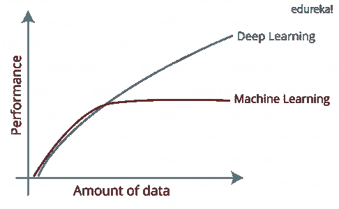

# Python 路线图——如何成为 Python 开发者？

> 原文：<https://medium.com/edureka/how-to-become-a-python-developer-462a0093f246?source=collection_archive---------0----------------------->

How to become a Python Developer? — Edureka

随着 Python 编程语言越来越受欢迎，市场上对 Python 开发者的需求越来越大，人们必然会想“如何成为一名 Python 开发者”。在本文中，我将向您介绍成为 Python 开发人员所需的结构化方法、职业见解和技能。

以下是本文将涉及的主题:

*   谁是 Python 开发者？
*   为什么要成为 Python 开发者？
*   工作角色
*   如何成为一名 Python 开发者？

# 谁是 Python 开发者？

让我首先回答这个问题，“到底谁是 python 开发者？”。嗯，对于 Python 开发人员来说，没有教科书上的定义，Python 开发人员可以根据他们所拥有的技能来选择特定的领域和工作角色。Python 开发人员可以是 Web 开发人员、软件工程师、数据分析师、数据科学家或自动化测试人员等。因此，Python 开发人员可以是上述任何人。

现在下一个问题是，既然已经有那么多编程语言可供我们学习，为什么还要成为一名 python 开发者呢？让我们来看看为什么你应该成为 python 开发者的几个原因。

# **为什么要成为 Python 开发者？**

Python 是 2018 年最受欢迎的编程语言，今年的图表似乎也在上升。易于访问和不断增长的需求足以吸引你成为 Python 开发人员。这种需求很好地迎合了职位空缺，成为一个拥有抢手技能的人将有助于你在人群中脱颖而出。

Python 编程语言有许多特性，使得开发人员转而使用 Python 而不是其他编程语言。简单的语法和可读性使得学习 Python 更加容易。

因为它非常简单，开发者现在不必花太多精力去构建复杂的程序。他们将只关注 Python 实际交付的实现部分。

Python 是一种通用解释编程语言，它有大量的库来满足我们的需求。例如:Matplotlib，Numpy，Pandas 等。

Python 也是免费和开源的。它可以运行在不同的平台上，如 windows，Mac，linux 等。近年来，Python 开发者越来越受欢迎，这也促进了需求的增长。

下面是几家使用 Python 编程语言的公司。看着这些巨头，你可以想象 Python 在业界产生了什么样的影响:

如果你是一名 Python 开发者，可以肯定的是，你将获得丰厚的报酬。正如你在图表中看到的，一个 python 开发者一年挣多少钱。

这是一个很大的数目，要达到这个水平需要大量的努力和有条理的方法。但这肯定没有看起来那么难。下面是给你的图表:

让我们来看看几个工作角色及其预期技能:

# 工作角色

## 软件开发人员/工程师

软件开发人员/工程师必须精通核心 python、web 框架、对象关系映射器。他们应该了解多进程架构和 RESTful API，以便将应用程序与其他组件集成。

对于软件开发人员来说，前端开发技能和数据库知识是一些不错的技能。当你打算成为一名软件开发人员时，编写 Python 脚本和系统管理也是一项附加任务。

## Python Web 开发人员

Python web 开发人员需要编写服务器端 web 逻辑。他们应该熟悉 web 框架、HTML 和 CSS，它们是 web 开发的基石。

良好的数据库知识和编写 Python 脚本是一项很好的技能。像 Tkinter 这样的基于 GUI 的 web 应用程序库是必须的。掌握所有这些技能，你就成为了一名 python web 开发者。

## 数据分析师

需要一名数据分析员进行数据解释和分析。他们应该精通数学和统计学。

像 Numpy、Pandas、Matplotlib、seaborn 等 Python 库被用于数据可视化和数据操作，因此在这里学习 Python 也是有益的。

## 数据科学家

数据科学家必须具备数据分析、解释、操作、数学和统计方面的全面知识，以便在决策过程中提供帮助。他们还必须精通机器学习和人工智能，掌握所有的机器学习算法，如回归分析、朴素贝叶斯等。

数据科学家必须彻底了解 Tensorflow、scikit-learn 等库。数据科学家将履行涉及全面发展的职责。

如下图所示，数据科学家需要或期望的熟练程度。因此，您的方法应该是平衡的，并且平等地划分到所有这些领域中。

## 机器学习工程师

机器学习工程师必须了解数学和统计学之上的深度学习概念、神经网络架构和机器学习算法。机器学习工程师必须足够精通梯度下降、回归分析和建立预测模型等算法。

下面是机器学习中常用的几个 python 库。机器学习工程师的工作不仅仅是编程。

它们被要求使机器执行特定的任务。机器学习工程师利用创造力，并将其用于实现最先进的应用程序。

## 人工智能工程师

一名人工智能工程师必须具备编程技能、数据科学概念和数据建模概念的知识。深度学习和神经网络理解也是必须的。

人工智能工程师应该给计算机编程，让它们像人一样思考，或者像人一样对特定情况做出反应。所有这些都是通过认知模拟发生的。

常见的任务包括推理、知识表达、自然语言处理和一般智能。下面是神经网络的表示。

## 自动化测试工程师

编程技能就像是任何自动化测试工程师的一块基石。Selenium web 驱动程序和所有相关技术是必须的。例如:TestNG，ATLC 方法论。

作为一名自动化工程师，你应该识别自动化的软件过程。他们需要设计和执行自动化脚本来检查流程的功能，他们还需要开发自动化的测试策略和框架。

既然我们已经了解了 python 开发人员在掌握了特定职业技能后可以从事的各种工作角色，那么让我们也来看看成为 python 开发人员应该遵循的方法。

# 如何成为一名 Python 开发者？

开始寻求成为 python 开发人员，您必须采取结构化的方法来掌握所有技能。以下是相同的列表:

## Python 基础

1.  变量和数据类型
2.  数据结构和算法
3.  循环、条件和控制语句
4.  I/O 操作和异常处理
5.  模块和文件处理
6.  数据库知识

从 Python 基础开始，您必须掌握所有这些基本概念，这是任何编程语言的基础。

掌握了这些概念后，你可以为自己选择职业道路，并努力掌握实现目标所需的所有技能。

## Web 框架

1.  姜戈还是弗拉斯克
2.  HTML，CSS
3.  MVC-MVT 架构
4.  服务器端开发
5.  前端技能
6.  剧本写作

掌握 web 框架和这些概念会让你成为一名 web 开发人员。

您可以根据自己的需求开发基于 GUI 的应用程序或 web 应用程序来掌握您的技能。

## 走向数据科学

1.  数学和统计学
2.  图书馆(Matplotlib、Numpy、Pandas、Seaborn)
3.  数据可视化
4.  解释和数据分析
5.  数据处理
6.  数据库知识

这些概念和技能会让你离成为数据科学家更近一步。

为了练习，你可以拿起一个数据集，试着分析和解释数据。您还可以对数据集进行更改来操作数据。

## 机器学习和人工智能概念

1.  机器学习算法
2.  应用数学和统计学
3.  库(Scikit-learn、Tensorflow、Keras)
4.  构建预测模型
5.  解决问题的技巧

这些是成为数据科学家的高级学习理念。

你可以从制作预测模型开始你的实践。获取一个数据集，并尝试使用逻辑回归模型预测结果。下面是一个用于机器学习的库。

## 深度学习

1.  神经网络体系结构
2.  自然语言处理

这些概念是一个相当附加的东西，或者你可以说是面向深度学习的高级学习，这将帮助你成为一名深度学习工程师。

为了查看深度学习的性能范围，这里有一个用于分析的图表。如你所见，性能随着深度学习呈指数级攀升。

## 自动化测试

1.  Selenium Web 驱动程序，IDE，Selenium 网格
2.  测试

有了更好的编程技能，您可以在测试自动化方面走得更远。为流程自动化构建和设计 python 脚本。

您可以通过编写 python 脚本来检查功能和测试流程，从而掌握自动化技能。

## 杂项技能

1.  网页抓取使用美汤，请求库
2.  使用 OpenCV 的计算机视觉

现在，这些是你可以掌握的一些杂项技能，它们将帮助你成为一名更好的程序员。实践你所学的理论，是成为 python 开发者的关键。

成功的 python 开发者总是建议，你所学习的理论应该是你全部努力的 20%，其余的 80%应该用于实现你所学习的理论。

通过这篇文章，我们已经讨论了成为 Python 开发人员的“为什么”和“如何”部分，如果你明智地遵循职业道路，结构化的方法和学习将使你很容易达到目标。

我希望你清楚本文中涉及的主题，并准备好开始成为一名 python 开发人员。如果你想查看更多关于人工智能、DevOps、道德黑客等市场最热门技术的文章，你可以参考 Edureka 的官方网站。

请留意本系列中的其他文章，它们将解释 Python 和数据科学的各个方面。

> 1. [Python 教程](/edureka/python-tutorial-be1b3d015745)
> 
> 2. [Python 编程语言](/edureka/python-programming-language-fc1015de7a6f)
> 
> 3. [Python 函数](/edureka/python-functions-f0cabca8c4a)
> 
> 4.[Python 中的文件处理](/edureka/file-handling-in-python-e0a6ff96ede9)
> 
> 5. [Python Numpy 教程](/edureka/python-numpy-tutorial-89fb8b642c7d)
> 
> 6. [Scikit 学习机器学习](/edureka/scikit-learn-machine-learning-7a2d92e4dd07)
> 
> 7. [Python 熊猫教程](/edureka/python-pandas-tutorial-c5055c61d12e)
> 
> 8. [Matplotlib 教程](/edureka/python-matplotlib-tutorial-15d148a7bfee)
> 
> 9. [Tkinter 教程](/edureka/tkinter-tutorial-f655d3f4c818)
> 
> 10.[请求教程](/edureka/python-requests-tutorial-30edabfa6a1c)
> 
> 11. [PyGame 教程](/edureka/pygame-tutorial-9874f7e5c0b4)
> 
> 12. [OpenCV 教程](/edureka/python-opencv-tutorial-5549bd4940e3)
> 
> 13.[用 Python 进行网页抓取](/edureka/web-scraping-with-python-d9e6506007bf)
> 
> 14. [PyCharm 教程](/edureka/pycharm-tutorial-d0ec9ce6fb60)
> 
> 15.[机器学习教程](/edureka/machine-learning-tutorial-f2883412fba1)
> 
> 16.[Python 中从头开始的线性回归算法](/edureka/linear-regression-in-python-e66f869cb6ce)
> 
> 17.[面向数据科学的 Python](/edureka/learn-python-for-data-science-1f9f407943d3)
> 
> 18.[Python 中的循环](/edureka/loops-in-python-fc5b42e2f313)
> 
> 19. [Python 正则表达式](/edureka/python-regex-regular-expression-tutorial-f2d17ffcf17e)
> 
> 20. [Python 项目](/edureka/python-projects-1f401a555ca0)
> 
> 21.[机器学习项目](/edureka/machine-learning-projects-cb0130d0606f)
> 
> 22.[Python 中的数组](/edureka/arrays-in-python-14aecabec16e)
> 
> 23.[在 Python 中设置](/edureka/sets-in-python-a16b410becf4)
> 
> 24.[Python 中的多线程](/edureka/what-is-mutithreading-19b6349dde0f)
> 
> 25. [Python 面试问题](/edureka/python-interview-questions-a22257bc309f)
> 
> 26. [Java vs Python](/edureka/java-vs-python-31d7433ed9d)
> 
> 27. [Python Lambda 函数](/edureka/python-lambda-b84d68d449a0)
> 
> 28.[网飞如何使用 Python？](/edureka/how-netflix-uses-python-1e4deb2f8ca5)
> 
> 29.[Python 中什么是套接字编程](/edureka/socket-programming-python-bbac2d423bf9)
> 
> 30. [Python 数据库连接](/edureka/python-database-connection-b4f9b301947c)
> 
> 31. [Golang vs Python](/edureka/golang-vs-python-5ac32e1ef2)
> 
> 32. [Python Seaborn 教程](/edureka/python-seaborn-tutorial-646fdddff322)
> 
> 33. [Python 职业机会](/edureka/python-career-opportunities-a2500ce158de)

*原载于 2019 年 4 月 2 日*[*https://www.edureka.co*](https://www.edureka.co/blog/how-to-become-a-python-developer/)*。*