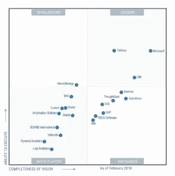

# 如何成为 Tableau 开发者？

> 原文：<https://medium.com/edureka/how-to-become-a-tableau-developer-c00a8f71044?source=collection_archive---------1----------------------->

How To Become A Tableau Developer? — Edureka

***这使得 ***Tableau 开发者*** 成为 BI 行业中最受欢迎的配置文件之一。这也意味着获得 Tableau* 中的*认证将会给你符合行业标准的可信度。***

那么，成为 Tableau 开发人员需要什么呢？在这个博客中，我们将谈论 Tableau 职业生涯的所有事情。所以，这篇文章的大纲应该是这样的。

*   Tableau 开发人员的角色
*   追求 Tableau 开发人员的职业生涯
*   Tableau 开发人员的职责
*   成为 Tableau 开发人员所需的技能
*   Tableau 的未来和范围

# Tableau 开发人员的角色

Tableau developer 是一名专业人员，他借助数据可视化来创建解决方案，以增强业务流程。这项工作包括各种任务，包括但不限于与开发人员合作，创建 BI 仪表板和报告，以及从数据中获得洞察力，以反馈会议来改进系统。这份工作非常适合那些有很强的商业头脑、数学背景和出色的数据仓库技能的人。

# 追求 Tableau 开发人员的职业生涯

Tableau 被称为 BI 工具的领导者，它被 it 研究巨头 Gartner 评为最佳。Gartner 的魔力象限根据执行能力和愿景的完整性连续第六次提到 tableau。

除了对 Tableau 专家有很大的需求之外，还有奖励可以提供。如果你浏览求职网站，你会发现大量的招聘信息。Tableau 的专业人员也获得了 IT 行业最高的薪水，平均年薪为 91，000 美元。有大量的工作需要桌面作为主要技能。

# Tableau 开发人员的职责

Tableau 开发人员的职责因其工作的组织类型而异。一些典型的 tableau 开发人员职责包括:

## 构建解决方案

tableau 开发人员的主要目标是创建满足业务需求的技术解决方案。这可以通过找到创新的解决方案并将其要求转化为现实来实现。

## OLAP

Tableau 开发人员被期望创建工具来保存组织内的数据，这被称为在线分析处理。

## 测试

他们开发数据库查询并进行单元测试，以解决和分析出现的问题。这个过程是开发的一个持续部分，在整个项目中不断发生。

## 系统增强

这项工作的关键部分是评估和改进现有的系统。这还包括与企业内的其他团队合作，整合新系统以简化公司流程和工作流。

## 证明文件

为已完成的项目创建报告是 tableau 开发人员的一项重要任务。他们还创建和更新技术文档，供组织内的高级工作人员和同事参考。

## 熟练使用工具

除了其他应用程序，Tableau 开发人员还经常使用以下工具:

*   **BI 技术** —甲骨文 BI、微软 Power BI 等。
*   **SQL 语言**—SQL Server Integration Services(SSIS)，SQL Server Reporting Services(SSRS)。
*   **数据分析工具** — ETL 框架，在线分析处理(OLAP)

## **讲故事和预测**

Tableau 具有预测和讲故事等惊人的功能。Tableau 以其 ***讲故事*** 等特性呈现数据，其他工具无法做到。人们甚至可以亲自连接到数据，了解分析的深度。 ***预测*** 在 Tableau 中使用一种称为指数平滑的技术。

# 成为 Tableau 开发人员所需的技能

成为 Tableau 开发人员所需的知识、技能和能力如下:

*   商业或计算机科学学士学位。
*   应用程序生命周期开发的企业级经验。
*   精通 ***结构化查询语言*** 和大量数据集。
*   出色的分析能力，能够分析客户或企业的需求。
*   从项目开始到结束，在系统软件方面有很高的技能。
*   在消费者测试和原型阶段为系统寻找解决方案。
*   强烈关注细节，发现数据或编码中的错误。
*   深入了解 ***微观策略******数据架构*** 。
*   有效的书面和口头沟通技巧。

# Tableau 的未来和范围

tableau 在 BI 工具中脱颖而出的一个原因是，在连接性方面有广泛的选择——从电子表格、数据库甚至大数据开始。另外，您可以访问仓库、Salesforce 等云应用程序，甚至连接到 Amazon Redshift 等云数据库。Tableau 可以连接到你能想到的任何数据。除此之外，Tableau 还配备了一个 web 数据连接器，它用于直接从 Web 上获取 API，以便连接任何所需的数据源。

Tableau 授权业务用户轻松快速地在庞大的 Hadoop 数据集中识别有价值的数据。它消除了用户对查询语言知识的需求，使利益相关者更容易接触大数据。

Tableau 专注于自然语言处理和机器学习支持的数据，并用新技术塑造自己，以实现未来主义的方法来可视化数据。随着该工具中新的尖端功能的出现，例如为云和实时查询代理启动混合数据连接，作为内部数据的隧道，Tableau 的范围随着每次版本更新而扩大。

总之，我想说，Tableau 开发者的机会是无限的。因此，继续前进，并开始与 Tableau。如果你想查看更多关于人工智能、DevOps、道德黑客等市场最热门技术的文章，你可以参考 Edureka 的官方网站。

请留意这个系列中的其他文章和视频，它们会帮助你理解 Tableau 的各种概念。

> 1. [Tableau 教程](/edureka/tableau-tutorial-37d2d6a9684b)
> 
> 2.[什么是画面？](/edureka/what-is-tableau-1d9f4c641601)
> 
> 3. [Tableau 函数](/edureka/tableau-functions-ce794b10e588)
> 
> 4. [Tableau 仪表盘](/edureka/tableau-dashboards-3e19dd713bc7)
> 
> 5.[Tableau 中的 LOD 表达式](/edureka/tableau-lod-2f650ca1503d)
> 
> 6. [Tableau 提示和技巧](/edureka/tableau-tips-and-tricks-a18bf8991afc)
> 
> 7.[循序渐进指导学习 Tableau 公共](/edureka/tableau-public-942228327953)
> 
> 8. [Tableau 桌面 vs Tableau 公共 vs Tableau 阅读器](/edureka/tableau-desktop-vs-tableau-public-vs-tableau-reader-fbb2a3aa0bac)
> 
> 9.[如何在 Tableau 中创建和使用参数？](/edureka/parameters-in-tableau-ac552e6b0cde-ac552e6b0cde)
> 
> 10.Tableau 中的布景是什么，如何创建它们
> 
> 11.[数据混合](/edureka/tableau-lod-2f650ca1503d)
> 
> 12 .[Tableau 中的圆环图](/edureka/donut-chart-in-tableau-a2e6fadf6534)
> 
> 13.[2020 年你必须准备的 50 大 Tableau 面试问题](/edureka/tableau-interview-questions-and-answers-4f80523527d)
> 
> 14.[如何以及何时使用不同的 Tableau 图表](/edureka/tableau-charts-111758e2ea97)

*原载于 2019 年 2 月 18 日*[*【https://www.edureka.co】*](https://www.edureka.co/blog/how-to-become-a-tableau-developer/)*。*