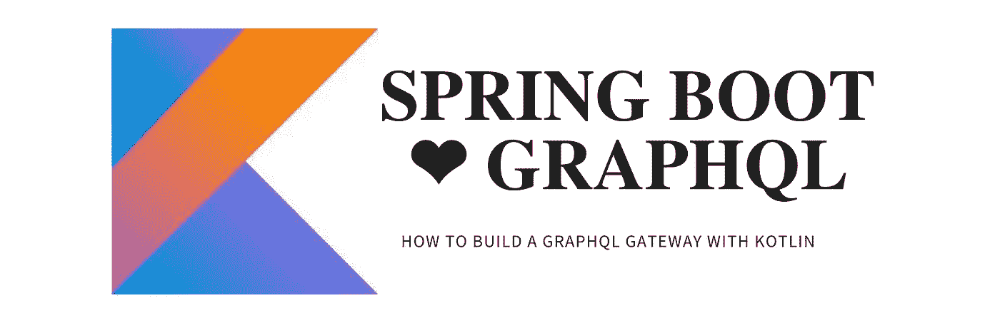
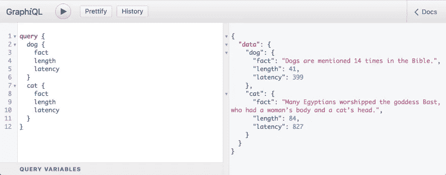

# 如何用 Spring Boot 和科特林构建一个 GraphQL 网关

> 原文：<https://blog.kotlin-academy.com/how-to-build-a-graphql-gateway-with-spring-boot-and-kotlin-97a186d93d46?source=collection_archive---------1----------------------->



使用 Spring Boot +科特林+协同程序+ GraphQL-java-kickstart，您可以用最少的样板文件构建一个 GraphQL 网关。

# 运行正常的

代码可从以下网址获得:

[](https://github.com/jmfayard/spring-playground) [## jmfayard/spring-游乐场

### 春季项目的游乐场。在 GitHub 上创建一个帐户，为 jmfayard/spring-playground 的发展做出贡献。

github.com](https://github.com/jmfayard/spring-playground) 

像这样运行服务器:

```
git clone https://github.com/jmfayard/spring-playground
cd spring-playground/graphql-gateway
./gradlew bootRun
```

在[打开 GraphiQL http://localhost:8080/](http://localhost:8080/)

# 动物事实

随着这个项目的启动和运行，您可以使用 GraphQL 查询获取动物事实。

输入以下查询:

```
query {
  dog {
    fact
    length
    latency
  }
  cat {
    fact
    length
    latency
  }
}
```

运行查询，您将看到类似这样的内容:



如果你是 GraphQL 的新手，请阅读来自@methodcoder 的介绍，我会等待。

# 猫的事实和狗的事实

动物事实从何而来？

服务器知道两个 REST APIs。

第一个是关于卡特彼勒的事实:

```
$ http get https://catfact.ninja/fact
{
    "fact": "Isaac Newton invented the cat flap. Newton was experimenting in a pitch-black room. Spithead, one of his cats, kept opening the door and wrecking his experiment. The cat flap kept both Newton and Spithead happy.",
    "length": 211
}
```

第二个是关于狗的事实:

```
$ http get https://some-random-api.ml/facts/dog
{
    "fact": "A large breed dog's resting heart beats between 60 and 100 times per minute, and a small dog breed's heart beats between 100-140\. Comparatively, a resting human heart beats 60-100 times per minute."
}
```

通过构建一个简单的网关，我们克服了复杂性，这样前端开发人员就少了一件需要担心的事情:

*   我们负责调用多个端点并组合它们，成为一个[后端对前端](https://samnewman.io/patterns/architectural/bff/)。
*   我们为前端提供了一个很好的 GraphQL 模式。
*   我们将响应格式规范化——dog 事实没有长度属性，但是我们可以计算它！
*   我们可以潜在地减少**总响应时间**。如果没有网关，前端将进行两次往返，比如说 300 毫秒，也就是 600 毫秒。对于网关，网关和 facts 服务器之间有一个 300 ms 的往返行程和两个往返行程。如果它们位于同一个网络上，则每个可以在 10 ms 内完成，总共 320 ms

那么，我们如何建立这个网关呢？

# 属国

如果您通过[https://start.spring.io/](https://start.spring.io/)从头开始一个新项目，您将需要添加这些依赖项:

*   弹簧网流量
*   java 语言
*   GraphQL-java-kickstart 库

[使用源卢克](https://github.com/jmfayard/spring-playground/blob/e2c74e6efe93674c0e382bef940d36a190145d80/graphql-gateway/build.gradle.kts#L23-L27)

注意，我使用了 [gradle refreshVersions](https://jmfayard.github.io/refreshVersions/) 来使项目保持最新变得容易。因此，版本不是在`build.gradle`文件中定义的，而是集中在`[versions.properties](https://github.com/jmfayard/spring-playground/blob/19b06ec2ffa4a0084a3f0799e891ecbe784132c6/graphql-gateway/versions.properties)`文件中。在`settings.gradle.kts`中，RefreshVersions 是这样引导的:

# graph QL-模式优先

GraphQL-java-kickstart 使用模式优先的方法。

我们首先在`resources/graphql/schema.grqphqls`中定义我们的模式:

然后，我们告诉春天我们的`GraphQLSchema`来自哪里:

Spring 至少需要一个 GraphQLQueryResolver，这个类负责实现 GraphQL 查询。

我们将定义一个，但现在保持为空:

```
@Component
class AnimalsQueryResolver() : GraphQLQueryResolver {

}
```

# GraphQLQueryResolver

如果我们用`./gradlew bootRun`启动我们的应用程序，我们将看到它很快失败，并显示以下错误消息:

```
FieldResolverError: No method or field found as defined in schema graphql/schema.graphqls:2 
with any of the following signatures 
(with or without one of [interface graphql.schema.DataFetchingEnvironment] as the last argument), 
in priority order: dev.jmfayard.factsdemo.AnimalsQueryResolver.cat()
  dev.jmfayard.factsdemo.AnimalsQueryResolver.getCat()
  dev.jmfayard.factsdemo.AnimalsQueryResolver.cat
```

模式是真实的唯一来源，它需要一些东西来实现一个`cat`查询，但是我们在代码中没有。

为了让 Spring 开心，我们确保我们的查询解析器具有与 GraphQL 模式相同的**形状**:

注意，您可以直接定义一个挂起函数来实现查询，而不需要任何额外的样板文件。

再次运行`./gradlew bootRun`现在春天开始了！

我们更进一步，将呼叫转移到`AnimalsRepository`:

我们如何实现这个存储库？我们需要一个 HTTP 客户端。

# 用 ktor-client 挂起 HTTP 调用

我们本可以使用 Spring 提供的内置 reactive `WebClient`,但是我想使用 ktor-client 尽可能简单。

首先，我们必须添加 ktor、http 和 kotlinx-serialization 的依赖项，然后配置我们的客户机。

参见提交[配置 ktor-client，ok http&kot linx . serialization](https://github.com/jmfayard/spring-playground/commit/c3445289143b321fc0fa1e4264e65b8989f78e31)

最有趣的部分在这里:

# 简单或非阻塞:为什么不两者兼而有之？

当我看到上面的代码时，我想起我喜欢协程。

我们开始以简单、直接的方式编写代码，就像过去我们以每个请求一个线程的模式编写阻塞代码一样。

在这里，编写非阻塞代码至关重要:网关花费大部分时间等待其他两个服务器的响应。

因此，使用某种承诺流或反应流编写的代码显然比阻塞代码更有效。

但是这些要求你“在反应流中思考”,让你的代码看起来确实不同。

有了协程，我们获得了效率，我们的代码也变得非常简单。

# 通过断路器的弹性

我们有一个网关，但它是一个坏网关。

更准确地说，它和它赖以工作的最差的服务器一样糟糕。

如果一个服务器系统地抛出一个错误或者得到 v e r y s l o w，我们的网关盲目地跟随。

我们不希望同样的错误不断出现，我们希望快速处理错误，而不用等待 TCP 超时。

我们可以通过使用[断路器](https://en.wikipedia.org/wiki/Circuit_breaker_design_pattern)使我们的网关更有弹性。

**Resilience4j** 提供了这样的断路器实现。

我们首先添加和配置库。

参见提交:[添加一个由 resilience4j](https://github.com/jmfayard/spring-playground/commit/60d88ac2c434728b07409bd90d381cb21791f7ce) 供电的断路器。

用法非常简单:

# 我想了解更多

参见[spring-playground/graph QL-gateway](https://github.com/jmfayard/spring-playground/tree/main/graphql-gateway)

[](https://github.com/jmfayard/spring-playground) [## jmfayard/spring-游乐场

### 春季项目的游乐场。在 GitHub 上创建一个帐户，为 jmfayard/spring-playground 的发展做出贡献。

github.com](https://github.com/jmfayard/spring-playground) 

激发本文灵感的演讲: [KotlinFest2019【由 Kotlin 驱动的吉拉软件的未来】](https://www.youtube.com/watch?v=4GkoB4hZUnw)

本项目中使用的库的文档:

*   [Ktor 客户端入门| Ktor](https://ktor.io/docs/getting-started-ktor-client.html)
*   [关于 graph QL Spring Boot—graph QL Java Kickstart](https://www.graphql-java-kickstart.com/spring-boot/)
*   [关于 GraphQL Java 工具— GraphQL Java Kickstart](https://www.graphql-java-kickstart.com/tools/)
*   [graph QL-Java/graph QL-Java:graph QL Java 实现](https://github.com/graphql-java/graphql-java)
*   Resilience4j

另一种方法:[用 Spring Boot 和科特林创建一个反应式 GraphQL 服务器](https://medium.com/expedia-group-tech/creating-a-reactive-graphql-server-with-spring-boot-and-kotlin-54aca7316470)

如果你想联系我，在 https://jmfayard.dev/contact/有一个长期有效的邀请。

# 点击👏说“谢谢！”并帮助他人找到这篇文章。

了解卡帕头最新的重大新闻。学院、[订阅时事通讯](https://kotlin-academy.us17.list-manage.com/subscribe?u=5d3a48e1893758cb5be5c2919&id=d2ba84960a)、[观察 Twitter](https://twitter.com/ktdotacademy) 并在 Medium 上关注我们。

如果您需要 Kotlin 工作室，请查看我们如何帮助您: [kt.academy](https://kt.academy/) 。

[](https://kotlin-academy.us17.list-manage.com/subscribe?u=5d3a48e1893758cb5be5c2919&id=d2ba84960a)