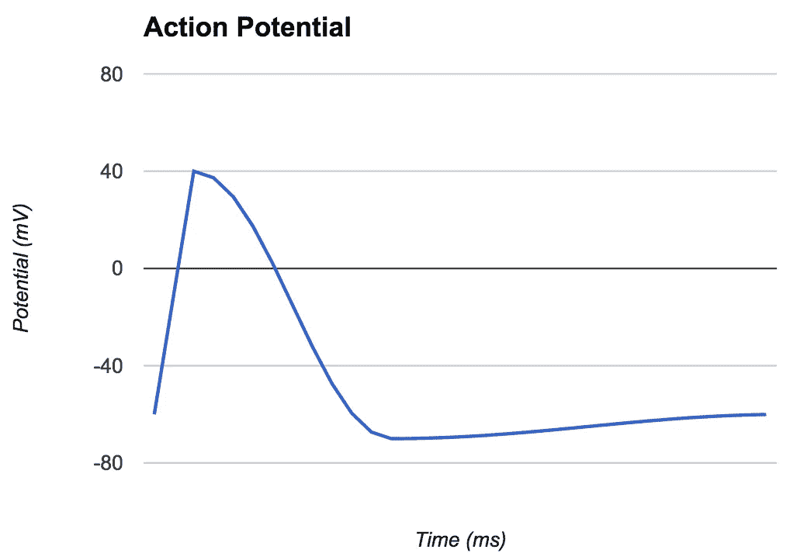

# 如何构建神经元:探索 JavaScript Pt 1 中的 AI

> 原文：<https://medium.com/javascript-scene/how-to-build-a-neuron-exploring-ai-in-javascript-pt-1-c2726f1f02b2?source=collection_archive---------3----------------------->

Dual Neuron — Scott Ingram (CC-BY-NC-2.0)

几年前，我在做一个需要适应性的项目。从本质上讲，软件需要随着时间的推移，在频繁重复的任务中学习并变得更好。

我读过关于神经网络以及人们用它们取得的一些早期成功，所以我决定亲自尝试一下。这标志着对人工智能终身着迷的开始。

人工智能真的很重要。在接下来的 25 年里，有一小部分技术会极大地改变世界。三个最大的颠覆者深深依赖人工智能:

*   自动驾驶汽车
*   嗡嗡声
*   增强现实和虚拟现实

仅自动驾驶汽车就将扰乱美国超过**1000 万个工作岗位**，从根本上提高运输和运输效率，并可能导致汽车所有权的巨大变化，因为我们将运输和汽车所有权和维护的痛苦外包给优步这样的应用程序。

你可能听说过谷歌的自动驾驶汽车，但特斯拉、奔驰、宝马和其他汽车制造商也在自动驾驶技术上下了大赌注。

监管，而不是技术，是亚马逊航空等基于无人机的商业服务的主要障碍，就在几天前，[美国联邦航空局放宽了对商业无人机飞行的限制](http://www.presstelegram.com/general-news/20160621/feds-clear-drones-for-routine-commercial-use-but-dont-expect-amazon-deliveries-anytime-soon)。亚马逊用无人机送货上门仍然是不合法的，但这很快就会改变，当这种情况发生时，商业将永远不会一样。

当然，上个假期销售了 50 万架消费级无人机，这意味着无人机改变的不仅仅是商业。预计在未来几年，将会看到更多的这种飞机在世界各地的大都市令人讨厌地盘旋。

增强和虚拟现实将从根本上改变人类的意义。随着我们的感官被与现实世界无缝融合的虚拟结构增强，我们将找到新的工作方式、新的游戏方式和新的互动方式，包括 AR 辅助学习、远程呈现和我们尚未梦想到的全新体验。

## 所有这些技术有什么共同点？

所有这些技术都要求我们的设备能够感知周围的环境，并能够对环境输入做出行为反应。自动驾驶汽车需要看到障碍物，并做出纠正以避开它们。无人机需要探测碰撞危险、风和着陆的地面。房间尺度 VR 需要提醒你房间的边界，这样你就不会撞到墙壁，AR 设备需要检测桌子，椅子，桌子和墙壁，并允许虚拟元素和角色与之交互。

处理感官输入并弄清楚它们的含义是我们大脑负责的最重要的工作之一。

人类的大脑如何处理这项工作的复杂性？拥有**个神经元**。

单个神经元不会做任何特别有趣的事情，但当组合在一起时，**神经网络**负责我们识别周围世界、解决问题以及与环境和周围人互动的能力。

神经网络是一种机制，它允许我们使用语言，建立工具，接球，打字，阅读这篇文章，记住事情，基本上做所有我们认为是“思考”的事情。

最近，科学家们一直在扫描小动物大脑的切片，以实现全脑仿真。例如，[一个分子水平的模型研究了*秀丽隐杆线虫*蛔虫](http://www.artificialbrains.com/openworm)中的 302 个神经元。

蓝脑计划试图用人脑做同样的事情。这项研究使用显微镜扫描活体人脑组织切片。这是一个雄心勃勃的项目，在启动十年后仍处于起步阶段，但没有人预计它会在明天完成。

除了最简单的生物体，我们离全大脑仿真还有很长的路要走，但最终，我们可能能够在计算机上在分子水平上仿真整个人类大脑。

在我们试图自己模拟甚至基本的神经元功能之前，我们应该更多地了解神经元是如何工作的。

## 什么是神经元？

神经元是一种从**突触末端**(通常来自**树突**，但有时直接在细胞膜上)收集输入信号(电**电位**)的细胞。当这些信号总和超过轴突小丘触发区的某个**阈值电位**时，就会触发一个输出信号，称为**动作电位**。

动作电位沿着被称为**轴突的输出神经纤维传播。**轴突分裂成**侧枝**可以将输出信号运送到神经网络的不同部分。每个轴突分支都通过分裂成一簇簇微小的末端分支而终止，这些分支通过**突触**与其他神经元连接。

> 注意:在真实的神经元中,**髓鞘**包裹着一些轴突，有间隙让离子进入轴突以恢复动作电位。髓鞘显著提高了动作电位沿轴突传播的速度和强度，并允许一些轴突跨越数英尺。很少有人工神经元能模仿它。他们应该吗？

## **什么是突触？**

**突触**这个词用来描述从一个神经元到下一个神经元的传输机制。

> 一个神经元要么激活要么不激活。它的动作电位都大致相同，并且都持续几毫秒。突触转换信号。

突触后终壁上有两种突触受体:**离子通道**和**代谢通道。**

离子通道是快速的(几十毫秒)，并且可以通过分别打开带正电或带负电的离子进入细胞的通道来兴奋或抑制突触后神经元中的电位。

在**离子传导**中，神经递质从**突触前神经元**释放到**突触间隙**——突触前神经元和**突触后神经元**末端之间的微小间隙。它与突触后端壁上的受体结合，导致它们打开，允许带电离子流入突触后细胞，引起细胞电位的变化。

代谢通道比离子通道更慢，更容易控制。在化学传递中，动作电位触发**化学递质**从突触前末端释放到突触间隙。

这些化学递质与没有自己离子通道的代谢受体结合。这种结合引发了细胞壁内部的化学反应，释放出 G 蛋白，从而打开与不同受体相连的离子通道。由于 G 蛋白必须首先扩散并重新结合到邻近的通道，这个过程自然需要更长的时间。

**代谢效应的持续时间可以从大约 100 毫秒到几分钟不等**，这取决于神经递质被吸收、释放、扩散或再循环回到突触前末梢所需的时间。

像离子通道一样，信号可以对突触后神经元电位产生兴奋或抑制作用。

还有另一种类型的突触，称为电突触。与上述依赖于轴突末端化学神经递质和受体的化学突触不同，电突触通过**间隙连接**将一个细胞的树突直接连接到另一个细胞的树突，间隙连接是一种允许离子和其他小分子直接在细胞之间通过的通道，有效地创建了一个具有多个轴突的大型神经元。

由电突触连接的细胞几乎总是同时放电。当任何连接的细胞触发时，所有连接的细胞都随之触发。然而，有些缝隙连接是单向的。

除此之外，电突触连接控制肌肉群的细胞，如心脏，其中所有相关细胞的合作非常重要，从而产生同步的肌肉收缩。

> 注意:大脑中的环境化学物质可以渗入突触间隙，影响突触传递。当神经递质被突触前末端重吸收时，这被称为**重吸收**。你可能听说过一类常见的药物，叫做血清素再摄取抑制剂，用于治疗抑郁症。它们抑制再吸收过程，这导致血清素扩散到周围的大脑化学物质中，而不是被终末再吸收。

> 在自然界中，大脑化学会对我们的情绪和行为产生深远的影响。人工智能神经网络应该效仿吗？

## 突触可塑性

不同的突触可以有不同的强度(称为**权重**)。突触的重量会随着时间的推移而改变，这一过程被称为突触可塑性。

人们认为，突触连接强度的变化是我们形成记忆的方式。换句话说，为了学习和形成记忆，我们的大脑实际上重新连接了自己。

> 化学突触有多种神经递质，可以以多种方式调节突触后神经元电位。

突触权重的*增加*称为[**【LTP】**](https://en.wikipedia.org/wiki/Long-term_potentiation)**。**

突触重量的*减少*称为 [**【长期抑郁】**](https://en.wikipedia.org/wiki/Long-term_depression) **。**

如果突触前神经元放电时，突触后神经元倾向于大量放电，则突触权重增加。如果细胞不经常一起放电，这种联系就会减弱。换句话说:

> 一起放电的细胞连接在一起。
> 细胞发出的火焰把电线分开。

突触可塑性的关键就藏在**一对 20ms 的窗口:**

如果突触前神经元在之前*触发，突触后神经元*在 20ms 内*触发，则权重增加( **LTP** )。*

如果突触前神经元在之后*触发，突触后神经元*在 20ms 内*触发，则权重减少( **LTD** )。*

这个过程被称为 [**尖峰时序相关可塑性**](https://en.wikipedia.org/wiki/Spike-timing-dependent_plasticity) 。

锋电位时间依赖性可塑性是在 20 世纪 90 年代发现的，目前仍在探索中，但据信从细胞轴突到树突的动作电位反向传播与 LTP 过程有关。

在一个典型的向前传播事件中，**谷氨酸**将从突触前末端释放出来，它与突触后末端壁中的 **AMPA 受体**结合，允许带正电荷的**钠离子** (Na+)进入细胞。

如果细胞内部发生足够大的去极化事件(可能是来自轴突触发点的反向传播电位)，静电排斥将打开 [**NMDA 受体**](https://en.wikipedia.org/wiki/NMDA_receptor)**中的镁块，允许更多的钠连同**钙** (Ca +)一起涌入细胞。同时，**钾** (K+)流出细胞。这些事件本身只持续几十毫秒，但它们有间接的持久影响。**

**钙的流入导致额外的 AMPA 受体插入细胞膜，这将允许更多的钠离子在未来的动作电位事件中从突触前神经元进入细胞。**

**类似的过程与 trigger LTD .相反。**

**在 LTP 事件中，一种称为**生长因子**的特殊蛋白质也可以形成，这种蛋白质可以导致新的突触生长，加强两个细胞之间的联系。假设神经元继续频繁地一起放电，新突触生长的影响可能是永久性的。**

## **代码中的神经元**

**许多人工神经元的行为不太像神经元，而更像具有两种简单状态的晶体管:开或关。如果足够多的上游神经元处于开启状态而非关闭状态，则该神经元处于开启状态。否则就关了。其他神经网络使用从-1 到+1 的输入值。基本的数学看起来有点像下面的:**

**如果你想节省 CPU 功率，以便可以模拟更多的神经元，这是一个好主意，我们已经能够使用这些基本原则来完成非常简单的模式识别任务，例如使用预训练网络的光学字符识别(OCR)。然而，有一个问题。**

**正如我上面所描述的，**真正的神经元不会以那种方式表现**。相反，突触通过胞体(细胞体)将波动的连续值电位随时间传递到轴突小丘触发区，在那里信号的总和可能会或可能不会在任何给定的时间点触发动作电位。如果胞体中的电位仍然很高，当细胞以高频率(每几毫秒一次)触发时，脉冲可能会继续。**

**许多变量影响过程、触发频率和动作电位爆发的模式。根据上述模型，您如何确定触发事件是否发生在 LTP/LTD 窗口内？**

**我们的基本模型缺少什么关键元素？时间。**

**但这是另一篇文章的内容。敬请期待《T2》第二部。**

# **[跟随埃里克·埃利奥特学习 JavaScript】](https://ericelliottjs.com/product/lifetime-access-pass/)**

*****埃里克·艾略特*** *著有* [*【编程 JavaScript 应用】*](http://pjabook.com) *(奥赖利)，以及* [*【跟埃里克·艾略特学 JavaScript】*](http://ericelliottjs.com/product/lifetime-access-pass/)*。他为 Adobe Systems******Zumba Fitness*******华尔街日报*******【ESPN*******BBC****等顶级录音师贡献了软件经验********

****他大部分时间都在旧金山湾区和世界上最美丽的女人在一起。****