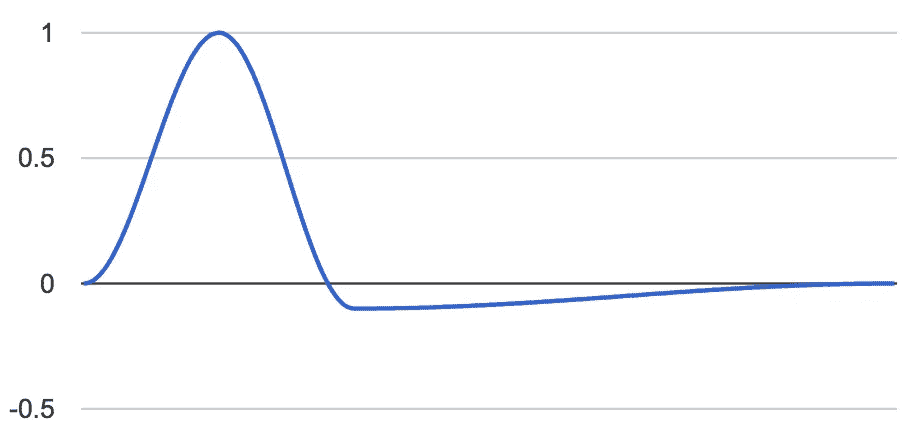
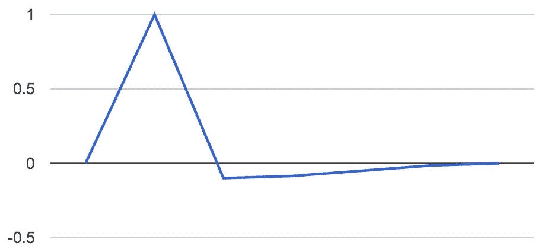

# 如何构建神经元:探索 JavaScript Pt 2 中的 AI

> 原文：<https://medium.com/javascript-scene/how-to-build-a-neuron-exploring-ai-in-javascript-pt-2-2f2acb9747ed?source=collection_archive---------2----------------------->


Dual Neuron — Scott Ingram (CC-BY-NC-2.0)

在这个系列中，我们将讨论一个将在未来 25 年改变我们生活的世界的话题。我们将看到许多无人机、自动驾驶汽车、虚拟现实和增强现实设备改变我们的出行方式、运输方式以及我们看待世界和与世界互动的方式，这些都将由人工智能和神经网络提供动力。

需要叙旧吗？

*   [如何构建神经元:在 JavaScript Pt 1 中探索 AI](/javascript-scene/how-to-build-a-neuron-exploring-ai-in-javascript-pt-1-c2726f1f02b2)

在第 1 部分中，我们简单介绍了什么是神经元以及它们是如何工作的，并通过展示一个如何对突触输入求和并确定神经元是否应该触发的简单示例结束了本文，并通过提出一个问题结束了本文:**时间呢？**

## 获取来源

从现在开始，我将在一个名为[神经库](https://github.com/ericelliott/neurolib)的图书馆里记录这些冒险。本文中讨论的所有工具都可以通过运行:

```
git clone [git@github.com](mailto:git@github.com):ericelliott/neurolib.git && cd neurolib
git checkout pt2
```

运行单元测试:

```
npm test
```

## 不是你传统的人工神经网络

如果你熟悉传统的神经网络，你可能会想知道我什么时候开始谈论 [**梯度下降**](https://www.youtube.com/watch?v=bxe2T-V8XRs&list=PL77aoaxdgEVDrHoFOMKTjDdsa0p9iVtsR) 或 [**隐马尔可夫模型**](https://www.youtube.com/watch?v=TPRoLreU9lA) **(嗯)**。答案是，也许有一天。

现在，我想探索真正的神经元和突触在真正的大脑中是如何工作的，而不是直接跳到数学抽象中。换句话说，我们将对神经网络采取模拟方法，而不是抽象方法。我们不会试图在分子水平上模拟大脑，但我们会试图模拟连续值随着时间的推移在神经网络中流动的方式，也许这将允许我们在某种程度上模拟真实神经网络的学习行为。

## 生物神经可塑性概述

回顾一下神经传递和可塑性:突触前神经元放电，释放神经递质，与受体结合，打开离子通道，这些离子通道可能与其他树突电位相加，触发动作脉冲，这可能进一步激发细胞体中的化学物质，导致蛋白质产生，蛋白质可能与突触壁结合，植入更多的离子通道，等等，所有这些都取决于突触前神经元和突触后神经元放电的紧密程度。(如果你现在感到困惑，你可能想[重读第一部分](/javascript-scene/how-to-build-a-neuron-exploring-ai-in-javascript-pt-1-c2726f1f02b2)。

换句话说:

> 一起放电的细胞连接在一起。
> 细胞发出的火焰会把电线分开。

根据锋电位时序相关的可塑性(在真实神经元实验中观察到)，一个关键问题是:

"单元格 *x* 在单元格 *y* 的 20 毫秒内触发了吗？"电压也很重要，所以还有一个相关的问题:“电压是多少？”

为了试图模拟尖峰时序相关的可塑性，我们将建立一个神经元，它将突触的连续值求和，并随着时间发出脉冲*，与时钟同步的* 。

## 虚拟时钟

我们希望能够调整我们的时间分辨率，所以我们将使用许多游戏和音频/视频编辑器采用的策略。我们将构建一个虚拟时钟，并以滴答声来度量时间，而不是以毫秒或其他实时单位来度量时间。

虚拟时钟的另一个巨大优势是，我们可以精确地安排彼此相关的事件，而不是依靠 JavaScript 极其不可靠的 *`setTimeout()`* 机制。仅供参考， *`setTimout()`* 排班通常会延迟*50 毫秒。这足以完全降低随机动作电位。*

我们的虚拟时钟默认情况下会使用 *`setTimeout()`* ，但是由于我们所有的事件都会同步到虚拟分笔成交点，所以我们不会错过重要的事件，即使 *`setTimeout()`* 迟到。我们的时钟还将具有自动抖动校正功能，因此即使 *`setTimeout()`* 确实出了问题(它会出问题)，我们的时间刻度仍将相对于实时相当准确地同步。

也就是说，我们的一些事件可能在这里或那里晚了几毫秒，但是如果我们每*20 毫秒*有一个滴答，并且有 *5* 个滴答，总持续时间应该仍然接近*100 毫秒*。

因为 *`setTimeout()`* 是如此的不可靠，我希望将来能够用不同的调度程序替换它。也许我们可以同步到网络音频 API 或 *`requestAnimationFrame`* 来优化我们未来的计时。仅供参考，网络音频 API 精确到 *44.1 kHz* ，并且可以触发一个 *`ended`* 事件，我们可以用它来安排事件。web audio API 也在一个单独的线程中工作，所以即使我们阻塞了主线程，时间也应该是准确的。从理论上讲，这将使我们的计时比使用 *`setTimeout()'的计时精确几百倍。*

这是初稿:

为了方便起见，我们公开了时钟参数。它们以后可能会派上用场。这里的 subscribe 机制大致受 [ES-Observables API](https://github.com/zenparsing/es-observable) 的启发，但是我们可能需要对定时机制进行更多的控制，如果我们简单地使用 RxJS 5.x+来完成这项工作的话。我们甚至可以从头开始学习一些我们自己的东西。

## 产生动作电位

因为我们对随时间变化的连续值感兴趣，而不是像数字电路或统计分析那样对待神经元，我们将模拟真实动作电位的行为。真实动作电位有一个被称为**去极化**相的急剧上升斜率，一个被称为**复极**相的急剧下降斜率，其持续超过静息电位**超极化**，随后是一个被称为**不应期**的缓慢上升相。

我们将动作电位分为 3 部分，去极化、复极+超极化(统称为下降期)和不应期(返回静息电位)。

为了产生电位，我们需要几个可调参数:*`去极化 Ms`* 、*`复极化 Ms`* 、*`折射 Ms`* 、 *`min`* 、 *`max`* 和*`静止电位`。*在我们的模拟中，我们将使用零作为静息电位，它代表生物静息电位，~ *-60mV* 。

因为我们已经生成了一个独立于实时的时钟，所以我们可以使用任何我们想要的时间分辨率来表示数据，它被表示为 *`ticksPerMs`* 。

生成曲线的第一步是创建平滑的**插值**，这样我们就可以得到圆角，就像你在真实波形中看到的一样。插值是在已知数据点的范围内填充缺失数据的过程。

为此，我们将采用起始值、结束值和插值的当前样本帧，传统上称为` *mu`。*我认为简单的余弦插值应该可以完成这项工作:

接下来，我们将创建一个名为 *`createPhase()`* 的函数，它接受以节拍(帧)为单位的长度、起始值和结束值，并返回该阶段中每个节拍的值数组。 *`cosineInterpolate()`* 创建单个值。 *`createPhase()`* 从起点到终点创建一组完整的值:

有了这些效用函数，我们就可以整合完整的动作电位:

为了节省每次计算的时间，我们将记住这个函数。我们将参数转换成一个键，并将结果数组添加到 memo 对象中。下次函数运行时，我们在 memo 对象中查找这个键。如果它存在，我们返回存储的数组，而不是生成一个新的动作电位。

当我将一些典型引用的时间值输入到这些参数中时，在 *44.1 khz* (我们稍后可能会调整分辨率以提高性能)，我得到的曲线如下所示:



这看起来和我一直在看的理想化动作电位图差不多。作为一个起点，这应该很好。

## 将动作电位与时钟同步

现在我们有了一个函数，它可以生成动作电位作为样本值的数组，我们可以将其与时钟同步，这样每个值都会在正确的时间发出。

让我们创建一个数据节点，将一个可观察对象映射到另一个可观察对象。使用它，我们将能够把时钟刻度映射到我们想要的任何值:

现在我们将能够连接一串节点，所有节点都同步到同一个时钟。我们可以使用 *`createNode()`* 将数组值同步到一个时钟，使用*` nodefromrary()`:*

为了沿着轴突传播我们的动作电位，我们所要做的就是调用*` createactionpotential()`*，并将其与我们的时钟信号一起传递到*` nodefromraray()`*。

现在让我们创造一个故意缓慢、低分辨率的动作电位，看看会发生什么:

在本例中，我们使用每毫秒一个节拍将每毫秒缩放到*500 毫秒*。这给了我们相当四四方方的分辨率，但它让我们以一种我们可以看到相对准确的方式来观察时序。

当我们绘制这些值时，它看起来像这样:



Low-resolution action potential

既然我们有了时钟同步的动作电位，下一步就是让这个信号通过突触。

__

1.  [动作电位在大鼠新皮质锥体神经元中的起始和传播](http://www.ncbi.nlm.nih.gov/pmc/articles/PMC1160040/) J Physiol。1997 年 12 月 15 日；505(第三章):617–632。

# [跟随埃里克·埃利奥特学习 JavaScript】](https://ericelliottjs.com/product/lifetime-access-pass/)

***埃里克·艾略特*** *著有* [*【编程 JavaScript 应用】*](http://pjabook.com) *(奥赖利)，以及* [*【跟埃里克·艾略特学 JavaScript】*](http://ericelliottjs.com/product/lifetime-access-pass/)*。他为 Adobe Systems******尊巴健身*******华尔街日报*******【ESPN*******BBC****等顶级录音师贡献了软件经验******

**他大部分时间都在旧金山湾区和世界上最美丽的女人在一起。**