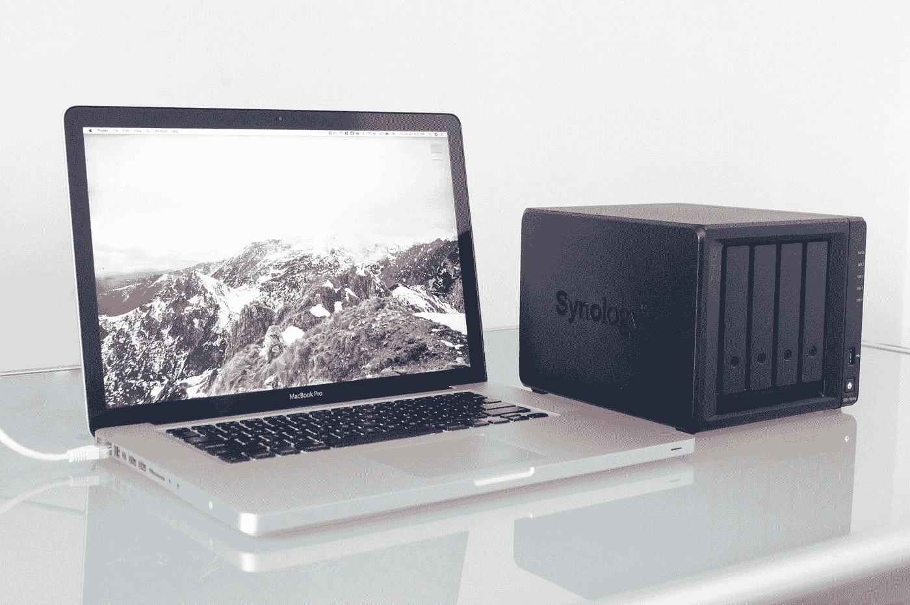

# 如何用 AWS S3 建立一个 Vue.js 静态网站

> 原文：<https://medium.com/bb-tutorials-and-thoughts/how-to-build-a-vue-js-static-website-with-aws-s3-caab0fa54119?source=collection_archive---------0----------------------->

## 包含示例项目的逐步指南

Photo by [Alex Cheung](https://unsplash.com/@alexcpl?utm_source=medium&utm_medium=referral) on [Unsplash](https://unsplash.com?utm_source=medium&utm_medium=referral)

有很多方法可以用 Vue 建立一个网站，比如 Java 用 Vue，NodeJS 用 Vue，NGINX 服务 Vue 等等。对于单页应用程序，你需要做的就是加载初始的**index.html。**一旦你加载了 index.html，Vue 库就会开始工作，并完成剩下的工作，比如加载…