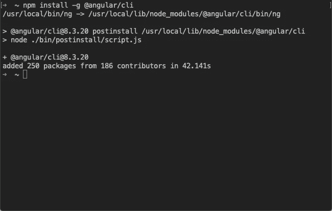
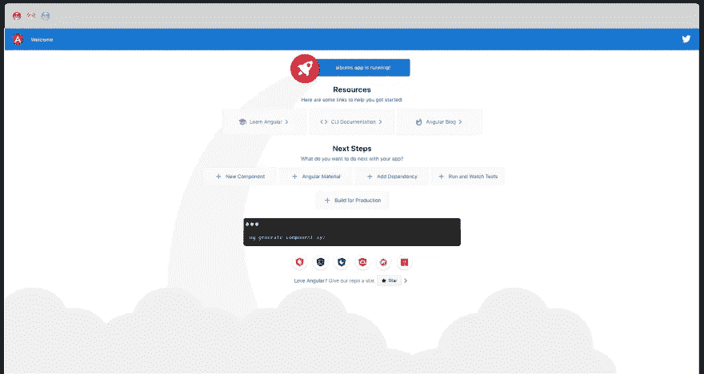
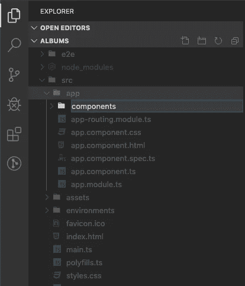
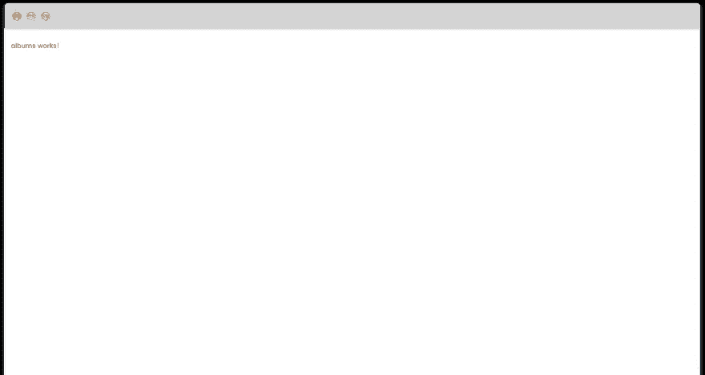
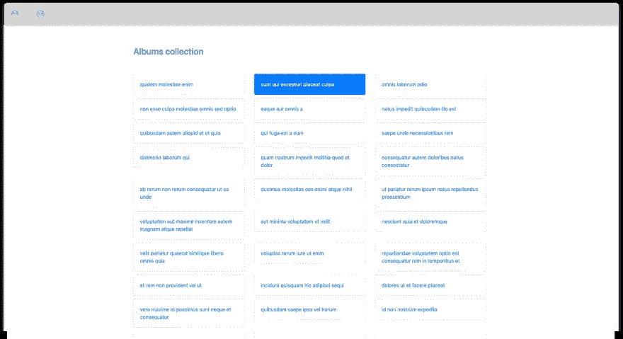
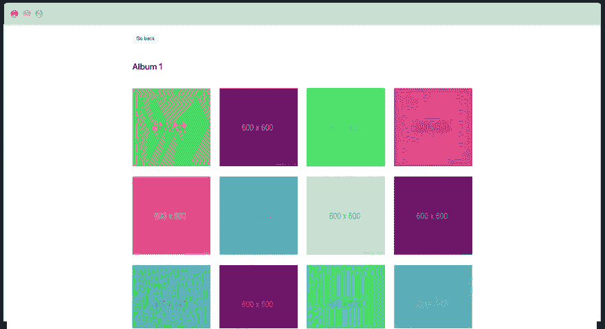

# 如何在 10 分钟内搭建一个 API 请求的 Angular 8 应用？

> 原文：<https://medium.com/quick-code/how-to-build-an-angular-8-application-with-api-request-in-10-minutes-628266d05e9?source=collection_archive---------0----------------------->


[Duomly — Programming Online Courses](https://www.duomly.com)

不久前，我创建了第一个关于 [React.js](https://www.blog.duomly.com/how-to-create-react-app-in-5-minutes/) 的教程，向您展示了如何使用现有的 API 和引导程序创建一个简单的 React.js 应用程序。对本文的积极回应让我想到了创建一系列简单教程的想法，这些教程讲述了如何用最流行的前端框架构建应用程序。让它对初学者和那些喜欢看和学，然后读和学的人更有帮助；我还决定给每一集添加一个 Youtube 视频。

所以，正如我之前已经提到的，我已经创建了关于 [React.js](https://www.youtube.com/watch?v=SPM4xyYd9MI) 的文本和 Youtube【链接】教程。在此之后，我决定继续使用 Vue.js，这就是如何创建 [Vue.js 教程](https://www.blog.duomly.com/vue-js-tutorial-how-to-create-vue-js-app-in-5-minutes/)和 [Vue js 教程——如何在 Vue](https://www.youtube.com/watch?v=i43MZ_oSRfs) 中构建应用程序。

今天是时候为角度爱好者创作一篇文章和一集 Youtube 视频了。所以，让自己舒服一点，先从谷歌开发者创建的框架说起。

开始吧！

## 1.安装@angular/cli

本教程中，我们将开始安装 Angular CLI。这个工具允许我们创建一个安装了所有依赖项的现成应用程序。更棒的是，Angular CLI 将允许我们创建现成的组件和服务。因此，让我们打开控制台并使用以下命令:

```
npm install -g @angular/cli
```

安装完成后，您应该会看到如下信息:



[Duomly — Programming Online Courses](https://www.duomly.com)

## 2.创建项目

因此，我们已经有了构建应用程序的工具，现在我们将创建一个。导航到要创建应用程序的文件夹，并使用 ng 命令。在我的例子中，应用程序的名称是“相册”,但是你可以随意命名你的应用程序。

```
ng new albums
```

运行该命令后，将会询问您两个问题。第一，如果你想安装路由，第二，你喜欢什么风格，CSS，Sass，Less，等等。

在这种情况下，我对第一个问题选择了是，并决定使用 CSS 进行样式化。

成功创建项目后，我们就可以运行它了。

## 3.运行应用程序

要运行应用程序，您需要首先在控制台中获取 app 文件夹。对我来说，是专辑。然后键入以下命令:

```
ng serve
```

这可能需要几秒钟的时间，在您看到编译成功的消息后，您可以在浏览器中检查它是如何工作的。【Angular 应用的默认端口是 4200，但如果你愿意，你可以自定义它。

让我们转到浏览器，打开 [http://localhost:4200](http://localhost:4200/) 或您的自定义端口。您应该会看到如下图所示的应用程序:



[Duomly — Programming Online Courses](https://www.duomly.com)

太好了，第一步完成了。现在，让我们开始构建我们的应用程序吧！

## 4.创建第一个组件

让我们在您最喜欢的代码编辑器中打开一个包含该应用程序的文件夹。在**内部。/src/app** 文件夹是我们的主文件 app.component.ts 和 app.module.ts。我们现在想创建自己的组件，但是为了避免应用程序的结构混乱，让我们创建一个名为**组件**的新文件夹。



[Duomly — Programming Online Courses](https://www.duomly.com)

很好，如果我们的文件夹现在已经准备好了，让我们在您的控制台中导航到该文件夹，我们将使用 Angular CLI 来生成组件。为此，我们将使用以下命令:

```
ng generate component albums
```

一秒钟后，我们的组件应该准备好了。现在，让我们删除当前显示的内容，并将 rout 设置为我们的新组件。

## 5.设置第一条路线

让我们从删除 app.component.html 文件中的几乎所有内容开始。我们唯一想留下的是< router-outlet >，文件应该是这样的:

```
<div class="container">
  <router-outlet></router-outlet>
</div>
```

如果准备好了，让我们转到 **app-routing.module.ts** 来设置相册组件的路径。我们必须添加一个新路径，如下面的代码所示:

```
const routes: Routes = [
  { path: '', component: AlbumsComponent },
];
```

在这一步之后，我们应该在浏览器中看到相册组件的模板。



[Duomly — Programming Online Courses](https://www.duomly.com)

## 6.创建服务和 API 调用

接下来我们要做的是创建一个 API 调用。在 Angular 中，我们使用服务创建一个 Http 请求，但是我们还需要从 **app.module.ts** 文件中的@angular/common/http 导入 HttpClientModule，我们把它注入到 imports 数组中。

```
import { BrowserModule } from '@angular/platform-browser';
import { NgModule } from '@angular/core';
import { HttpClientModule } from '@angular/common/http';

import { AppRoutingModule } from './app-routing.module';
import { AppComponent } from './app.component';
import { AlbumsComponent } from './components/albums/albums.component';

@NgModule({
  declarations: [
    AppComponent,
    AlbumsComponent,
  ],
  imports: [
    BrowserModule,
    AppRoutingModule,
    HttpClientModule
  ],
  providers: [],
  bootstrap: [AppComponent]
})
export class AppModule { }
```

现在，让我们在**中创建一个名为 services 的新文件夹。/src/app** 保持我们的服务。如果您准备好了服务文件夹，您可以使用以下命令生成新的服务，就像组件一样(请记住导航到您想要创建服务的文件夹):

```
ng generate service <servicename> 
```

在我们的例子中，让我们创建一个名为 photos 的服务。准备好后，打开 photos.service.ts 文件，从@angular/common/http 导入 HttpClient。完成后，在构造函数中注入 HttpClient，如下面的代码所示:

```
import { Injectable } from '@angular/core';
import { HttpClient } from '@angular/common/http';

@Injectable({
  providedIn: 'root'
})
export class PhotosService {
  constructor(
    private http: HttpClient
  ) { }
}
```

最后，我们可以创建我们的第一个 API 调用。和之前的教程一样，我将使用[www.jsonplaceholder.com](http://www.jsonplaceholder.com/)API。让我们创建一个发出 API 请求并返回它的函数。

```
getAlbums() {
    return this.http.get('https://jsonplaceholder.typicode.com/albums');
  }
```

## 7.从组件调用 API

让我们继续为数据调用 API。在 albums.component.ts 中，让我们导入服务并将其注入构造函数中的组件。

```
import { PhotosService } from './../../services/photos.service';
import { Component, OnInit } from '@angular/core';

@Component({
  selector: 'app-albums',
  templateUrl: './albums.component.html',
  styleUrls: ['./albums.component.css']
})
export class AlbumsComponent implements OnInit {
  constructor(
    private photosService: PhotosService,
  ) { }

  ngOnInit() {}
}
```

我们还需要在组件中为相册**定义一个属性。就在构造函数上方，让我们添加相册属性。**

```
export class AlbumsComponent implements OnInit {
  albums;
  constructor(
    private photosService: PhotosService,
  ) { }
```

现在，让我们将 API 的响应分配给 ngOnInit()方法中的 albums 属性。

```
ngOnInit() {
  this.albums = this.photosService.getAlbums();
}
```

## 8.创建模板

现在是时候显示我们的数据了，为此，我们需要一个好的模板。为了更方便快捷，让我们在 index.html 文件中导入 Bootstrap。

```
<head>
  <meta charset="utf-8">
  <title>Albums</title>
  <base href="/">
  <meta name="viewport" content="width=device-width, initial-scale=1">
  <link rel="icon" type="image/x-icon" href="favicon.ico">
  <link rel="stylesheet" href="https://stackpath.bootstrapcdn.com/bootstrap/4.4.1/css/bootstrap.min.css" integrity="sha384-Vkoo8x4CGsO3+Hhxv8T/Q5PaXtkKtu6ug5TOeNV6gBiFeWPGFN9MuhOf23Q9Ifjh" crossorigin="anonymous">
</head>
```

如果完成了，让我们打开 albums.component.html 文件并创建一个模板，如下面的代码所示。

```
<div>
  <h3>Albums collection</h3>
  <div class="row">
    <div class="col-sm-4" *ngFor="let album of albums | async">
      <div class="card">
        <div class="card-body">
          <a>{{album.title}}</a>
        </div>
      </div>
    </div>
  </div>
</div>
```

为了将数据添加到模板中，我们使用了*ngFor 和 async pipe。正如您可能看到的，在代码内部，有一个元素将被重定向到特定的相册以显示该相册中的照片。为此，我们需要创建另一条路线。

## 9.使用变量创建路线

在 app-routing.module.ts 文件中，我们必须添加另一个 route 对象。在这种情况下，路径将是一个带有变量的字符串，我们将通过 id 重定向到一个特定的相册。请按照下面的示例更新代码。

```
const routes: Routes = [
  { path: '', component: AlbumsComponent },
  { path: 'photos/:albumId', component: PhotosComponent }
];
```

现在，您应该会收到一个错误，因为我们在路径中使用了一个不存在的 Photos 组件。在这种情况下，我们必须创建一个新的组件来消除 bug。

## 10.创建另一个组件

像以前一样，让我们导航到控制台中的 components 文件夹，并使用 ng 命令生成一个名为 photos 的新组件。如果它准备好了，你的错误就不会再出现了。

## 11.添加重定向链接

在相册组件中，我们没有完成代码。让我们回到模板并更新链接，如下面的代码所示。

```
<a routerLink="photos/{{album.id}}">{{album.title}}</a>
```

现在，让我们将一些 CSS 代码应用于 albums.components.css 文件中的模板。

```
h3 {
  margin-top: 5%;
  margin-bottom: 5%;
}

.card {
  margin-bottom: 3%;
}

.card:hover {
  background-color: #007bff;
}

.card:hover a {
  color: white;
}

.card a:hover {
  color: white;
  text-decoration: none;
}
```

呜哇！应用程序的第一部分已经就绪。在浏览器中查看结果，您应该会看到如图所示的应用程序。



[Duomly — Programming Online Courses](https://www.duomly.com)

## 12.创建第二个 API 调用

现在我们需要从通过相册 id 获取数据到我们的新组件开始。让我们回到 **photos.service.ts** 文件并创建另一个函数。

```
getPhotos(albumId) {
    return this.http.get(`https://jsonplaceholder.typicode.com/photos?albumId=${albumId}`);
  }
```

## 13.从链接获取查询参数

如果它准备好了，我们可以在照片组件中使用它。因此，打开 photos.component.ts 文件，像以前在相册组件中一样导入 photos 服务，并以同样的方式注入它。

```
import { PhotosService } from './../../services/photos.service';
import { Component, OnInit } from '@angular/core';@Component({
  selector: 'app-photos',
  templateUrl: './photos.component.html',
  styleUrls: ['./photos.component.css']
})
export class PhotosComponent implements OnInit {
  photos;
  constructor(
    private photosService: PhotosService,
  ) { }
```

现在，我们将在 ngOnInit()方法中调用 getPhotos()函数，但不要忘记在构造函数上方初始化 Photos 的属性。

```
ngOnInit() {
  this.photos = this.photosService.getPhotos(albumId);
}
```

在这一步中，我们显然需要一个相册 id，它可以从链接中的查询参数中获得。要访问这些参数，我们需要从@angular/router 安装 ActivatedRoute，并且我们还需要在构造函数中注入它。

当它准备好了，我们可以初始化照片属性下面的另一个属性 albumId。在 ngOnInit()方法中，让我们将 URL 中的 id 分配给 this.albumId，并将其传递给 API URL。

```
import { PhotosService } from './../../services/photos.service';
import { Component, OnInit } from '@angular/core';
import { ActivatedRoute } from '@angular/router';@Component({
  selector: 'app-photos',
  templateUrl: './photos.component.html',
  styleUrls: ['./photos.component.css']
})
export class PhotosComponent implements OnInit {
  photos;
  albumId;
  constructor(
    private photosService: PhotosService,
    private route: ActivatedRoute,
  ) { } ngOnInit() {
    this.albumId = this.route.snapshot.params.albumId;
    this.photos = this.photosService.getPhotos(this.albumId);
  }
}
```

我们就快到了，现在我们唯一需要做的就是为照片创建一个模板。

## 14.创建模板

在 photos.component.html 文件中，让我们添加以下 HTML 代码，并用*ngFor 传递照片。

这里我们也会传递 this.albumId 来显示相册的 Id。

```
<div>
  <button routerLink="/" class="btn btn-light">Go back</button>
  <h3>Album {{albumId}}</h3>
  <div class="row">
    <div class="col-md-3 photo" *ngFor="let photo of photos | async">
      
    </div>
  </div>
</div>
```

最后一步是添加一些 CSS 代码，使我们的应用程序漂亮。

```
.photo {
  margin-bottom: 3%;
}
h3 {
  margin-bottom: 5%;
  margin-top: 5%;
}
button {
  margin-top: 10px;
}
```

## 15.呜哇！

我们在那里！在浏览器中检查您的应用程序，并尝试导航到相册并返回。您应该能够看到如下图所示的屏幕。


[Duomly — Programming Online Courses](https://www.duomly.com)

相册页面



[Duomly — Programming Online Courses](https://www.duomly.com)

照片页面

恭喜你！

## 结论

在本文中，我使用 Angular 8 创建了一个简单的应用程序。为了创建应用程序、组件和服务，我使用 Angular CLI 工具，并且我们使用 Bootstrap 来使我们的模板又好又快。应用程序有一个简单的路由，让你熟悉创建路由和 REST API 请求，向你展示我们如何在 Angular 中管理 API 调用。结果，我得到了一个有专辑列表和每个专辑的详细页面的应用程序。

我希望你会发现这个教程很有帮助，并把它作为你第一次角度应用训练的基础。如果你觉得 Youtube 视频更舒服，请随意在这里观看本教程。

有一个不错的编码，
来自 Duomly 的安娜


[Duomly — Programming Online Courses](https://www.duomly.com)

本文最初发表于:[https://www.blog.duomly.com/angular-tutorial/](https://www.blog.duomly.com/angular-tutorial/)