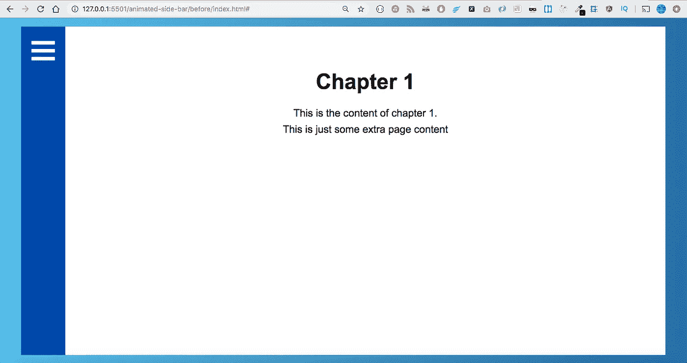

# 如何使用 CSS 网格构建一个基本的抽屉并制作动画

> 原文：<https://medium.com/quick-code/how-to-build-and-animate-a-basic-drawer-using-css-grid-4525ffd265ba?source=collection_archive---------0----------------------->

所以在过去的几个月里，我一直在尽可能多地学习 CSS Grid，这样我就可以制作一个关于它的课程。本课程将是 Flexbox 课程的后续课程，我已经在 Flexbox 中创建了一门课程(如有兴趣，请参见课程[此处](https://www.udemy.com/flexbox-in-depth))。

作为我研究的一部分，我想看看我们能用 CSS 网格制作出什么样的动画。我发现我可以建立一个好看的…