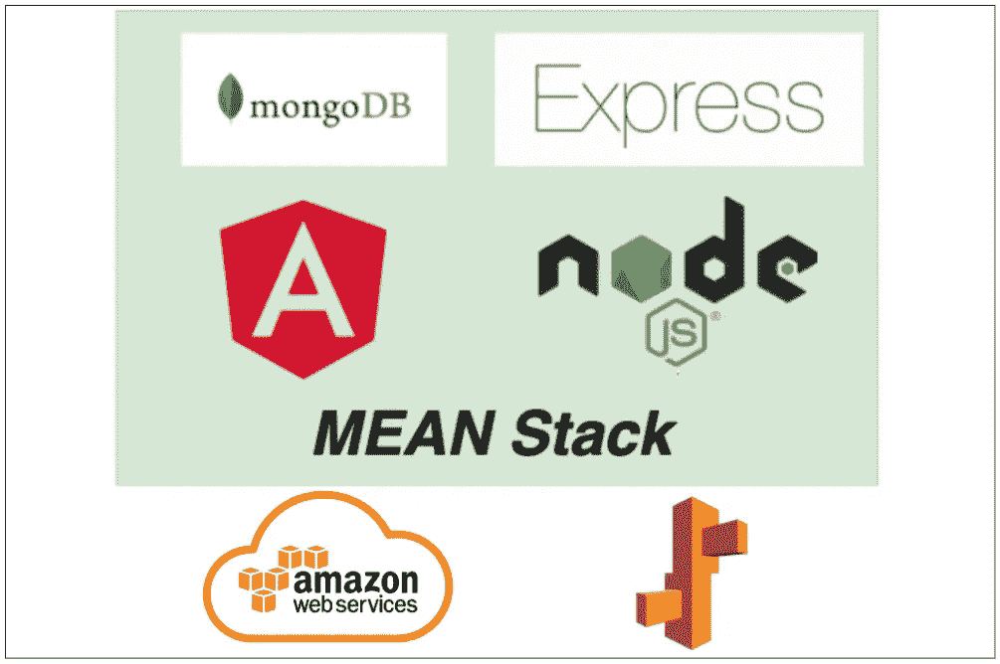

# 如何在 AWS 弹性豆茎上构建和部署 MEAN Stack

> 原文：<https://medium.com/bb-tutorials-and-thoughts/how-to-build-and-deploy-mean-stack-on-aws-elastic-beanstalk-be79a7dd7877?source=collection_archive---------0----------------------->

## 包含示例项目的分步指南

AWS 提供 200 多种服务，了解您应该选择哪种服务来满足您的需求非常重要。如果您想快速部署应用程序，而不用担心底层基础设施，AWS Elastic Beanstalk 就是答案。弹性豆茎减少管理…