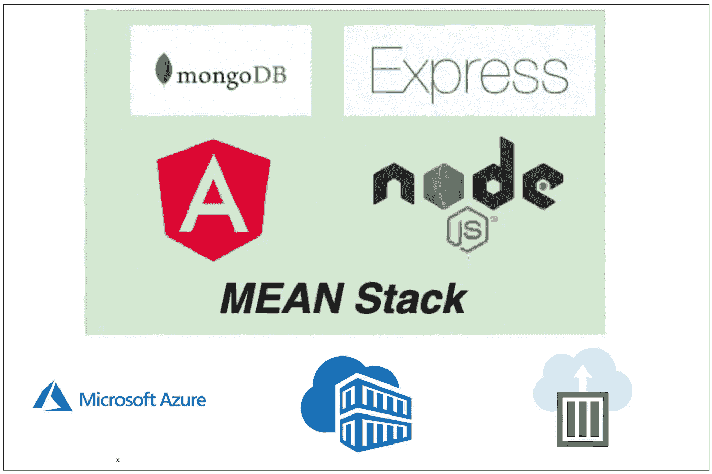

# 如何在 Azure 容器实例上构建和部署均值堆栈

> 原文：<https://medium.com/bb-tutorials-and-thoughts/how-to-build-and-deploy-mean-stack-on-azure-container-instances-d35b7468163b?source=collection_archive---------0----------------------->

## 包含示例项目的逐步指南

如果你想在不关注基础设施的情况下部署你的应用，Azure 容器实例是正确的选择。您可以立即运行容器，而不用担心诸如 Kubernetes 之类的容器编排。说到您可以构建和部署的平均堆栈…