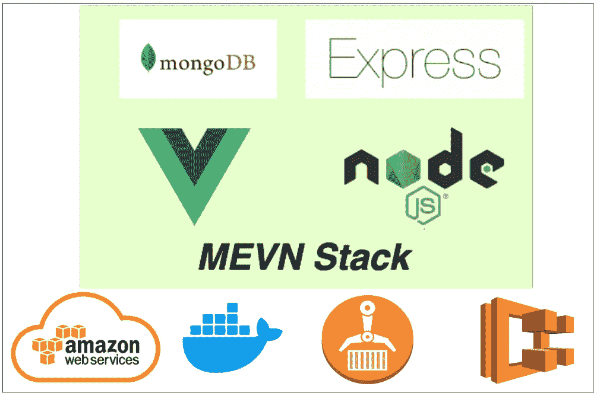

# 如何在 AWS ECS 上构建和部署 MEVN 堆栈

> 原文：<https://medium.com/bb-tutorials-and-thoughts/how-to-build-and-deploy-mevn-stack-on-aws-ecs-477b6229ba85?source=collection_archive---------0----------------------->

## 包含示例项目的分步指南

AWS 提供 200 多种服务，了解您应该选择哪种服务来满足您的需求非常重要。Amazon Elastic Container Service(Amazon ECS)是一个高度可伸缩的、快速的容器管理服务，它使得在 Amazon EC2 的集群上运行、停止和管理 Docker 容器变得很容易