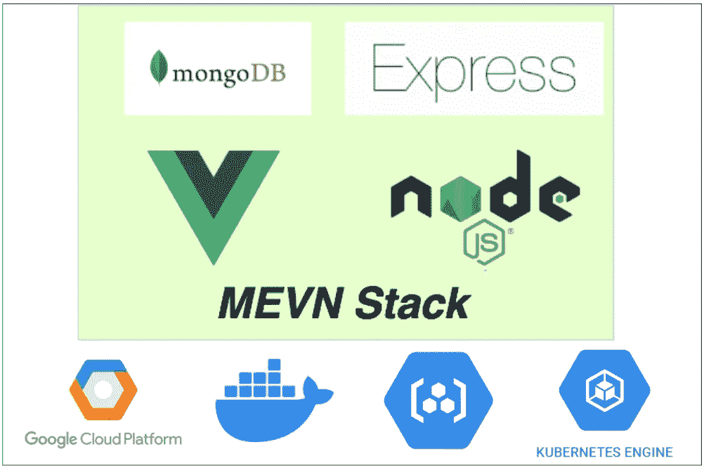

# 如何在 GCP GKE 上构建和部署 MEVN 堆栈

> 原文：<https://medium.com/bb-tutorials-and-thoughts/how-to-build-and-deploy-mevn-stack-on-gcp-gke-fc20fafdf41a?source=collection_archive---------0----------------------->

## 包含示例项目的分步指南

GKE 是 GCP 管理的 Kubernetes 解决方案，让您在云中运行和管理容器化的应用程序。由于这是一个托管的 Kubernetes 服务，微软为我们处理了很多事情，比如安全性、维护、可伸缩性和监控。这使我们能够快速地将我们的应用程序部署到…