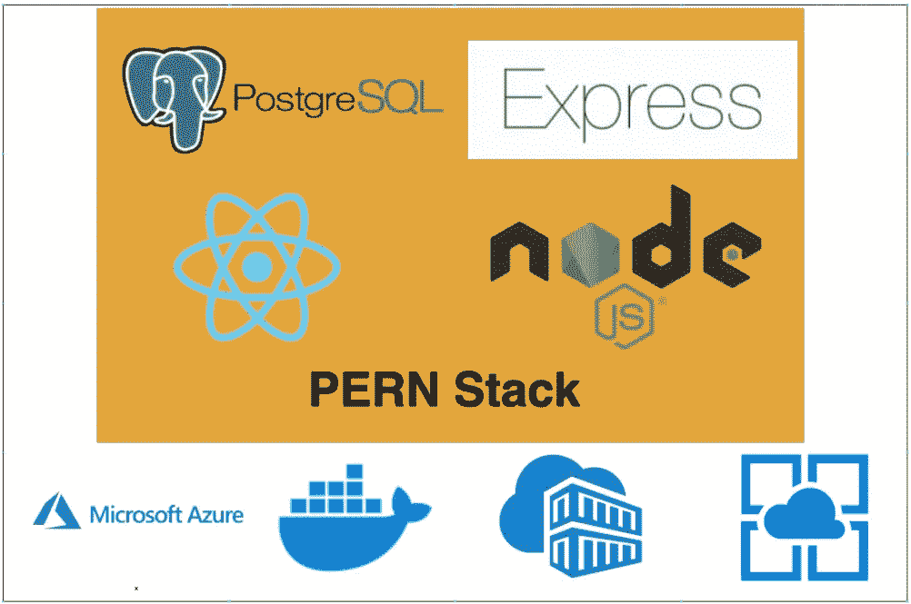

# 如何在 Azure 应用服务上构建和部署 PERN 堆栈

> 原文：<https://medium.com/bb-tutorials-and-thoughts/how-to-build-and-deploy-pern-stack-on-azure-app-services-a73cc4808d84?source=collection_archive---------0----------------------->

## 带有 Docker 运行时的示例项目

如果您希望通过选择运行时在托管平台上部署应用程序，应用程序服务是正确的选择。可以在 Azure app Services 下创建功能 app、web app、逻辑 App 等。说到 PERN Stack，你可以用多种方式构建和部署，Azure App service…