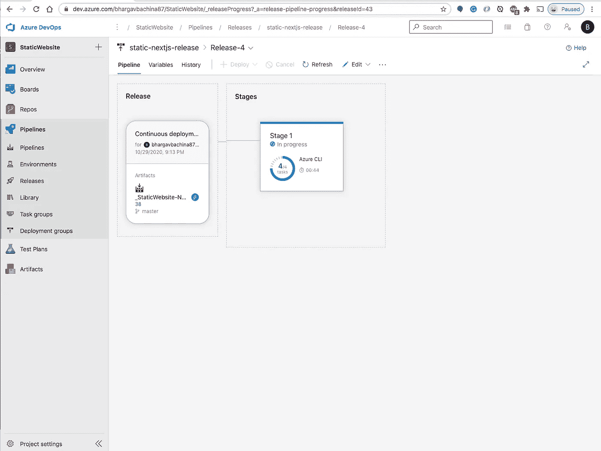

# 如何使用 Azure DevOps 为 NodeJS Azure 函数构建 CI/CD

> 原文：<https://medium.com/bb-tutorials-and-thoughts/how-to-build-ci-cd-for-nodejs-azure-functions-using-azure-devops-4f32fb55a1a0?source=collection_archive---------0----------------------->

## 包含示例项目的逐步指南

Azure 函数是一种在云中运行小段代码的简单方式。您不必担心托管这些代码所需的基础设施。您可以用 C#、Java、JavaScript、PowerShell、Python 或……中列出的任何语言编写函数