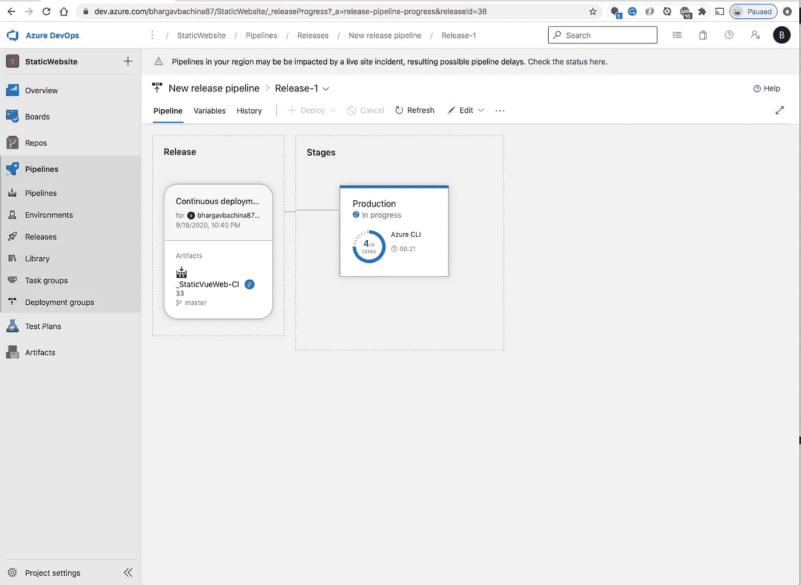

# 如何使用 Azure DevOps 为静态 Vue.js App 构建 CI/CD

> 原文：<https://medium.com/bb-tutorials-and-thoughts/how-to-build-ci-cd-for-static-vue-js-app-using-azure-devops-789e0a00e999?source=collection_archive---------0----------------------->

## 包含示例项目的逐步指南

**Azure DevOps**

当您将 Vue.js 应用程序部署到生产环境时，有许多部署策略，您的部署策略完全取决于您的应用程序架构。例如，如果您在 Vue 中使用 Java 或 Nodejs，您需要将您的应用程序部署在各自的…