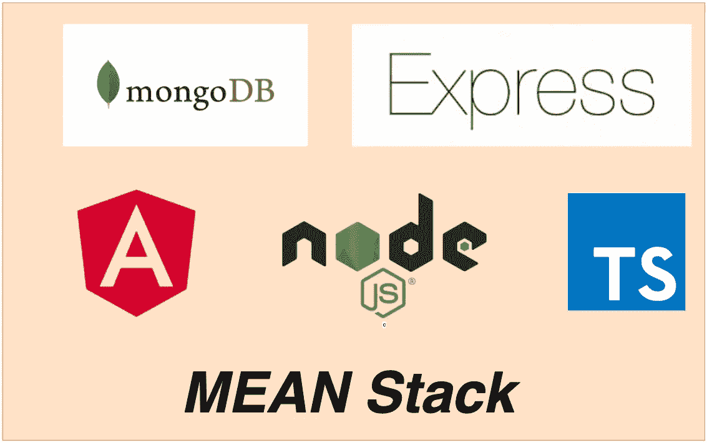

# 如何为生产构建平均堆栈—类型脚本版本

> 原文：<https://medium.com/bb-tutorials-and-thoughts/how-to-build-mean-stack-for-production-typescript-version-806b149c5f81?source=collection_archive---------0----------------------->

## 包含示例项目的逐步指南

我们有很多方法可以构建 Angular 应用程序并交付生产。一种方法是用 NodeJS 和 MongoDB 作为数据库来构建 Angular app。有四件事让这个栈流行起来，你可以用 Typescript 写任何东西。这四样东西是 MongoDB，Angular…