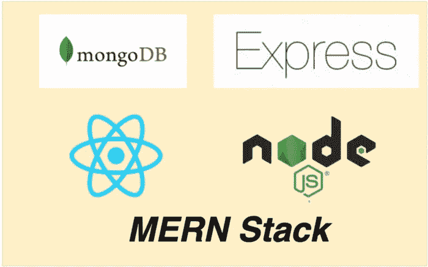

# 如何为生产构建 MERN 堆栈

> 原文：<https://medium.com/bb-tutorials-and-thoughts/how-to-build-mern-stack-for-production-1462e70a35cb?source=collection_archive---------0----------------------->

## 包含示例项目的逐步指南

我们有很多方法可以构建 React 应用并将其交付生产。一种方法是用 NodeJS 和 MongoDB 作为数据库来构建 React app。有四件事让这个栈流行起来，你可以用 Javascript 写任何东西。这四个东西是 MongoDB、React、Express 和 NodeJS。该堆栈可用于…