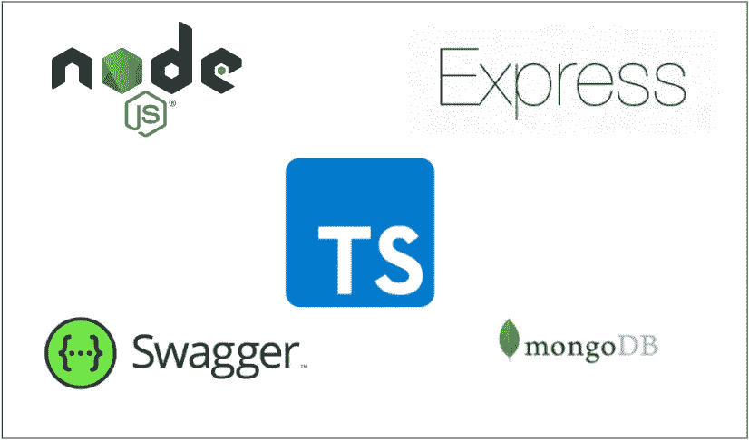

# 如何用 Express 和 MongoDB — Typescript 版本构建 NodeJS REST API

> 原文：<https://medium.com/bb-tutorials-and-thoughts/how-to-build-nodejs-rest-api-with-express-and-mongodb-typescript-version-38f4492920ee?source=collection_archive---------0----------------------->

## 包含示例项目的逐步指南

REST 是表述性状态转移的首字母缩写。Rest 遵循一些准则来促进系统间的通信。在这篇文章中，我们将如何用 NodeJS 和 MongoDB 构建一个 REST API 作为 typescript 中的数据库。首先，我们将看看如何开始…