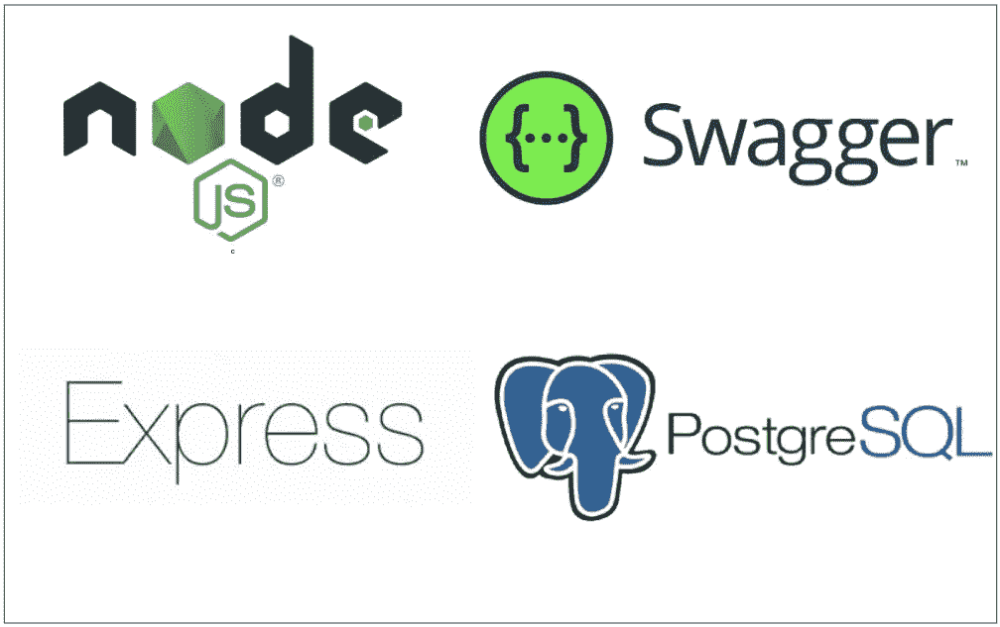

# 如何用 Express 和 PostgreSQL 构建 NodeJS REST API

> 原文：<https://medium.com/bb-tutorials-and-thoughts/how-to-build-nodejs-rest-api-with-express-and-postgresql-674d96d5cb8f?source=collection_archive---------0----------------------->

## 包含示例项目的逐步指南

REST 是表述性状态转移的首字母缩写。Rest 遵循一些准则来促进系统间的通信。在这篇文章中，我们将介绍如何使用 NodeJS 和 PostgreSQL 作为数据库来构建 REST API。首先，我们将了解如何从 Express Framework 开始，创建一个…