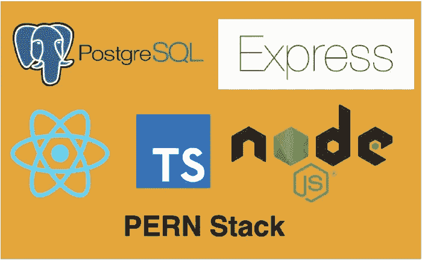

# 如何为生产构建 PERN 堆栈— Typescript 版本

> 原文：<https://medium.com/bb-tutorials-and-thoughts/how-to-build-pern-stack-for-production-typescript-version-cf5469be0485?source=collection_archive---------0----------------------->

## 包含示例项目的逐步指南

我们有很多方法可以构建 React 应用并将其交付生产。一种方法是用 NodeJS 和 PostgreSQL 作为数据库构建 React app。有四件事让这个栈流行起来，你可以用 Javascript 写任何东西。这四样东西是 PostgreSQL，React…