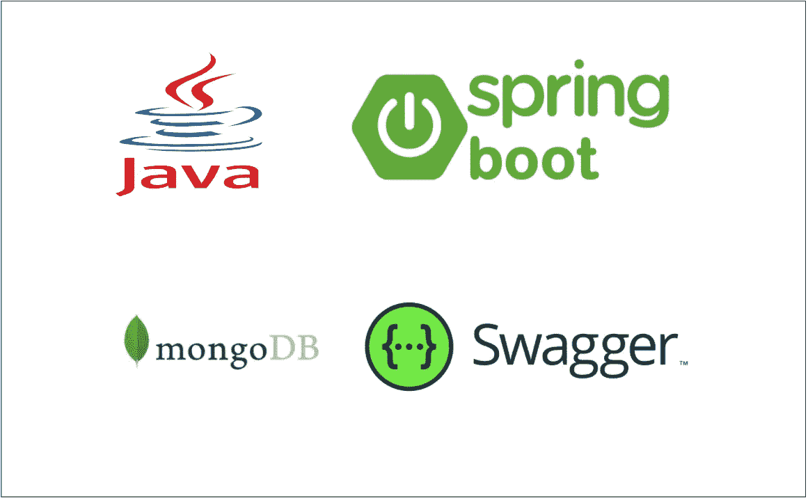

# 如何用 Spring Boot 和 MongoDB 构建 Java REST API

> 原文：<https://medium.com/bb-tutorials-and-thoughts/how-to-build-rest-api-with-spring-boot-and-mongodb-d8ebc658ffe3?source=collection_archive---------0----------------------->

## 包含示例项目的逐步指南

REST 是表述性状态转移的首字母缩写。Rest 遵循一些准则来促进系统间的通信。在这篇文章中，我们将介绍如何使用 Java 和 MongoDB 作为数据库来构建 REST API。首先，我们将看到如何从 spring 初始化器开始，创建一个结构和…