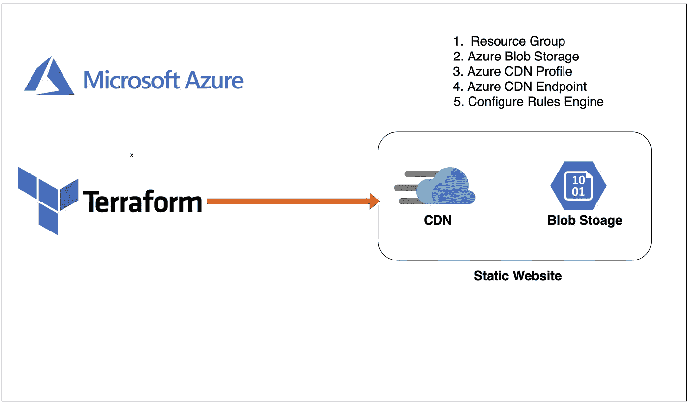

# 如何用 Terraform 在 Azure 上构建静态网站基础架构

> 原文：<https://medium.com/bb-tutorials-and-thoughts/how-to-build-static-website-infra-on-azure-with-terraform-4cfb8621cd4d?source=collection_archive---------0----------------------->

## 包含示例项目的逐步指南

有很多方法可以建立一个网站，并且有很多前端框架可以使用。对于单页应用程序，你需要做的就是加载初始的**index.html。**一旦你加载了 index.html，任何一个库都会启动并完成剩下的工作，就像…