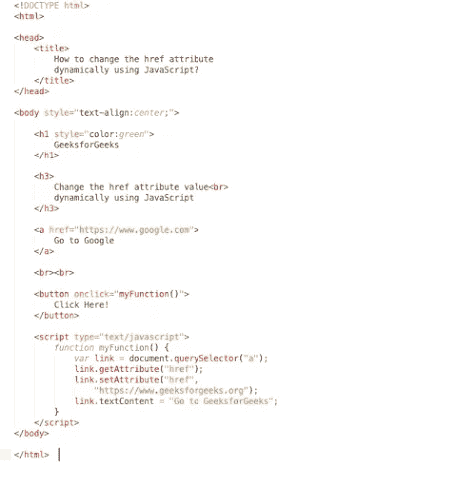
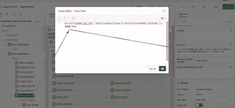
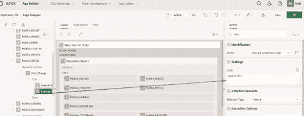
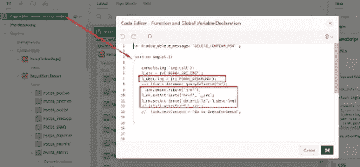
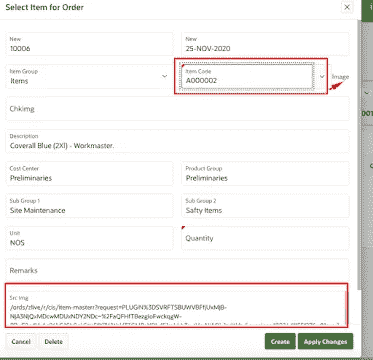
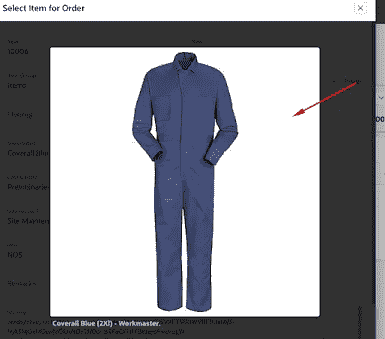

# 如何在 Oracle APEX 中动态更改“a”标记的 HREF 值

> 原文：<https://medium.com/oracledevs/how-to-change-the-href-value-of-a-tag-dynamic-in-oracle-apex-ef8a834d3f8b?source=collection_archive---------3----------------------->


JavaScript 是一种高级的、解释的、动态类型的客户端脚本语言。HTML 用于创建静态网页。JavaScript 与 HTML 和 CSS 一起支持交互式网页。文档对象操作(DOM)是 HTML 和 XML 文档的编程接口。DOM 作为 JavaScript 和 HTML 结合 CSS 的接口。DOM 将文档表示为节点和对象，也就是说，浏览器将每个 HTML 标签转化为我们可以操作的 JavaScript 对象。DOM 是网页的面向对象的表示，可以用脚本语言如 JavaScript 修改。要操作文档中的对象，我们需要选择它，然后进行操作。

可以通过五种方式选择元素:

*   [**document.querySelector()方法:**](https://www.geeksforgeeks.org/html-dom-queryselector-method/) 返回第一个匹配查询的元素。
*   [**document . queryselectorall()方法:**](https://www.geeksforgeeks.org/html-dom-queryselectorall-method/) 它返回所有匹配查询的元素。
*   [**document.getElementById()方法:**](https://www.geeksforgeeks.org/html-dom-getelementbyid-method/) 返回与 Id 匹配的一个元素。
*   [**document . getelementsbyclassname()方法:**](https://www.geeksforgeeks.org/html-dom-getelementsbyclassname-method/) 它返回所有匹配类的元素。
*   [**document . getelementsbytagname()方法:**](https://www.geeksforgeeks.org/html-dom-getelementsbytagname-method/) 返回与标签名匹配的元素列表。

DOM 允许属性操作。属性控制 HTML 标签的行为或提供关于标签的附加信息。JavaScript 提供了几种操作 HTML 元素属性的方法。

以下方法用于操作属性:

*   [**getAttribute()方法:**](https://www.geeksforgeeks.org/html-dom-getattribute-method/) 返回元素上某个属性的当前值，如果元素上不存在指定的属性，则返回 null。
*   [**setAttribute()方法:**](https://www.geeksforgeeks.org/php-domelement-setattribute-function/) 它更新指定元素上已经存在的属性的值，否则添加一个具有指定名称和值的新属性。
*   [**removeAttribute()方法:**](https://www.geeksforgeeks.org/html-dom-removeattribute-method/) 它用于移除指定元素的一个属性。

例子一:



示例二:用 href
1)定义页面项目，如零件代码和提到的文章代码

```
<a href=”&P6004_SRC_IMG.” data-lightbox=”image-1" data-title=”&P6004_DESCRLNG.” > Image </a>
```



2)更改零件代码时调用函数



3)定义函数全局变量声明



想谈谈吗？加入我们的[公共松弛](https://bit.ly/devrel_slack)！

[注册免费等级](https://signup.cloud.oracle.com/?language=en&sourceType=:ex:tb:::::&SC=:ex:tb:::::&pcode=)亲自体验。