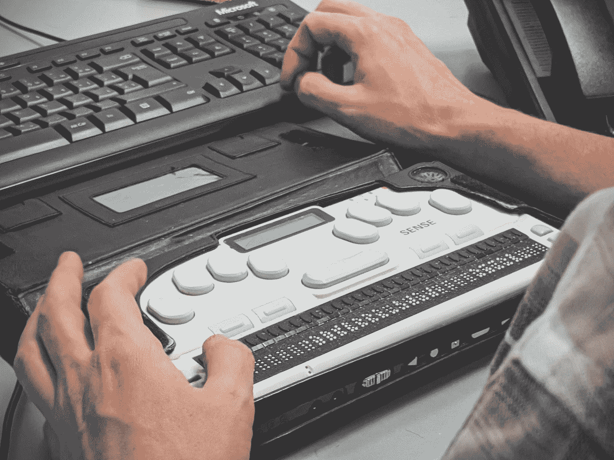
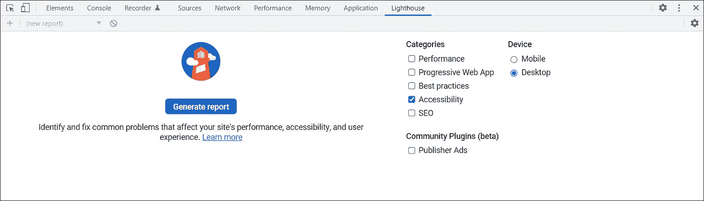

# 如何检查网页上的辅助功能错误

> 原文：<https://medium.com/version-1/how-to-check-for-accessibility-errors-on-a-web-page-cf8c6662342a?source=collection_archive---------0----------------------->

Photo by [Sigmund](https://unsplash.com/@sigmund?utm_source=medium&utm_medium=referral) on [Unsplash](https://unsplash.com?utm_source=medium&utm_medium=referral)

> 网络的力量在于它的普遍性。无论是否残疾，每个人都能获得服务是一个重要方面。

-蒂姆·伯纳斯·李，W3C 主管和万维网的发明者

作为前端开发人员，让 web 应用程序 ***可访问*** 是主要目标之一。为了确保有视觉障碍的人也可以没有太多麻烦地使用该应用程序，我们需要使它具有可访问性。许多项目都将易访问性测试作为他们的强制性要求。

那么如何检查 web 应用程序中的可访问性问题并修复它们呢？下面，我们将看到如何快速测试您的应用程序并修复可访问性问题。

# 测试可访问性的工具

有很多开源和付费的工具来测试 web 应用程序的可访问性。在本文中，我们将看到 3 个最常用的开源工具。

**1。谷歌灯塔**

*   在 Google Chrome 浏览器中打开开发者工具(右键+ inspect)
*   转到灯塔选项卡
*   在“类别”部分，选择“可访问性”复选框
*   选择设备类型
*   点击“生成报告”

Google Lighthouse 会给出一个 100 分的可访问性分数。它还会给出需要修复的错误列表。

**2。Axe 开发工具**

*   前往[谷歌 Chrome 网络商店](https://chrome.google.com/webstore/category/extensions)
*   搜索 ***轴开发工具***
*   将其添加到您的 Chrome 浏览器中
*   在谷歌 Chrome 浏览器中打开开发者工具
*   转到 Axe 开发工具选项卡
*   点击“扫描我的所有页面”

它会给你一个应用程序中易访问性错误的列表。

**3。WAVE by WebAIM**

*   前往[谷歌 Chrome 网络商店](https://chrome.google.com/webstore/category/extensions)
*   搜索 ***波浪评估工具***
*   将其添加到您的 Chrome 浏览器中
*   右键单击您的 web 应用程序
*   在上下文菜单中单击“浏览此页面”

它会给你一个应用程序中易访问性错误的列表。

虽然这些工具可以测试大多数可访问性问题，但是也建议进行手动检查。关于 WCAG 2.1 清单的快速参考可在 [WCAG2.1 快速参考](https://www.w3.org/WAI/WCAG21/quickref/)中找到

编码快乐！

**关于作者:** Nitish Kumar 是这里版本 1 的高级前端开发者。