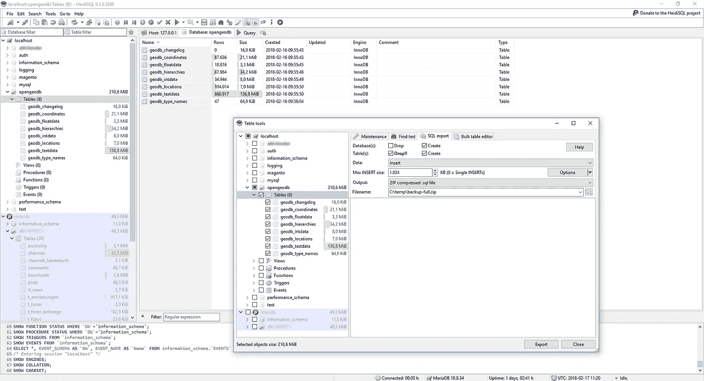

# 如何选择你的 MySQL 存储引擎？

> 原文：<https://medium.com/globant/how-to-choose-your-mysql-storage-engine-858887dbd57a?source=collection_archive---------0----------------------->

# 介绍

存储引擎负责存储、处理和检索表中的信息。对于这个故事，我们将特别讨论 MySQL，然后最著名的引擎是 MyISAM 和 InnoDB。

选择哪一个将在很大程度上取决于它的应用场景，但是 Arsys 希望帮助我们更好地理解这些众所周知的存储引擎。选择是根据我们的应用实现最佳质量比。如果我们需要事务、外键和锁，我们将不得不选择 InnoDB。相反，在对数据库的选择查询占主导地位的情况下，我们将选择 MyISAM。

InnoDB 为 MySQL 提供了具有提交、回滚和崩溃恢复功能的事务存储引擎(ACID 兼容)。InnoDB 执行行级锁定，并在 SELECT 语句上提供 Oracle 风格的非锁定一致读取功能。这些功能提高了管理多个并发用户的性能和能力。InnoDB 中不需要缩放锁，因为行级锁占用的空间很小。InnoDB 还支持外键约束。在 SQL 查询中，甚至在同一个查询中，InnoDB 类型的表可以自由地包含在其他类型的表中。

注意，您可以在同一个数据库中混合使用不同的表类型。在实践中，架构师应该分析使用不同的存储引擎是否会给项目开发人员带来更多或更少的困惑

# InnoDB 表的利与弊

InnoDB 不如默认的 MyISAM 表类型出名。然而，有几个原因可以说明为什么它是您的 web 应用程序的更好选择。

*   **数据完整性和外键约束:**
    外键在一个表中的列和另一个表中的列之间建立关系。
*   **事务:**
    InnoDB 表支持事务。
*   **行级锁定:**
    InnoDB 使用行级锁定，而不是表级锁定。

以下是 InnoDB 可能不适合的一些情况。

*   **复杂性增加:**
    创建 InnoDB 表并不比 MyISAM 复杂。
*   **较慢的性能:**
    如果您的应用主要是选择数据，性能是优先考虑的。

# 那么 MyISAM 表呢？

MyISAM 是默认的 MySQL 表类型。如果您从未有意指定类型，您的表将使用 MyISAM 引擎。这可能是一种优势，原因有几个。

*   **简单:**
    MyISAM 表很简单。
*   **速度:**
    MyISAM 表快。非常快。

有几种情况可能不适合使用 MyISAM。

*   **数据完整性差:**
    MyISAM 表不支持事务或外键约束。
*   糟糕的崩溃恢复:
    MySQL 是可靠的，但是 MyISAM 表在崩溃后可能会损坏。
*   **表锁定:**MyISAM 使用表级锁定。

# 你应该如何决定

通过大大简化在数据库设计期间必须分析的要点，可以做出一个决定，为我们的应用程序的最终实现提供一个相当近似的基线，回答几个相当简单的问题。

*   **您的表接收插入、更新和删除的时间会比它被查询的时间长吗？**
    我会推荐 InnoDB。
*   您需要进行全文搜索吗？
    你的引擎一定是 MyISAM。
*   **你更喜欢还是需要关系数据库设计？** 那你需要 InnoDB。
*   **是磁盘空间还是 RAM 有问题？**
    你会陷入迷途。

这还不是全部，上面的问题可能有助于您开始一个项目，但请记住，当前的 IT 公司已经或应该有一个数据库设计者的角色，他负责定义详细的数据库设计，包括存储引擎、表、索引、视图、约束、触发器、存储过程以及存储、检索和删除持久对象所需的其他特定于数据库的结构。

# 摘要

如果您正在处理特别大或复杂的项目或数据集，InnoDB 存储引擎表现出色，但它并不总是比它的前身 MyISAM 更好的选择。对于较小的应用程序和数据库，MyISAM 提供了更高的性能。事实上，你不一定要在它们之间做出选择。如有必要，两个存储引擎可以在同一个数据库中并行使用。