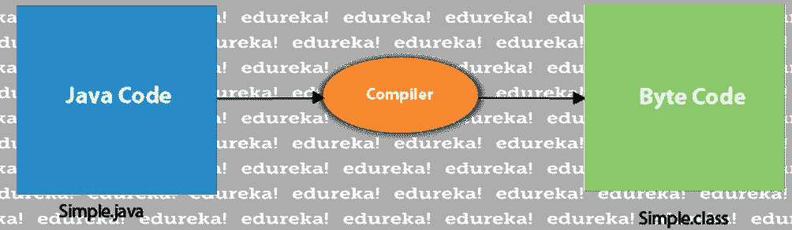

# 如何编译和运行你的第一个 Java 程序

> 原文：<https://medium.com/edureka/how-to-compile-and-run-java-program-12bbb1ceb9c9?source=collection_archive---------3----------------------->


像 Java、C、C++等高级语言。将程序编译成机器能够理解和执行的等价低级代码。在这个博客中，我们将讨论如何编写、编译和运行 java 程序。

第一步，创建一个文件夹，创建一个 Java 类，编写一个 Java 程序。当我们编写 Java 程序时，javac (Java 编译器)将 Java 源代码翻译成字节码即 ***。*** 类*文件*。字节码是 Java 虚拟机(JVM)的机器语言。字节码也被称为 Java 的神奇代码，它是独立于平台的。

将 Java 安装到系统中后的一个重要步骤就是设置路径。你可以参考这个‘如何在 Java 中设置路径？’文章了解确切的程序。

让我们创建一个简单的 java 程序。

创建一个 java 文件作为**HelloWorld.java**

```
public class HelloWorld {
    public static void main(String args[]) {
        System.out.println("Hello World");
    }
}
```

要编译这个程序，请在命令提示符下键入下面显示的命令，然后按 enter 键。

`javac HelloWorld.java`

这就运行了编译器**javac.exe**。编译任何 Java 程序的通用命令。

```
**javac <Java_file_name>.java**
```


一旦你按下回车键，HelloWorld。将生成类文件。你会在工作目录的文件中找到**HelloTesters.java**和 **HelloTesters.class** 。


当我们使用 ***javac*** 工具编译 java 程序时，一般 java 编译器会执行以下步骤:

*   语法检查
*   添加额外代码
*   将源代码转换为字节码，即从*开始。java 文件*到*。类别文件*

所以，当我说编译器在编译时添加额外的代码时，例如，如果你还没有在你的程序中写任何构造函数，那么编译器会在你的程序中添加一个默认的构造函数。



所以 java 编译的主要目的是产生一个 ***。机器理解的程序的类文件*** 。

*注意:Java 要求放在自己源文件中的每个类必须与扩展名为 Java 的类名相同。*

当我们开始编译源代码时，每个类都被放在自己的*中。包含字节码*的类文件*。假设，如果你想一次编译多个 Java 文件，那么你可以使用下面的命令:*

`javac *.java`

这个命令将把所有的 java 文件转换成一个. class 文件。

至此，我们结束了这篇关于 Java 编译过程的文章。我希望你理解了如何编译一个 java 程序，并且清楚我上面讨论的每一个方面。

到此，我们结束了这个博客。如果你希望查看更多关于人工智能、DevOps、道德黑客等市场最热门技术的文章，那么你可以参考 [Edureka 的官方网站](https://www.edureka.co/blog/?utm_source=medium&utm_medium=content-link&utm_campaign=how-to-compile-run-java-program)。

请留意本系列中解释 Java 其他各方面的其他文章。

> *1。* [*面向对象编程*](/edureka/object-oriented-programming-b29cfd50eca0)
> 
> *2。*[*Java 中的继承*](/edureka/inheritance-in-java-f638d3ed559e)
> 
> *3。*[*Java 中的多态性*](/edureka/polymorphism-in-java-9559e3641b9b)
> 
> *4。*[*Java 中的抽象*](/edureka/java-abstraction-d2d790c09037)
> 
> *5。* [*Java 字符串*](/edureka/java-string-68e5d0ca331f)
> 
> *6。* [*Java 数组*](/edureka/java-array-tutorial-50299ef85e5)
> 
> *7。* [*Java 收藏*](/edureka/java-collections-6d50b013aef8)
> 
> *8。* [*Java 线程*](/edureka/java-thread-bfb08e4eb691)
> 
> *9。*[*Java servlet 简介*](/edureka/java-servlets-62f583d69c7e)
> 
> *10。* [*Servlet 和 JSP 教程*](/edureka/servlet-and-jsp-tutorial-ef2e2ab9ee2a)
> 
> *11。*[*Java 中的异常处理*](/edureka/java-exception-handling-7bd07435508c)
> 
> *12。* [*高级 Java 教程*](/edureka/advanced-java-tutorial-f6ebac5175ec)
> 
> *13。* [*Java 面试题*](/edureka/java-interview-questions-1d59b9c53973)
> 
> *14。* [*Java 程序*](/edureka/java-programs-1e3220df2e76)
> 
> *15。*[*kot Lin vs Java*](/edureka/kotlin-vs-java-4f8653f38c04)
> 
> *16。* [*依赖注入使用 Spring Boot*](/edureka/what-is-dependency-injection-5006b53af782)
> 
> *17。* [*堪比爪哇的*](/edureka/comparable-in-java-e9cfa7be7ff7)
> 
> 18。 [*十大 Java 框架*](/edureka/java-frameworks-5d52f3211f39)
> 
> *19。* [*Java 反射 API*](/edureka/java-reflection-api-d38f3f5513fc)
> 
> 20。[*Java 中的 30 大模式*](/edureka/pattern-programs-in-java-f33186c711c8)
> 
> 21。 [*核心 Java 备忘单*](/edureka/java-cheat-sheet-3ad4d174012c)
> 
> *22。*[*Java 中的套接字编程*](/edureka/socket-programming-in-java-f09b82facd0)
> 
> *23。* [*Java OOP 备忘单*](/edureka/java-oop-cheat-sheet-9c6ebb5e1175)
> 
> *24。*[*Java 中的注释*](/edureka/annotations-in-java-9847d531d2bb)
> 
> *25。*[*Java 中的库管理系统项目*](/edureka/library-management-system-project-in-java-b003acba7f17)
> 
> *26。*[*Java 中的树*](/edureka/java-binary-tree-caede8dfada5)
> 
> *27。*[*Java 中的机器学习*](/edureka/machine-learning-in-java-db872998f368)
> 
> *28。* [*顶级数据结构&Java 中的算法*](/edureka/data-structures-algorithms-in-java-d27e915db1c5)
> 
> *29。* [*Java 开发者技能*](/edureka/java-developer-skills-83983e3d3b92)
> 
> *30。* [*前 55 名 Servlet 面试问题*](/edureka/servlet-interview-questions-266b8fbb4b2d)
> 
> *31。*[](/edureka/java-exception-handling-7bd07435508c)*[*顶级 Java 项目*](/edureka/java-projects-db51097281e3)*
> 
> **32。* [*Java 字符串备忘单*](/edureka/java-string-cheat-sheet-9a91a6b46540)*
> 
> **33。*[*Java 中的嵌套类*](/edureka/nested-classes-java-f1987805e7e3)*
> 
> **34。* [*Java 集合面试问答*](/edureka/java-collections-interview-questions-162c5d7ef078)*
> 
> *35。[*Java 中如何处理死锁？*](/edureka/deadlock-in-java-5d1e4f0338d5)*
> 
> *36。 [*你需要知道的 50 个 Java 合集面试问题*](/edureka/java-collections-interview-questions-6d20f552773e)*
> 
> **37。*[*Java 中的字符串池是什么概念？*](/edureka/java-string-pool-5b5b3b327bdf)*
> 
> **38。*[*C、C++和 Java 有什么区别？*](/edureka/difference-between-c-cpp-and-java-625c4e91fb95)*
> 
> *39。[*Java 中的回文——如何检查一个数字或字符串？*](/edureka/palindrome-in-java-5d116eb8755a)*
> 
> *40。 [*你需要知道的顶级 MVC 面试问答*](/edureka/mvc-interview-questions-cd568f6d7c2e)*
> 
> *41。[*Java 编程语言十大应用*](/edureka/applications-of-java-11e64f9588b0)*
> 
> **42。*[*Java 中的死锁*](/edureka/deadlock-in-java-5d1e4f0338d5)*
> 
> **43。*[*Java 中的平方和平方根*](/edureka/java-sqrt-method-59354a700571)*
> 
> **44。*[*Java 中的类型转换*](/edureka/type-casting-in-java-ac4cd7e0bbe1)*
> 
> **45。*[*Java 中的运算符及其类型*](/edureka/operators-in-java-fd05a7445c0a)*
> 
> **46。*[*Java 中的析构函数*](/edureka/destructor-in-java-21cc46ed48fc)*
> 
> **47。*[*Java 中的二分搜索法*](/edureka/binary-search-in-java-cf40e927a8d3)*
> 
> **48。*[*Java 中的 MVC 架构*](/edureka/mvc-architecture-in-java-a85952ae2684)*
> 
> **49。* [*冬眠面试问答*](/edureka/hibernate-interview-questions-78b45ec5cce8)*

**原载于 2019 年 7 月 19 日*[*https://www.edureka.co*](https://www.edureka.co/blog/how-to-compile-run-java-program/)*。**