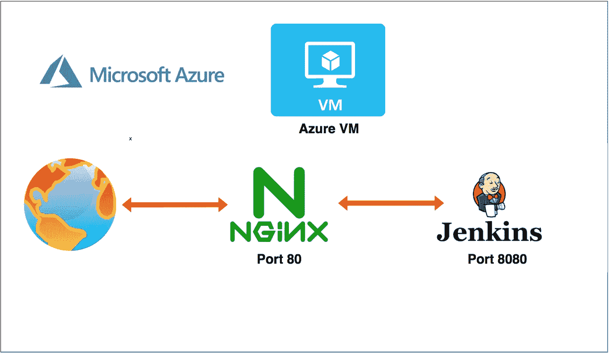

# 如何在 Azure VM 上为 Jenkins 实例配置反向代理

> 原文：<https://medium.com/bb-tutorials-and-thoughts/how-to-configure-reverse-proxy-for-jenkins-instance-on-azure-vm-6ed05c60527e?source=collection_archive---------0----------------------->

## NGINX webserver 逐步指南

Jenkins 是任何公司的 DevOps 战略中常见的工具之一。如果你真的喜欢 DevOps，作为代码的管道是你需要学习的热门技能之一。从构建您的应用程序到将它们部署在不同的环境中，Jenkins 可以负责…