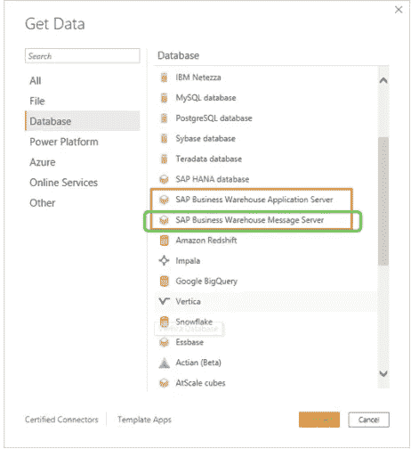

# 如何连接 SAP BI，导出 CSV/XLSX 格式的数据？

> 原文：<https://medium.com/walmartglobaltech/how-to-connect-to-sap-bi-and-export-data-in-csv-xlsx-a032bac66117?source=collection_archive---------4----------------------->

SAP BI — Power BI connector
Source: [https://www.sap.com/](https://www.sap.com/) [https://powerbi.microsoft.com/](https://powerbi.microsoft.com/) [https://icon-library.com/](https://icon-library.com/)

> **简介**

与 SAP 财务系统连接并从中检索数据一直是一项挑战，因为我们没有直接的连接器或库。

为了通过在粒度级别更智能、更有效地挖掘数据来解决这个问题，这是一种使用微软 Power BI 的编程方法。

> **研究**

我研究了许多其他 BI 工具，如 Alteryx、Tableau Prep 和一些其他连接器实现，但是得出的结论是 Power BI 的本机连接器适合连接 SAP BW 和 Power BI REST APIs 来访问资源。

Power BI REST API 为嵌入、管理和用户资源提供服务端点。

> **目标**

连接到 SAP 财务系统并导出数据。CSV 或。XLSX 用于数据协调。因为 Power BI 服务/API 的常规导出只支持。PDF，。PPTX 和。PNG，它提供了报告第一页的屏幕截图，我们没有以数据可用的格式导出整个报告。因此，我们正在利用这个解决方案，它可以生成一个. CSV 导出文件，同样可以用于对账！

> **先决条件**

*   超级商务智能台式机—2021 年 9 月版
*   Power BI 报告生成器
*   Azure 广告应用程序注册

> **问题陈述**

***连接 SAP BW，以编程方式导出 CSV/XLSX 格式的报表。***

如果您正在寻找一种自动化的方法来将 SAP 提取到。CSV/。XLSX 格式的数据对账，数据存储或电子邮件传输，这里是解决方案。

> **解决思路**

## 连接 SAP BW→选择所需报告→应用时间范围和过滤器→呈现报告→加载/转换数据→发布报告

## Power BI 报告-> Power BI 数据集创建-> PBI 报告生成器->从 PBI 数据集创建新的分页报告->发布

## OAuth2 身份验证->获取访问令牌(PowerShell cmdlets)

## PBI REST API->导出分页报表

这跨越了以下 5 个主要领域:

> **A 部分:与 SAP BI 的连接**

*   Power BI Desktop —选择数据源为以绿色突出显示的' **SAP BW Message Server'** 。

Source: [https://docs.microsoft.com/](https://docs.microsoft.com/)

*   选择所需的报告，应用时间范围和过滤器，并呈现报告→将数据加载/转换到 PBI 数据模型→在 Power BI 服务中发布报告
*   这些已发布的报告可以导出，但是对于常规报告，支持的文件格式是。PDF，。PPTX 和. PNG。无法在中导出这些报告。CSV 或。XLSX 通过自动化的方式。

**因此有了‘分页报告’！**

> **B 部分:分页报告**

那些是什么？

分页报告是

旨在打印或共享

格式化以适合页面

显示表格中的所有数据，即使表格跨越多页

像素完美

Power BI Report Builder 是为 Power BI 服务创作分页报告的独立工具。

**Power BI 服务中分页报表有哪些导出格式？**

您可以导出到 Microsoft XLSX、Microsoft Word、Microsoft PowerPoint、PDF、.CSV、XML 和 MHTML。

在发布 Power BI 报告时，会为该报告创建一个底层 Power BI 数据集。使用此数据集作为创建分页报表的数据源。为此，我们使用 Power BI Report Builder 桌面应用程序。这将创建一个带有。rdl 文件扩展名。分页的报告将被发布到 Power BI 服务以访问它。

分页报表适用于具有大量数据的报表。唯一的问题是，它取决于在您的高级容量中可用于分页报告的内存量。

**要点:发布这些报告的工作空间需要有额外的容量。**

*   带菱形图标的容量。

Source: Power BI service [https://app.powerbi.com/](https://app.powerbi.com/)

要创建分页报表，需要使用 Power BI Report Builder 应用程序。

1.  打开报表生成器并选择新建
2.  选择数据源作为 Power BI 数据集
3.  选择为使用 SAP BW source 发布的常规报告创建的数据集
4.  做连接测试，应该成功
5.  选择报表字段作为行组、列组和函数
6.  根据所需的 UI 执行报表属性设置
7.  将文件另存为。rdl
8.  发布此关于 Power BI 服务的报告。
9.  登录 Power BI service app.powerbi.com 后，将在/rdlreports 下看到报告，或键入“分页报告”。
10.  此报告的报告 id 将用于导出 REST APIs，以便将其导出为 CSV/XLSX。

> **C 部分:Azure 服务负责人/应用**

要访问 Power BI 服务的资源，我们需要在 Azure 门户上注册 Azure AD 应用程序。这也称为服务原则。

这是调用 Power BI REST APIs 所必需的。

**要点:需要在 PBI 服务中授予服务主体权限。**

**在 Power BI 服务中授予服务主体权限**

*   请求 Power BI admins 将您的服务主体添加到 requires Azure AD 组。

**要点:使用工作区访问接口以管理员身份添加服务主体。**

> **D 部分:Power BI REST API 访问令牌**

对于导出操作，我们提供了 Power BI Export REST APIs。要调用任何这样的 API，我们需要认证，即 access_token。

OAuth2 授权终点:

以下是 Azure 应用程序的 OAuth2 授权端点:

Source: Azure AD App registration [https://portal.azure.com/](https://portal.azure.com/)

*   使用以下端点执行身份验证:

https://login.microsoftonline.com/<<tenant_id>>/oauth 2/authorize？client _ id =<<application_id>> & response _ type = token & redirect _ uri =<<redirect url="" set="" at="" app="" level="">> & resource = https://analysis . windows . net/power bi/API</redirect></application_id></tenant_id>

如果您在浏览器中点击此 URL，它将重定向到 Microsoft 登录页面。成功登录后，它将重定向到以下 URL:

https://<<redirecturi>> # access _ token = eyj 0 exaioijkv 1 dwwdwqilcjhbgcioijs..zNE _ zmtzaan 5 suq & token _ type = Bearer & expires _ in = 4026 & session _ state = e 1871 fa 6–49 D5–4840–93s 0–7c 79989402 ca</redirecturi>

运筹学

Power Shell cmdlets:

连接-aza 帐户

这有助于使用经过验证的帐户连接到 Azure，以便使用来自 Az PowerShell 模块的 cmdlets。

一旦执行了成功的身份验证，就可以从以下位置获取访问令牌:

get-AzAccessToken-resource URL " https://analysis . windows . net/power bi/API "

这将返回一个应该用于身份验证的令牌。

使用此 access_token 作为进一步调用导出 API 的不记名授权令牌。

> **E 部分:导出分页报告**

1.  报告—导出到组中的文件//启动导出

[https://docs . Microsoft . com/en-us/rest/API/power-bi/reports/export-to-file-in-group](https://docs.microsoft.com/en-us/rest/api/power-bi/reports/export-to-file-in-group)

这将在成功导出后给出 export_id 作为响应。

curl-X POST-H " Content-Type:application/JSON "-H " Authorization:Bearer<<access_token>> "-d ' { " format ":" CSV " } ' https://api.powerbi.com/v1.0/myorg/groups/<<group_id>>/reports/<<report_id>>/export to</report_id></group_id></access_token>

2.报告—获取组中的导出到文件状态//检查导出状态，如果成功且 100%，则继续下载文件

[https://docs . Microsoft . com/en-us/rest/API/power-bi/reports/get-export-to-file-status-in-group](https://docs.microsoft.com/en-us/rest/api/power-bi/reports/get-export-to-file-status-in-group)

使用步骤#1 的 export_id 并执行轮询，直到成功为止。如果导出 100%完成并成功，我们可以继续进行文件下载。

curl-X GET-H " Content-Type:application/JSON "-H "授权:无记名<<access_token>> " https://api.powerbi.com/v1.0/myorg/groups/<<group_id>>/reports/<<report_id>>/exports/<<export_id from="" step2="">></export_id></report_id></group_id></access_token>

3.报告—获取要导出到组//下载文件中的文件的文件

[https://docs . Microsoft . com/en-us/rest/API/power-bi/reports/get-file-of-export-to-file-in-group](https://docs.microsoft.com/en-us/rest/api/power-bi/reports/get-file-of-export-to-file-in-group)

如果第 2 步完成，我们就可以执行文件下载了。用提供文件名。csv/。用于导出的输出文件的 xlsx 扩展名。

curl-X GET—output " export _ report . CSV "-H " Content-Type:application/JSON "-H " Authorization:Bearer<<access_token>> " https://api.powerbi.com/v1.0/myorg/groups/<<group_id>>/reports/<<report_id>>/exports/<<export_id from="" step2="">>/file</export_id></report_id></group_id></access_token>

这里我们有 SAP 数据导出报告。CSV 终于！

> 参考资料:

[https://docs.microsoft.com/en-us/rest/api/power-bi/](https://docs.microsoft.com/en-us/rest/api/power-bi/)
https://portal.azure.com/
[https://docs . Microsoft . com/en-us/power-bi/developer/embedded/register-app？tabs =客户%2CAzure](https://docs.microsoft.com/en-us/power-bi/developer/embedded/register-app?tabs=customers%2CAzure)

> 结论

这是构建一种机制的编程方式，该机制使用 Power BI native connector 以 CSV/XLSX 格式从 SAP 系统中提取数据，并立即返回。

出口愉快！