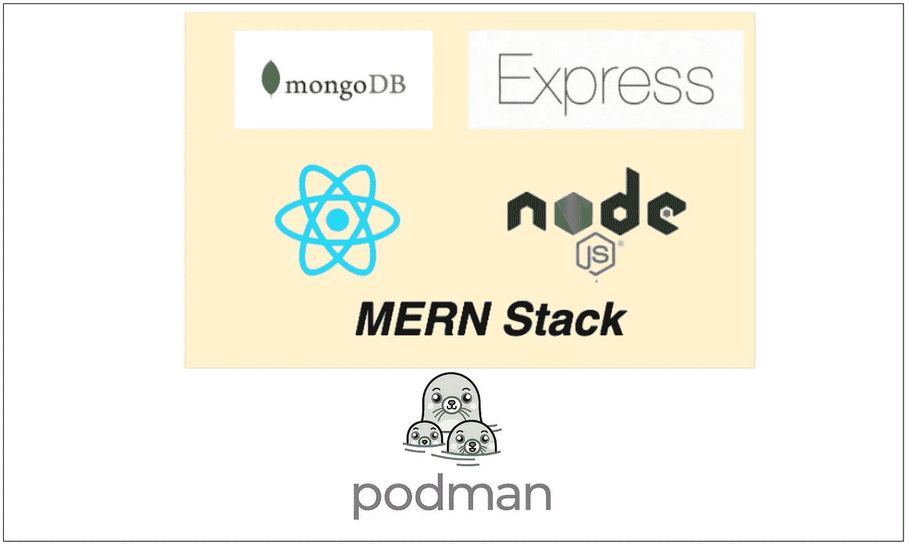

# 如何用波德曼集装箱化 MERN 堆栈

> 原文：<https://medium.com/bb-tutorials-and-thoughts/how-to-containerize-mern-stack-with-podman-8c46858fbbc4?source=collection_archive---------4----------------------->

## 包含示例项目的分步指南

Podman 是 Docker 的替代产品，具有无守护程序架构，是一个企业就绪的容器平台，使组织能够在任何地方无缝地构建、共享和运行任何应用程序。几乎每个公司都在将其应用程序容器化，以实现更快的生产工作负载，这样他们就可以部署…