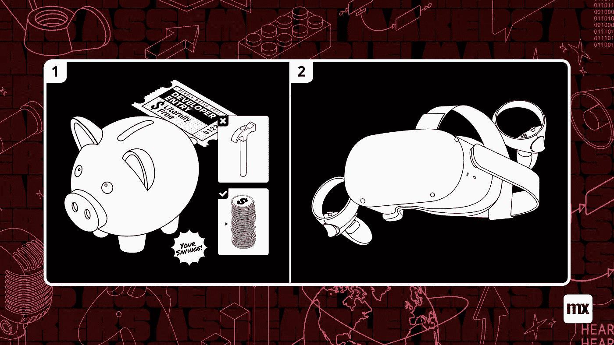
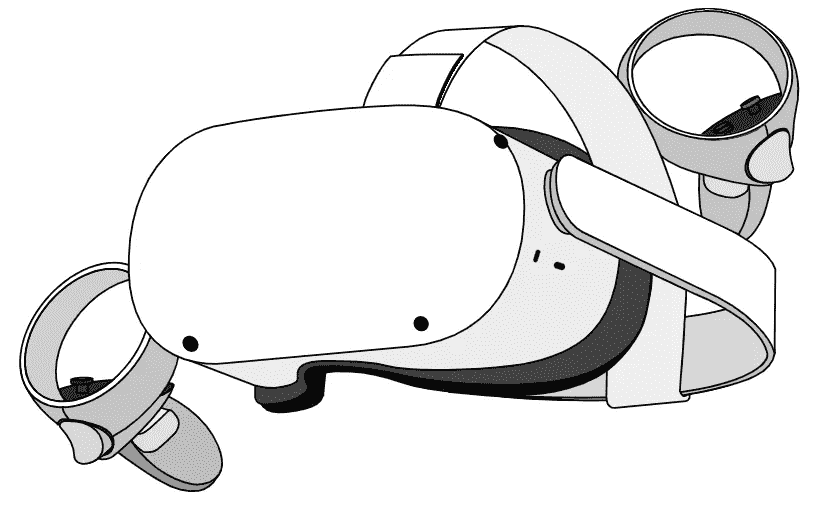

# 如何说服老板让你参加 Mendix World 2021

> 原文：<https://medium.com/mendix/how-to-convince-your-boss-to-let-you-attend-mendix-world-2021-e0263ccfe561?source=collection_archive---------4----------------------->

# 又到了一年中那个特殊的时刻，一年中的这个时候，我们都聚在一起，庆祝所有的低代码和门德克斯生活方式。我参加了最近的两次 Mendix 世界，一次是为一个合作伙伴工作，去年我作为 Mendix 的一员主持了我自己的会议。当谈到我们今年最大的活动时，我肯定会称自己为经验丰富的老手。

但是，尽管我很喜欢这些活动，但有许多以前的活动我没能参加。原因可能你自己也经历过:很难说服你的老板让你请假几天去参加一个活动。所以这就是我写这封信的原因，确保你有足够的理由说服你的老板给你 3 天假期。

[https://bit.ly/MXW21](https://bit.ly/MXW21)

# 活动的一些细节

众所周知，Mendix World 将于今年 9 月 7 日至 9 月 9 日举行。可以在这里 报名参加活动

** [## Mendix World 2021 |年 9 月 7 日至 9 日|低代码应用开发活动

### 好像你需要说服似的...在全球制造商社区中，他们希望通过探索什么来相互学习…

bit.ly](https://bit.ly/MXW21) 

从历史上看，Mendix World 将亲自举办，但由于疫情，去年这变成了一个虚拟活动。不过不要担心，因为这是我们有史以来最大的一年！这就是为什么今年我们决定保持虚拟化，让我们社区的每个成员都能以某种形式参与进来。

# 为什么你应该去

首先，它是免费的。对任何想参加的人完全免费。参加我们的活动不仅是免费的，您还可以为您和您的公司赢得丰厚的奖品

(但后面会详细介绍)。

一如既往，我们的活动团队在活动的每一分钟都安排了我们能找到的最好的会议。今年，我们总共有超过 85 场会议，涵盖各种主题。所有这些都被很好地整理到针对不同行业角色的特定轨道中，这样你就可以确保不会错过任何与你相关的东西。对我们预选的不感兴趣？然后创建你自己的个性化旅程，并装满你最感兴趣的东西。

说到错过，没必要担心。今年的所有会议都将按需提供，如果是现场会议，录像将在会议结束后立即提供，因此您可以重新观看这些主题演讲，并确保不会错过任何令人兴奋的明年发布会。

关于公告的主题，作为 Mendix 开发人员，你不会想错过明年为你准备的东西，我们肯定一直在努力工作，将 Studio Pro 9 装满你在 2021 年需要的一切。

# 你说有奖品吗？

我知道你会喜欢的。今年你可以赢得大奖，只需让你的朋友报名参加活动！推荐足够多的人，你就可以赢得 10 个 oculus quest 2 VR 耳机中的 1 个！其他奖品包括免费的 Mendix 基础环境、快速开发人员和升级开发人员考试以及其他赠品。

除此之外，我们还为您和您的公司提供折扣和我们学院的免费培训和认证，没错，来 Mendix World，您可以为您的公司赢得免费培训和考试，通常价值数百欧元！

为了加入我们的推荐计划，除了注册活动之外，您不必做任何事情。过一会儿，你会收到一封邮件，解释你需要知道的一切，以及如何获得奖励！

[https://www.mendix.com/pricing/basic-package/](https://www.mendix.com/pricing/basic-package/)

# 那里见！

综上所述，你应该参加今年活动的首要原因和每年一样:和我们了不起的社区走到一起，交流思想。今年，我们呼吁所有的制造商走到一起，聚集在一个你真的不能错过的事件！

 [## Mendix World 2021 |年 9 月 7 日至 9 日|低代码应用开发活动

### 好像你需要说服似的...在全球制造商社区中，他们希望通过探索什么来相互学习…

bit.ly](https://bit.ly/MXW21) 

*来自发布者-*

*如果你喜欢这篇文章，你可以在我们的* [*媒体页面*](https://medium.com/mendix) *或我们自己的* [*社区博客网站*](https://developers.mendix.com/community-blog/) *找到更多类似的文章。*

*希望入门的创客，可以注册一个* [*免费账号*](https://signup.mendix.com/link/signup/?source=direct) *，通过我们的* [*学苑*](https://academy.mendix.com/link/home) *即时获取学习。*

有兴趣更多地参与我们的社区吗？你可以加入我们的 [*闲散社区频道*](https://join.slack.com/t/mendixcommunity/shared_invite/zt-hwhwkcxu-~59ywyjqHlUHXmrw5heqpQ) *或者想更多参与的人，看看加入我们的* [*遇见 ups*](https://developers.mendix.com/meetups/#meetupsNearYou) *。***