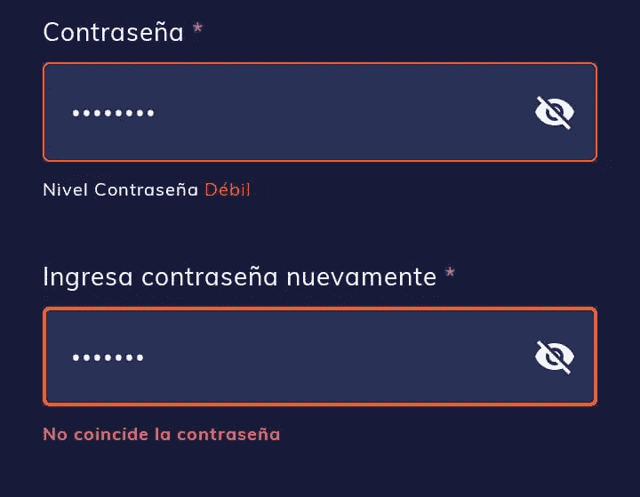
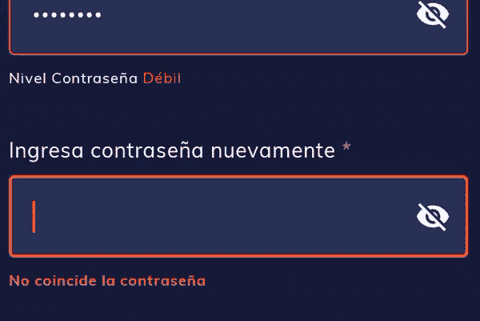
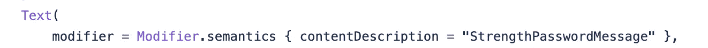

# 如何使用 Jetpack Compose 创建可组合的密码

> 原文：<https://medium.com/google-developer-experts/how-to-create-a-composable-password-with-jetpack-compose-f1be2d48d9f0?source=collection_archive---------0----------------------->

Password text field and password confirmation text field (Strings in Spanish)

Android 开发人员正在使用 jetpack compose 构建应用程序，但有时我们必须从头开始开发新的组件。例如，[切换按钮](https://cristian-code.medium.com/jetpack-compose-toggle-button-c6628cf44c05)或密码文本字段或密码确认文本字段。然而，Android 社区是巨大的，并且共享许多关于 jetpack compose 的博客帖子和代码片段。我将向您展示如何使用 jetpack compose 创建密码文本字段和密码确认。让我们从密码文本字段开始。

首先，记住 jetpack compose 中的主要概念或良好实践，因为您将看到的代码具有这些内容。一些良好做法包括:

*   无状态组件。
*   状态提升。
*   插槽模式。
*   修饰符参数来自定义可组合的。

给我看看代码…下面的代码是关于一个可组合的密码:

让我们解释几行代码:

*   VisualTransformation 属性允许显示或不显示密码。
*   TrailingIcon 属性是典型的眼睛图标，但是如果您更改 show password 变量的状态，图标也会随之更改。
*   第 71 行验证安全密码级别。如果要验证密码的安全级别，可以使用 validateStrenghtPassword 参数设置 true。
*   Strengthchecker 是一个允许您验证密码安全级别的功能。我将在奖金部分向您展示一个示例
*   onHasStrongPassword 是一个高阶函数，可以让您知道密码的安全级别。我们在这里应用状态提升。
*   BuildAnnotatedString 是一个函数，它允许您为每个单词创建具有不同样式的自定义字符串，例如

可组合的密码文本字段如下所示:

Composable password text field (Strings in Spanish)

密码确认文本字段类似于密码文本字段，唯一的变化是它不验证密码的安全级别，但它验证文本是否等于密码。以下代码是关于可组合的密码确认文本字段的:

让我们解释几行代码:

*   TrailingIcon 属性是典型的眼睛图标，但是如果您更改 show password 变量的状态，图标也会随之更改。
*   第 71 行验证密码文本字段是否等于确认密码文本字段；否则，它会显示一个文本。

可能如下所示的可组合确认密码文本字段:

password confirmation text field (Strings in spanish)

# 测试

随后，我创建了一些测试来正确验证这些行为。

首先，将语义属性分配给要匹配的组件，因为组件没有 ID。例如，在我们的代码中，您分配一个内容描述。

semantics properties for a composable (Line 23 of passwordtextfield Composable)

为可组合文本分配另一个内容描述

semantics properties for a composable (Line 81 of passwordtextfield Composable)

第二，我们的测试，验证强密码和弱密码。这些 Android 测试有一个活动上下文。

Password Text Field Tests

其他密码确认测试:

Confirm Password Text Field Tests

Jetpack compose 是一个优秀的声明式 UI 框架；然而，它提出了新的挑战，比如根据我们的需求创建可组合的。

我希望这些信息对你有用。记得分享这篇博文，欢迎你的评论。

访问我的社交网络:

*   [https://twitter.com/jggomezt](https://twitter.com/jggomezt)
*   https://www.youtube.com/devhack
*   【https://devhack.co/ 

# 奖金

用于验证密码安全级别的代码

StrengthChecker function

# 资源

*   [https://developer.android.com/courses/pathways/compose](https://developer.android.com/courses/pathways/compose)
*   [https://developer.android.com/jetpack/compose/state](https://developer.android.com/jetpack/compose/state)
*   [https://www.youtube.com/watch?v=y8k6udRQjbQ](https://www.youtube.com/watch?v=y8k6udRQjbQ)