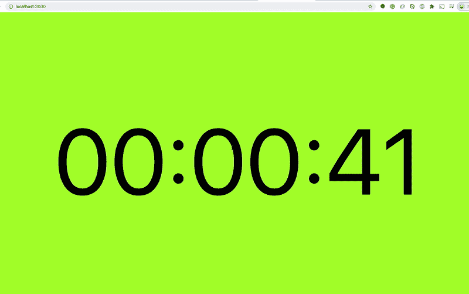

# 如何在 React 应用程序中创建倒计时器—类型脚本版本

> 原文：<https://medium.com/bb-tutorials-and-thoughts/how-to-create-a-countdown-timer-in-react-app-typescript-version-5617abfe44f3?source=collection_archive---------0----------------------->

## 一步一步的例子项目指南

在 web 开发中，有一个倒计时器是很常见的。在某些情况下，应该在特定时间在网站上做一些事情，或者您希望将一组用户重定向到您网站上的事件流。无论是哪种情况，我们都需要…