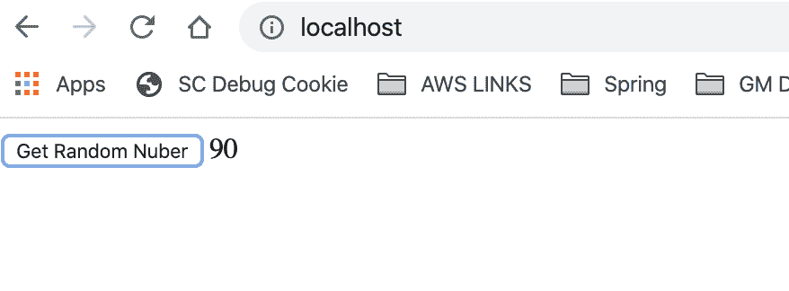
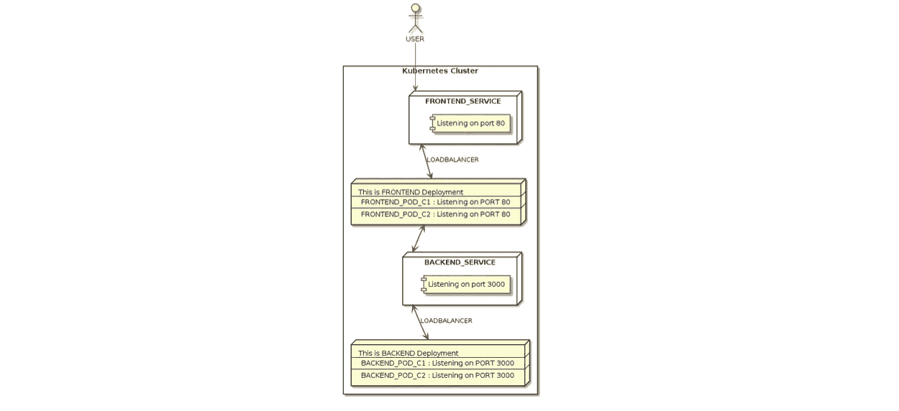
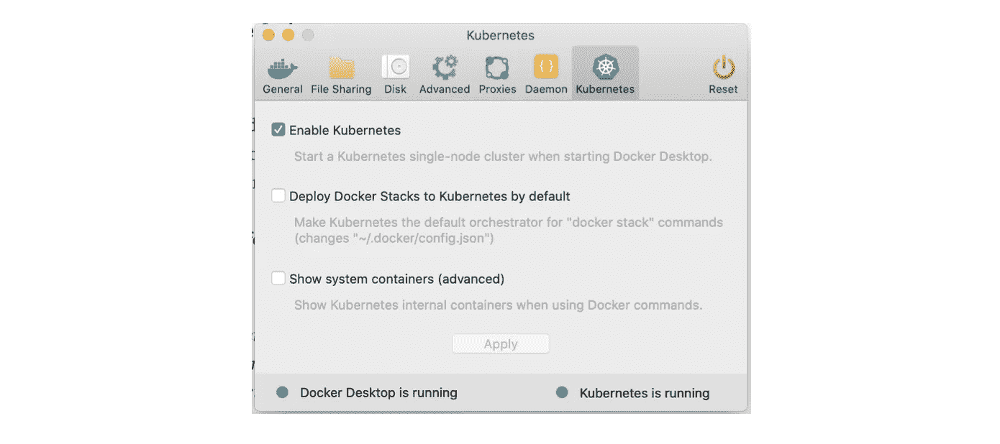
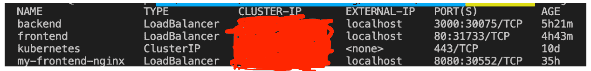

# 如何在本地创建 Kubernetes 集群——简单教程

> 原文：<https://medium.com/capital-one-tech/how-to-create-a-kubernetes-cluster-locally-simple-tutorial-63eab6c8c3f5?source=collection_archive---------3----------------------->

# 如何在本地创建一个 Kubernetes 集群并部署与 Kubernetes 通信的简单前端应用程序


作为第一资本公司的一名软件工程师，我每天都在工作中探索前沿技术。我曾与 Docker 和 Docker Swarm 合作，我一直想学习 Kubernetes。但是，我一直推迟。最后，我能够一头扎进去，并想，“为什么不用 Kubernetes 创建一个应用程序，并在我头脑清醒时写下它！”这样，其他人——而不仅仅是我自己——可以从我学到的东西中受益。

# 介绍

今天，我们将创建一个 Kubernetes 集群，并部署一个简单的 React JS 应用程序，它通过调用 Express JS 应用程序来生成一个随机数。我们将通过使用 Kubernetes 来协调整个过程。我们将首先对我们的前端/后端应用程序进行分类。然后，我们将使用 Kubernetes 部署 pod(React 前端应用程序/Express 后端应用程序),并通过 Kubernetes 服务访问它们。



# 什么是 Kubernetes 集群？

像任何集群一样，您向 Kubernetes 提供一组节点。您告诉 kubernetes 如何在集群中部署容器。每个容器获得多少内存或处理单元，以及它们如何相互交互。

# Kubernetes 聚类图

下图描述了我们今天要实现的目标，我们将为我们的前端和后端创建一个 Kubernetes 集群和服务/部署。



# 先决条件

1.  [桌面 Docker](https://www.docker.com/products/docker-desktop)(最新版本)
2.  [库伯内特](https://kubernetes.io/docs/setup/learning-environment/minikube/)或[码头工人库伯内特](https://www.docker.com/products/kubernetes)
3.  节点和 NPM(仅当您希望独立运行应用程序时)
4.  YAML

***注:*** *本教程要求具备关于 Docker、Node、& NPM 的基础/工作知识。*

让我们开始吧，不要再多费口舌了。

# Kubernetes 入门

## 安装 Kubernetes

*如果你有* ***Docker 桌面*** *，进入* ***首选项*** *，进入* ***Kubernetes 标签，*** *，点击* ***启用 Kubernetes*** *。将 Kubernetes 安装到你的机器上可能需要一段时间，所以在它发挥魔力的时候去做一杯咖啡吧。☕*



要验证 Kubernetes 是否正在运行，请键入以下两个命令:

```
kubectl versionOutputs:Client Version: version.Info{Major:"1", Minor:"15", GitVersion:"v1.15.0", GitCommit:"e8462b5b5dc2584fdcd18e6bcfe9f1e4d970a529", GitTreeState:"clean", BuildDate:"2019-06-19T16:40:16Z", GoVersion:"go1.12.5", Compiler:"gc", Platform:"darwin/amd64"}Server Version: version.Info{Major:"1", Minor:"14", GitVersion:"v1.14.8", GitCommit:"211047e9a1922595eaa3a1127ed365e9299a6c23", GitTreeState:"clean", BuildDate:"2019-10-15T12:02:12Z", GoVersion:"go1.12.10", Compiler:"gc", Platform:"linux/amd64"}kubectl cluster-infoOutputs:
Kubernetes master is running at https://kubernetes.docker.internal:6443KubeDNS is running at [https://kubernetes.docker.internal:6443/api/v1/namespaces/kube-system/services/kube-dns:dns/proxy](https://kubernetes.docker.internal:6443/api/v1/namespaces/kube-system/services/kube-dns:dns/proxy)
```

# 将应用程序捆绑为 Docker 图像

## 这方面的完整代码可以在 [GitHub](https://github.com/chiku11/react-k8) 上找到

请下载该项目。该项目中有两个子文件夹。

*   客户端->基于 React 的应用程序
*   服务器->基于 Express 的应用

请按照以下步骤设置项目并启动 Kubernetes 集群:

## 客户

*   *光盘客户端*
*   *npm 安装*
*   *npm 运行构建*
*   ***docker build -t 前端:1.0。***
*   ***ku bectl apply-f frontend . deploy . yml***
*   ***ku bectl apply-f frontend . service . yml***

## 后端

*   *光盘服务器*
*   *npm 安装*
*   ***docker build -t 后端:1.0。***
*   ***ku bectl apply-f back end . deploy . yml***
*   ***ku bectl apply-f back end . service . yml***

进入浏览器，键入`localhost`并按回车键，你应该看到应用程序加载。

# 进一步降低

## Kubernetes 豆荚

Pods 是可以在 Kubernetes 中创建和管理的最小可部署计算单元。

```
kubectl run nginx-frontend --image=frontend:1.0
```

上面创建了一个托管前端容器的 pod。您还不能访问它，因为没有为容器公开主机端口。我们稍后会揭开这些。

一个 pod 也可以托管多个容器。让我们通过 YAML 文件来创建，而不是通过命令行。

```
# To create a pod with multiple containers
 kubectl apply -f app.pod.yml# To see container status
 kubectl get pod/mymulticontainerapp
 Outputs:
 NAME                  READY   STATUS    RESTARTS   AGE
 mymulticontainerapp   2/2     Running   0          9m# To see more details about the container
kubectl describe pod/mymulticontainerapp
```

要从主机访问容器，您必须进行端口转发，即将主机端口连接到容器端口。您可以通过下面的命令来完成:

```
kubectl port-forward pod/mymulticontainerapp 9999:80 3000:3000Outputs:
Forwarding from 127.0.0.1:9999 -> 80
Forwarding from [::1]:9999 -> 80
Forwarding from 127.0.0.1:3000 -> 3000
Forwarding from [::1]:3000 -> 3000
```

上述命令将主机端口 9999 暴露给容器端口 80，将主机端口 3000 暴露给容器端口 3000，这是我们的前端/后端容器正在侦听的端口。对主机 9999 的任何请求都将被转发到端口 80 上的容器。对主机 3000 的任何请求都将被转发到端口 3000 上的容器。

去浏览器打开 127.0.0.1:9999 或者 localhost:9999，应该会加载前端 app。

要删除 pod，您可以使用以下命令:

```
k delete pod/mymulticontainerapp
```

要检查 pod，您可以使用以下命令:

```
Front End:
kubectl exec mymulticontainerapp -c myfrontendapp -it /bin/sh
ls /usr/share/nginx/html
exitBack End:
kubectl exec mymulticontainerapp -c mybackendapp -it /bin/sh
ls
exit
```

以上命令打开容器内部的外壳进行交互。

在我们跳到下一个主题 **—** 部署之前，理解 YAML 文件中的元数据至关重要。元数据是关于容器的数据。您可以向元数据添加标签和键值。您还可以使用标签或键值作为选择器来标识稍后将由部署/服务使用的 pod。

让我们把所有的豆荚都标上`mymulticontainerapp`:

```
kubectl get pods --selector=name=mymulticontainerapp
```

# 部署

你描述一个展开中的期望状态，展开控制器[以受控的速率将实际状态改变为期望状态。您可以定义部署来创建新的副本集，或者删除现有的部署并在新部署中采用它们的所有资源。](https://kubernetes.io/docs/concepts/architecture/controller/)

它看起来应该和你之前看到的 YAML 非常相似。这里要注意的要点是*种类*——这是一种部署而不是 pod。

**选择器:**用于通过标签识别现有的 pod，例如它们的元数据。如果有一个 pod 已经使用这样的标签运行，它将是此部署的一部分。

**副本:**它指定您希望在这个容器中创建多少个 pod。如果您说两个，它将有两个 pod 运行后端。

假设副本设置为两个，并且已经有四个 pod 使用标签`app: node-backend`运行。它将终止其中两个 pod 以满足两个副本的要求。如果副本设置为 6 个，它还会将单元扩大 2 个。

**Spec:** 它指定了容器的详细信息，如图像名称、容器端口、pod 内容器的 CPU/内存限制等。

**模板:**通过规范指定新创建的 pod 要使用的标签。

*******

要创建部署，请运行以下命令:

```
kubectl apply -f backend.deploy.ymlOutput:
deployment.apps/node-backend created
```

要查看所有部署:

```
k get deploymentsOutput:
NAME           READY   UP-TO-DATE   AVAILABLE   AGE
node-backend   2/2     2            2           46s
```

要访问部署期间创建的容器，可以使用 port-forward。

```
kubectl port-forward deployment/node-backend 3000:3000You can access by going to localhost:3000/random
```

# Kubernetes 服务

公开在一组[pod](https://kubernetes.io/docs/concepts/workloads/pods/pod-overview/)上运行的应用程序的一种抽象方式是作为网络服务。

这里需要注意的是——种类是服务，类型是负载平衡器。这在主机端口 3000 上创建了一个`LoadBalancer`,并将请求代理到 3000 上的容器。

这里`LoadBalancer`在平衡什么？如果你仔细观察，你会发现我们指定了一个选择器。选择器搜索标签为`app: node-background`的 pod，发送到 3000 主机的任何请求都将在这些 pod 之间进行负载平衡。这里我们有两个副本，请求将被负载平衡到这两个单元。

要创建服务，请运行以下命令:

```
kubectl apply -f backend.service.yml.
```

要查看所有服务，请运行以下命令:

```
k get service
```



这将告诉您服务名称以及它是什么类型的服务。在这里，你可以看到有一个名为后端的服务，类型为`LoadBalancer`，我们刚刚使用服务 yml 创建了这个服务。

您也可以对前端执行相同的步骤:

```
kubectl apply -f backend.deploy.yml
kubectl apply -f backend.service.yml
```

# 那不是很容易吗？

我们已经了解了如何创建一个 Kubernetes 集群，以及如何部署一个简单的前端应用程序来与 Kubernetes 中的后端应用程序进行通信。希望这有助于你了解 Kubernetes 的基本知识。Kubernetes 是一个巨大的海洋，我们只是触及了其中的一小滴。但是我希望这有助于为你将来学习 Kubernetes 铺平道路！

**有用链接:**

https://kubernetes.io/docs/concepts/

【https://docs.docker.com/ 

*披露声明:2020 资本一。观点是作者个人的观点。除非本帖中另有说明，否则 Capital One 不隶属于所提及的任何公司，也不被这些公司认可。使用或展示的所有商标和其他知识产权是其各自所有者的财产。*