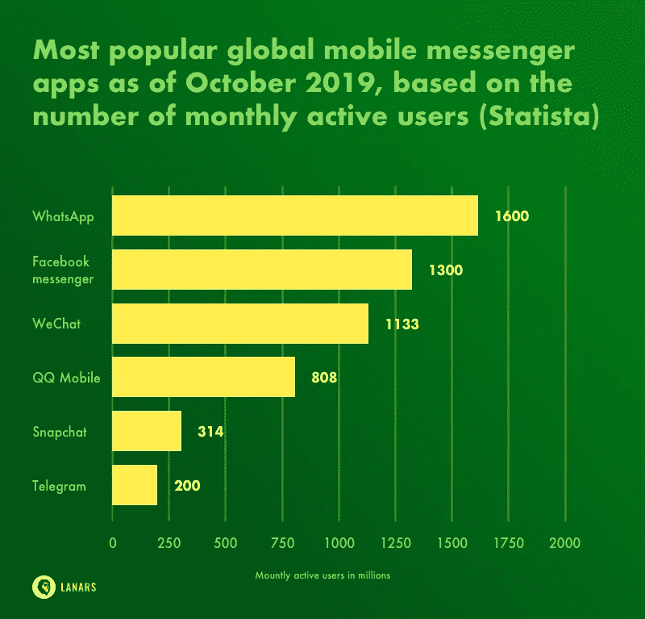
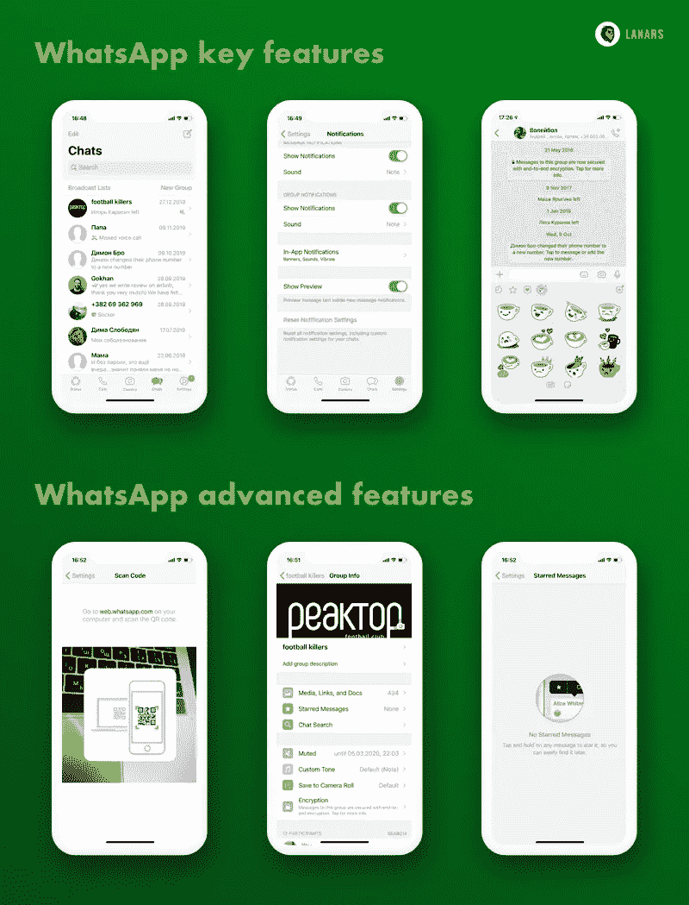
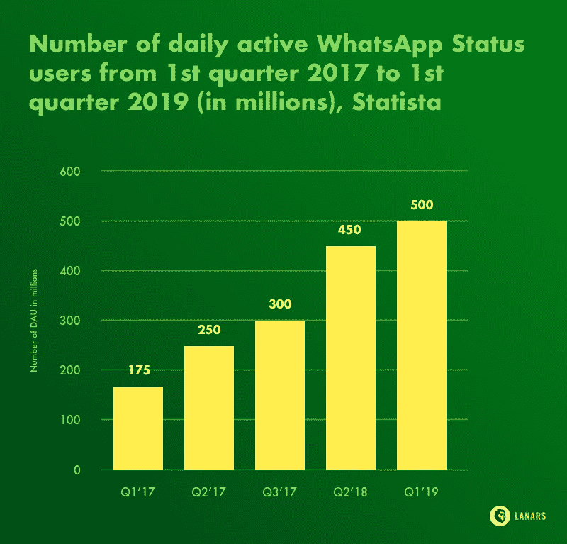
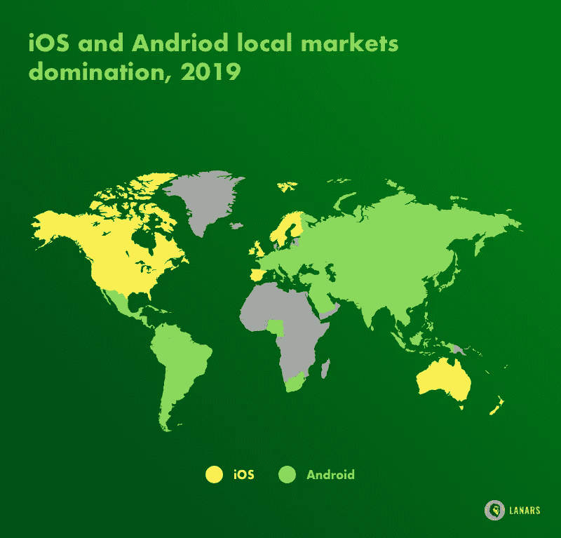
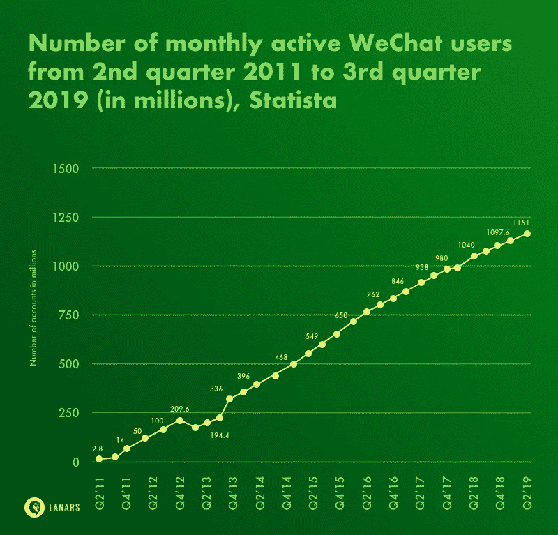

# 如何在 2020 年创建消息传递应用程序

> 原文：<https://medium.com/quick-code/how-to-create-a-messaging-app-in-2020-78ea7445a273?source=collection_archive---------0----------------------->

即时通讯应用只是社交网络应用的一个子类型，公共功能有限，在 2020 年将获得可观的收入。[根据最新统计](https://datareportal.com/reports/digital-2019-q3-global-digital-statshot)，截至今年年底，WhatsApp 已经成功吸引了 16 亿用户，而 Facebook Messenger 的受众是 13 亿用户，微信已经聚集了[超过 10 亿](https://www.statista.com/statistics/258749/most-popular-global-mobile-messenger-apps/)用户。观众规模和参与度对于关系到利润的应用来说都是至关重要的。

如何在 2020 年制作一个消息应用程序，它是否合理？尽管你可能不会触及市场领导者，但利基信使和初创公司仍有空间，它们专注于尚未在信使或微信应用中实现的即将到来的技术。

虽然聊天应用的多功能性正在变成他们的弱点，但用于特定用户之间交流的利基工具正在变得越来越受欢迎。成功的秘诀很简单:与其满足世界上所有的用户，不如关注那些你很了解的人的需求。例如，游戏玩家、卡车司机或音乐家。注意！你必须确定这些人需要经常保持联系。

用我们的文章精心打造使者。

# 在 2020 年创建一个聊天应用程序是个好主意吗？

那么，基本上，什么是即时聊天应用？一种简化和加快用户间交流的工具。它允许他们在任何地方(如果有移动连接)都可以使用，交换文本、音频或视频消息，以及相互呼叫或视频聊天。

如何制作聊天应用程序，以及为什么需要它？因为方便，人们使用消息应用程序而不是给客户发邮件、发短信或打电话。他们可以使用智能手机(而不是电脑)，下载的聊天应用程序可以在会上、街上或聊天应用程序上使用，这可以节省用户的时间，为他们提供聊天历史，有多种使用方式(游戏、支付或新闻阅读)。

如果您计划收回投资，您需要研究即时通讯的市场潜力，并了解如何击败竞争对手。不要惊慌地查看聊天工具的市场份额——大多数手机用户每天都会使用两个以上的信使。

然而，要创建一个聊天应用程序，你必须向用户提供一些他们在其他信使中可能找不到的东西。在这种情况下，利基信使，如那些狗爱好者，同事，或英语学习的学生是需要的。示例-部队信使和火花。

值得注意的是，信使正在慢慢成为第三方企业的主要推广工具，以及经理和团队成员保持联系的方式。微信在中国以其多功能的商业功能就是一个很好的例子。可以预见，2020 年，messenger 原生广告领域将有大量投资。抓住时机，为特定的受众开发即时消息。

虽然创造一个现代的信使是一项困难而昂贵的任务，但请记住，像 WhatsApp 这样的市场巨头自成立以来，在营销、公关和用户获取方面没有投入任何资金，现在其团队成员不到 150 人。

# 消息应用和聊天应用设计的主要特性

所有的 messenger 应用程序都有一些共同点，它们允许用户相互交流。与此同时，聊天室编程似乎很棘手，因为你需要向你的客户提供独家功能，将他们变成忠诚的客户。

首先，你需要弄清楚启动你的创业是你想推出什么类型的产品。尝试总结您的项目想法，并列出您需要集成到应用程序中的关键功能。第二，检查你的想法是否可行。进行市场调查，包括潜在客户研究和竞争对手研究。从你的文章— [如何创业](https://lanars.com/../blog/how-to-start-a-startup-make-a-business-step-by-step)中了解更多信息。

在这里，我们想用聊天应用开发领域的基本和高级特性武装你。

**基本功能** *建议 MVP 功能*

*   **登录**
    用户有三种方式可以通过你的产品的授权门——通过他们的电话号码、电子邮件和社交媒体账户。大多数全球信使(WhatsApp、Telegram 和 Viber)都是基于电话号码的。
*   **个人资料设置和定制**
    用户应该有一个工具，可以在繁忙时关闭通知，以及更改资料图片来表达自己。一个好主意是在你的应用程序功能中加入黑名单选项和收藏联系人分组。
*   **消息和群聊** 信息交流是聊天 MVP 的核心特性。文本、音频、照片和视频是这种交流的主要形式。您可以应用各种技术来增强该功能，包括 cloud server one。
*   **文件交换** 用户可能喜欢用你的 app 分享电子门票、全尺寸照片或文本文档等文件，而不是常规的邮件客户端。允许他们在信息中附加文件，并创建一个可以吸引商业部门的聊天室网站。
*   **联系人导入** 给用户提供他们应该使用你的产品的理由，向他们展示他们的朋友和同事也在使用这个工具。自动化的社交网络连接和电话簿数据导出也节省了用户的时间。为用户提供向朋友发送邀请的选项是一个好主意。
*   **地点
    如何创建消息应用？用户将有机会分享他们的位置，发送关于下一个会议点的信息，或者在交互式地图上显示一些东西。出于这个原因，该应用程序应该与内置的智能手机 GPS 工具进行交互。**
*   **秘密聊天和数据加密**
    基于动态数据加密技术和云消息(一种保持共享数据安全的常规方法)的额外安全级别的秘密聊天是保护信使免受网络攻击的两种常用方法。
*   **推送通知
    聊天应用最显著的特点之一是用户可以即时联系。**

**高级功能** *想法缩放您的 messenger*

*   **带视频和音频的通话** 当然，你的听众可以使用常规的移动网络和其他视频聊天工具给别人打电话。但是为什么不试着把他们留在应用程序中，用一个方便的产品来满足他们的所有需求呢？请注意，视频通话需要大量的电力。除非你不能保持高质量的沟通，否则你不应该开发这些功能。
*   **公共频道** 你可能会在现在大部分的聊天应用里面发现这个功能。要击败竞争对手，吸引那些能为你的产品创造内容和新受众的用户，就要规划公共渠道的实施。
*   **自毁故事** 临时状态，可以用文字和动画的形式呈现，最初是 Snapchat 开发的。如今，流行的即时通讯工具也将这一特性整合到了它们的功能中。
*   聊天机器人是一种营销工具，也是第三方公司通过原生广告接触用户的一种选择。用户更喜欢节省时间，而不是在多个应用程序之间分散注意力，所以用聊天机器人预订餐厅或购物对他们来说似乎是一个很好的选择。
*   **贴纸**
    动画、贴纸、图片——这些都是娱乐的元素。如果用户有机会时不时地使用你的应用程序，他们会从你的应用程序中获得积极的情绪。
*   **应用内游戏**
    要做信使，达到高额利润？只有一小部分观众在聊天手机应用中玩游戏。同时，游戏也是一个机会，可以留住用户的注意力，向他们展示更多的广告，并因此从与公司的合作中获得更多的利润。

考虑到不要失去你的预算，最好从 MVP(最小可行产品)构建开始。MVP 开发在最初阶段只涉及关键特性集成和仔细的反馈研究。我们建议你根据我们的博客文章[如何建立一个 MVP](https://lanars.com/../blog/how-to-build-a-minimum-viable-product) 继续基本的功能。

# 营销调查和平台

如何创建聊天 app？正如我们在上面已经写的，你的第一步是描述和总结你的产品想法，并清楚地定义你的预算。极其重要的是，不仅要列出你未来应用的功能，还要提出盈利模式。创建一个项目草案，将成为你的营销假设。

下一步是检查你的想法是否有市场需求，是否有利可图。为此，你需要研究市场。市场调研的结果将帮助你定义你的 MVP 特征并形成你的市场策略。在我们的文章[中找到如何将你的应用创意货币化的详细说明](https://lanars.com/../blog/how-you-can-monetize-your-app-idea)。还有一个方面会受到市场调查的影响，那就是平台解决方案。

***受众研究***

怎么做一个聊天应用？找出谁会对你的产品感兴趣，并对这些人进行大致的描述。请注意，目标用户群可能不止一个。年龄、性别、收入水平、职业、离开的地方、家庭状况会帮助你了解你在和谁打交道。然后，列出你的听众的需求、恐惧、口味和习惯。

***竞争对手分析***

看看你的市场定位和目标受众描述，回答你的竞争对手的优势和劣势是什么。这对于创建简短的主要竞争对手简介以供公司使用也是至关重要的。

找出他们的产品有多少用户，他们使用什么样的营销方式。时刻关注竞争对手的企业形象、新闻和网站。要创建一个聊天网站和应用程序，你需要脱颖而出，你在发现阶段的任务是找到你的产品的独特优势。

***平台解决方案和技术***

如果你知道你的目标用户是谁，你会很容易发现他们更喜欢什么设备(Android，iOS，或者别的什么)。性别、教育、收入比率和用户的地理位置对你来说将是最重要的，因为 Android 和 iOS 主导着不同的市场。阅读我们的文章 [Android vs iOS:首先为哪个平台构建应用程序更好。](https://lanars.com/../blog/android-vs-ios-which-platform-to-build-your-app-for-first)

简而言之，虽然 Android 用户比 iOS 用户多，但 iPhone 用户倾向于在付费应用或应用内购买上花费更多。与此同时，相比 iOS，Android 开发更棘手，成本也更高。

如果您的 MVP 开发预算有限，跨平台开发可能也是一个节约的想法。这种方法让你有机会接触到更广泛的受众，而不受平台的限制。然而，它的用户体验可能没有原生应用那么棒。

还有一些高级聊天应用功能可能会让你的开发者感到困惑。尽管即时通话维护、云数据库集成、额外数据加密和离线兑现可能会借助相对便宜的第三方服务，但开发定制算法和使用自己的服务器的风险也较小。

# 构建聊天应用的挑战

在 2020 年，你应该面对一个竞争激烈的环境，你的目标受众有各种各样的消息应用可供选择。这就是为什么从一开始就推出具有独特功能的高质量产品是极其重要的。建立市场形象、早期指标研究和紧急技术支持是你在构建消息应用时必须记住的问题。

为了帮助您开发一款被认为是用户友好的高科技产品，我们收集了您需要注意的几点:

*   **网络安全** 如果你不能保证用户的数据不会被第三方公司窃取或使用，他们就不会对你的解决方案感兴趣。未经所有者许可，不安全的个人资料也可以用于第三方营销活动。多阶段验证(通过电子邮件、脸书、电话号码或其他社交账户)和地理检查是避免风险的方法。
    共享内容加密(包括端到端技术和内部加密协议，密钥不断变化)是提高用户数据安全性的另一种方法。
*   用户愿意富有成效地利用互联网时间，他们早已习惯了一体化解决方案。2020 年，一个消息传递应用程序不仅仅是一个交换小文本、多媒体文件或相互通话的工具。微信和 Facebook Messenger 现在是像 Venmo(更多:[做一个像 Venmo 和 Square Cash](https://lanars.com/../blog/how-much-does-it-cost-to-create-app-like-venmo) 这样的移动点对点支付 App 要多少钱)这样的点对点支付工具，游戏平台，在线营销工具。那么像 Messenger's Stories 这样的社交网络功能呢？
    为了战胜竞争对手，即将推出的聊天应用应该表现为经典社交网络、手机游戏和直接沟通工具的混合体，以及市场和支付终端。
*   **频繁更新** 互联网环境多变，变幻莫测，app 市场竞争对手非常多。那么，如何制作一款具有高留存率和出色入职用户体验的短信应用，让你的产品成为病毒呢？问题是，没有确切的答案。你的应用需要始终领先，以保持用户参与和满意。

如果没有深思熟虑的定期更新，一个出色的 MVP 可能会在一个月后被用户完全遗忘。确保你有一个强大的有远见的团队和资源，让你的应用每天都变得更好。

# 开发一个 WhatsApp 这样的消息应用要多少钱？

虽然没有人会在不熟悉技术文档和营销目标的情况下告诉你你的想法实现的确切价格，但我们希望为你提供对应用定价的基本了解。制作视频聊天应用或 WhatsApp 这样的全功能产品的预算取决于以下因素:

*   *功能的数量和复杂性，独特屏幕、数据库和移动内置功能集成的数量*
*   *App 开发平台*
*   *设计要求*
*   *开发国家*

查看我们的博客文章[制作一个应用程序需要多少成本](https://lanars.com/../blog/how-much-does-it-cost-to-make-an-app)以了解这些因素如何影响应用程序开发定价。在这里，我们想总结一下你需要多少钱来建立一个消息应用程序 MVP(仅包含最常见和最基本的功能)。

*   签到和个人简介
    *离 50 分*
*   80 小时后的消息和群聊

*   *视频和音频通话
    *从 180 小时**
*   *文件往来
    40 小时起*
*   **位置跟踪
    *从 30 小时***
*   **20 小时后推送通知** 
*   ***广告
    *15-30 小时****

**如何建立一个消息应用程序，然后将其货币化？最简单的方法就是把你的受众卖给品牌。要了解更多信息，请阅读我们的文章[如何将你的应用创意货币化。](https://lanars.com/../blog/how-you-can-monetize-your-app-idea)**

**UX 和用户界面设计将需要 90 至 150 小时，后端开发预计将需要 600 小时。注意！对一个移动平台的功能开发给出了每小时的估计。**

**虽然开发人员可能会花费多少时间来构建你希望在你的应用程序中拥有的功能，但对于内部和外包开发来说，仍然有一些问题。内部开发成本很容易计算，看看你的固定队友的工资。**

**外包开发可能是在岸的(你外包你所在地区的任务)，近岸的(邻国)，或离岸的(遥远的定义)不同。**

> **总的建议是选择文化、语言、时区、公司规模和工作风格差异较小的合作伙伴。**

**对于说英语的客户来说，顶级聊天应用程序开发的最佳目的地是乌克兰、波兰和保加利亚(每小时 25-40 美元)，印度、菲律宾或越南(10 美元起)是最便宜的选择。**

**如何做一个安卓或 iOS 的消息类 app？**

> **原生应用为用户提供更好的体验，并保持较高的留存率。然而，开发良好的跨平台应用程序也可能表现出良好的 UI。**

**在本地开发的情况下，请记住，您必须为 iOS 和 Android 开发两个应用程序。用户界面和 UX 设计也应该适用于每个移动平台。那意味着你应该加倍预算。**

**不要忘记你的产品需要营销和持续的技术支持。营销活动可以有灵活的预算。然而，如果你的团队从一开始就有营销人员，你的信使将有更高的成功机会。营销人员应该参与市场和目标受众研究以及 MVP 反馈分析。**

**我们建议增加 10%的最终预算。将预留资金用于应用程序的技术支持和首次更新。**

**准备 2020 年做一个聊天 app？**

**联系 LANARS 来评估你的想法。**

***原载于***。****